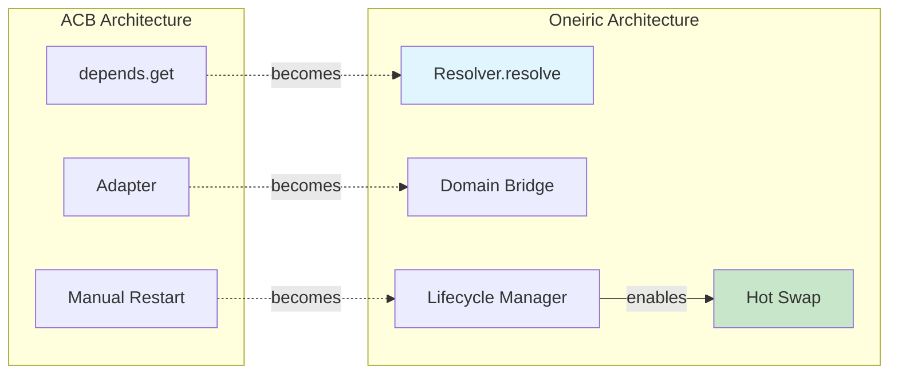
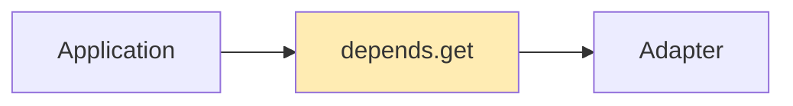
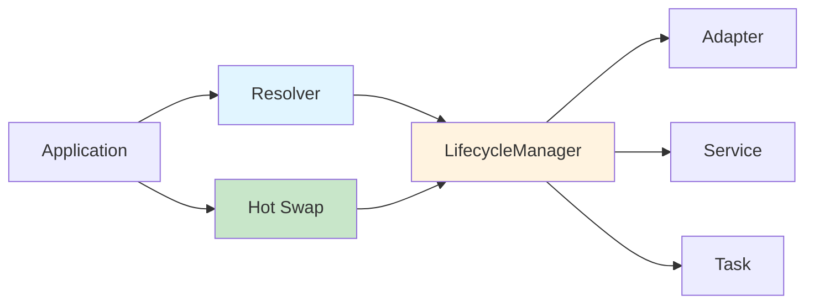

# Migration Guide: ACB to Oneiric

**Last Updated:** 2025-02-02
**Target Audience:** Developers migrating from ACB to Oneiric
**Prerequisites:** Familiarity with ACB adapter patterns

______________________________________________________________________

## Overview

This guide helps you migrate applications from ACB to Oneiric. Oneiric extracts ACB's adapter resolution and lifecycle patterns into a universal, domain-agnostic infrastructure layer.

### Key Concept Mapping

| ACB Concept | Oneiric Equivalent | Notes |
|-------------|-------------------|-------|
| `depends.get(Adapter)` | `resolver.resolve("adapter", key)` | Explicit domain + key |
| Adapters only | Adapters, Services, Tasks, Events, Workflows, Actions | Universal resolution |
| 2-tier resolution (config > convention) | 4-tier resolution (override > priority > stack > order) | More deterministic |
| Manual restart for changes | Hot-swapping with lifecycle manager | Runtime updates |
| Bevy DI | Resolver + LifecycleManager | Registry pattern |
| `AdapterSettings` | `BaseModel` settings per adapter | Pydantic validation |

### Visual Concept Mapping



### Architecture Comparison

**ACB (Before):**



**Oneiric (After):**



**Key Differences:**

- ✅ **Explicit domains** - No more implicit adapter-only resolution
- ✅ **Hot-swapping** - Update components without restart
- ✅ **Universal** - Same patterns for all component types
- ✅ **Explainable** - Every decision can be traced

______________________________________________________________________

## Quick Start: 5-Minute Migration

### Before (ACB)

```python
from acb import depends

# Get adapter implicitly
cache = depends.get(Cache)
await cache.set("key", "value")
```

### After (Oneiric)

```python
from oneiric.core.resolution import Resolver
from oneiric.core.lifecycle import LifecycleManager
from oneiric.adapters import AdapterBridge, register_builtin_adapters

# Set up resolver and lifecycle
resolver = Resolver()
register_builtin_adapters(resolver)  # Or register your own
lifecycle = LifecycleManager(resolver)
bridge = AdapterBridge(resolver, lifecycle, settings)

# Use adapter explicitly
handle = await bridge.use("cache")
await handle.instance.set("key", "value")
```

**Key Changes:**

1. Explicit resolver setup (not implicit like ACB)
1. Domain-bridge pattern (AdapterBridge, ServiceBridge, etc.)
1. Explicit key resolution ("cache" instead of type-based)

______________________________________________________________________

## Step 1: Replace Adapter Resolution

### ACB Pattern

```python
from acb import depends, AdapterSettings
from acb.adapters.cache import Cache

class MyService:
    def __init__(self):
        self.cache = depends.get(Cache)

    async def process(self, key: str):
        await self.cache.set(key, "processed")
```

### Oneiric Pattern

```python
from oneiric.core.resolution import Resolver
from oneiric.core.lifecycle import LifecycleManager
from oneiric.adapters import AdapterBridge

class MyService:
    def __init__(self, bridge: AdapterBridge):
        self.bridge = bridge

    async def process(self, key: str):
        handle = await self.bridge.use("cache")
        await handle.instance.set(key, "processed")

# Usage
resolver = Resolver()
lifecycle = LifecycleManager(resolver)
bridge = AdapterBridge(resolver, lifecycle, settings.adapters)
service = MyService(bridge)
```

**Benefits:**

- Explicit dependencies (easier to test)
- Explainable resolution
- Hot-swappable at runtime

______________________________________________________________________

## Step 2: Migrate Adapter Implementations

### ACB Adapter

```python
from acb.adapters import Adapter, AdapterSettings
from pydantic import BaseSettings

class RedisSettings(BaseSettings):
    url: str = "redis://localhost"

class RedisAdapter(Cache):
    settings: RedisSettings

    async def initialize(self):
        self.client = await aioredis.from_url(self.settings.url)

    async def get(self, key: str):
        return await self.client.get(key)

    async def set(self, key: str, value: str):
        await self.client.set(key, value)
```

### Oneiric Adapter

```python
from oneiric.adapters import AdapterMetadata
from oneiric.adapters.cache import CacheAdapter
from pydantic import BaseModel, Field

class RedisSettings(BaseModel):
    url: str = Field(default="redis://localhost", alias="redis_url")

    class Config:
        populate_by_name = True

class RedisAdapter(CacheAdapter):
    settings: RedisSettings

    async def health_check(self) -> bool:
        try:
            return await self.client.ping()
        except Exception:
            return False

    async def initialize(self):
        self.client = await aioredis.from_url(self.settings.url)

    async def cleanup(self):
        await self.client.close()

    async def get(self, key: str):
        return await self.client.get(key)

    async def set(self, key: str, value: str):
        await self.client.set(key, value)

# Registration
register_adapter_metadata(
    resolver,
    package_name="myapp",
    package_path=__file__,
    adapters=[
        AdapterMetadata(
            category="cache",
            provider="redis",
            stack_level=10,
            factory=lambda: RedisAdapter(),
            description="Redis cache adapter",
        )
    ],
)
```

**Key Improvements:**

- `health_check()` method for hot-swap validation
- `cleanup()` method for graceful shutdown
- Explicit metadata for explainability
- Pydantic Field aliases for flexible config

______________________________________________________________________

## Step 3: Configuration Migration

### ACB Configuration

```yaml
# config/adapters.yml
adapters:
  cache:
    provider: redis
    settings:
      url: redis://localhost:6379
```

### Oneiric Configuration

```toml
# settings/adapters.toml (or .yml)
[adapters.selections]
cache = "redis"

[adapters.provider_settings.redis]
url = "redis://localhost:6379"
# Or use env var:
# url = "$REDIS_URL"
```

**Or use YAML:**

```yaml
# settings/adapters.yml
adapters:
  selections:
    cache: redis

  provider_settings:
    redis:
      url: "redis://localhost:6379"
```

**Key Changes:**

- Explicit `selections` block
- `provider_settings` instead of nested `settings`
- Environment variable support via `$VAR` syntax

______________________________________________________________________

## Step 4: Use Domain Bridges

Oneiric provides bridges for all domains, not just adapters:

### Adapter Bridge

```python
from oneiric.adapters import AdapterBridge

bridge = AdapterBridge(resolver, lifecycle, settings.adapters)
handle = await bridge.use("cache")
result = await handle.instance.get("key")
```

### Service Bridge

```python
from oneiric.domains import ServiceBridge

service_bridge = ServiceBridge(resolver, lifecycle, settings.services)
handle = await service_bridge.use("payment-processor")
result = await handle.instance.process_payment(amount=100)
```

### Task Bridge

```python
from oneiric.domains import TaskBridge

task_bridge = TaskBridge(resolver, lifecycle, settings.tasks)
handle = await task_bridge.use("send-email")
await handle.instance.run(to="user@example.com", subject="Hello")
```

### Event Bridge

```python
from oneiric.domains import EventBridge

event_bridge = EventBridge(resolver, lifecycle, settings.events)
await event_bridge.dispatch(
    topic="user.created",
    payload={"user_id": 123}
)
```

### Workflow Bridge

```python
from oneiric.domains import WorkflowBridge

workflow_bridge = WorkflowBridge(resolver, lifecycle, settings.workflows)
result = await workflow_bridge.run(
    workflow="fulfillment",
    context={"order_id": 123}
)
```

______________________________________________________________________

## Step 5: Hot-Swapping Components

Oneiric's killer feature: update components without restarting.

### Basic Swap

```python
# Swap cache from Redis to Memcached
await lifecycle.swap("adapter", "cache", provider="memcached")

# Automatic flow:
# 1. Resolve new provider (memcached)
# 2. Instantiate new instance
# 3. Run health check
# 4. If healthy: bind, cleanup old instance, done
# 5. If unhealthy: rollback unless force=True
```

### With Rollback Protection

```python
try:
    await lifecycle.swap("adapter", "cache", provider="memcached")
except HealthCheckError:
    # Automatic rollback occurred
    logger.error("Swap failed, reverted to previous provider")
```

### Force Swap (Skip Health Check)

```python
await lifecycle.swap(
    "adapter", "cache",
    provider="memcached",
    force=True  # Skip health check (dangerous)
)
```

### Config Watchers (Auto-Swap)

```python
from oneiric.runtime.watchers import SelectionWatcher

watcher = SelectionWatcher(
    domain="adapter",
    config_path="settings/adapters.yml",
    bridge=adapter_bridge,
    poll_interval=5.0,
)

# Watcher monitors config and triggers swaps automatically
async with watcher:
    await asyncio.sleep(3600)  # Run for 1 hour
```

______________________________________________________________________

## Step 6: Remote Manifests

Oneiric supports loading components from remote manifests (CDN, S3, etc.).

### Manifest Structure

```yaml
# manifest.yaml
api_version: "2.0"
manifest_id: "myapp-production"
manifest_source: "https://cdn.example.com/manifest.yaml"

adapters:
  - domain: adapter
    key: cache
    provider: redis
    package: myapp.adapters.cache
    import_path: myapp.adapters.cache:RedisAdapter
    metadata:
      stack_level: 10
      capabilities: ["distributed", "persistent"]
    settings:
      url: "$REDIS_URL"

  - domain: adapter
    key: cache
    provider: memcached
    package: myapp.adapters.cache
    import_path: myapp.adapters.cache:MemcachedAdapter
    metadata:
      stack_level: 5
    settings:
      url: "$MEMCACHED_URL"
```

### Load Remote Manifest

```python
from oneiric.remote.loader import RemoteManifestLoader
from oneiric.remote.security import verify_manifest_signature

loader = RemoteManifestLoader(
    manifest_url="https://cdn.example.com/manifest.yaml",
    trusted_public_keys=["ed25519:..."],
)

# Sync and register
await loader.sync(resolver)

# Or watch for changes
await loader.watch(resolver, refresh_interval=120)
```

### Sign Manifests

```bash
# Generate keypair
oneiric.cli manifest generate-keypair

# Sign manifest
oneiric.cli manifest sign \
  --input manifest.yaml \
  --output manifest.signed.yaml \
  --private-key-path private_key.pem
```

______________________________________________________________________

## Step 7: Observability Migration

### Structured Logging

```python
from oneiric.core.logging import get_logger

logger = get_logger("myapp")

# Structured context automatically added
logger.info("cache-operation", key="user:123", operation="get")

# Output (JSON):
# {
#   "event": "cache-operation",
#   "key": "user:123",
#   "operation": "get",
#   "domain": "adapter",
#   "key": "cache",
#   "provider": "redis"
# }
```

### OpenTelemetry Tracing

```python
from oneiric.core.observability import trace_resolution

with trace_resolution("adapter", "cache"):
    handle = await bridge.use("cache")
    # Span created automatically with metadata
```

### CLI Diagnostics

```bash
# Explain why a component was chosen
oneiric.cli explain adapter cache

# Show all candidates (active + shadowed)
oneiric.cli list adapter --shadowed

# Show lifecycle status
oneiric.cli status adapter cache --json

# Health check
oneiric.cli health --probe
```

______________________________________________________________________

## Common Migration Patterns

### Pattern 1: Conditional Adapter Selection

**ACB:**

```python
cache = depends.get(Cache)  # Which one? Unknown
```

**Oneiric:**

```python
handle = await bridge.use("cache", provider="redis")  # Explicit
# Or use config selections
handle = await bridge.use("cache")  # Uses config
```

### Pattern 2: Multiple Adapters of Same Type

**ACB:**

```python
# Difficult - requires custom DI setup
```

**Oneiric:**

```python
# Easy - use different keys
cache_primary = await bridge.use("cache", key="cache-primary")
cache_session = await bridge.use("cache", key="cache-session")
```

### Pattern 3: Testing with Mock Adapters

**ACB:**

```python
# Requires overriding DI container
```

**Oneiric:**

```python
# Just register a mock resolver
test_resolver = Resolver()
test_resolver.register(Candidate(
    domain="adapter",
    key="cache",
    provider="mock",
    factory=lambda: MockCache(),
))

test_bridge = AdapterBridge(test_resolver, test_lifecycle, test_settings)
```

### Pattern 4: Environment-Specific Configuration

**ACB:**

```python
# Complex env-specific configs
```

**Oneiric:**

```python
# Use stack levels or priorities
# Local: stack_level=0
# Dev: stack_level=10
# Prod: stack_level=20

# Or use ONEIRIC_STACK_ORDER
export ONEIRIC_STACK_ORDER="prod:20,dev:10,local:0"
```

______________________________________________________________________

## Before/After Examples

### Example 1: Web Service

**ACB:**

```python
from acb import depends, AdapterSettings
from acb.adapters.cache import Cache
from acb.adapters.queue import Queue

class OrderService:
    def __init__(self):
        self.cache = depends.get(Cache)
        self.queue = depends.get(Queue)

    async def create_order(self, order: Order):
        await self.cache.set(f"order:{order.id}", order.json())
        await self.queue.enqueue("process-order", order.id)
```

**Oneiric:**

```python
from oneiric.adapters import AdapterBridge
from oneiric.domains import TaskBridge

class OrderService:
    def __init__(self, adapter_bridge: AdapterBridge, task_bridge: TaskBridge):
        self.adapter_bridge = adapter_bridge
        self.task_bridge = task_bridge

    async def create_order(self, order: Order):
        cache = await self.adapter_bridge.use("cache")
        await cache.instance.set(f"order:{order.id}", order.json())

        task = await self.task_bridge.use("process-order")
        await task.instance.run(order_id=order.id)

# Usage
resolver = Resolver()
lifecycle = LifecycleManager(resolver)
adapter_bridge = AdapterBridge(resolver, lifecycle, settings.adapters)
task_bridge = TaskBridge(resolver, lifecycle, settings.tasks)
service = OrderService(adapter_bridge, task_bridge)
```

### Example 2: Event Handler

**ACB:**

```python
from acb import depends
from acb.adapters.queue import Queue

class OrderCreatedHandler:
    def __init__(self):
        self.queue = depends.get(Queue)

    async def handle(self, event: OrderCreated):
        await self.queue.enqueue("process-order", event.order_id)
```

**Oneiric:**

```python
from oneiric.domains import EventBridge, TaskBridge

class OrderCreatedHandler:
    def __init__(self, event_bridge: EventBridge, task_bridge: TaskBridge):
        self.event_bridge = event_bridge
        self.task_bridge = task_bridge

    async def handle(self, event: OrderCreated):
        # Dispatch event
        await self.event_bridge.dispatch(
            topic="order.processing",
            payload={"order_id": event.order_id}
        )

        # Or enqueue task directly
        task = await self.task_bridge.use("process-order")
        await task.instance.run(order_id=event.order_id)
```

______________________________________________________________________

## Testing Strategy

### Unit Tests

```python
import pytest
from oneiric.core.resolution import Resolver, Candidate
from oneiric.core.lifecycle import LifecycleManager

@pytest.fixture
def test_resolver():
    resolver = Resolver()
    resolver.register(Candidate(
        domain="adapter",
        key="cache",
        provider="mock",
        factory=lambda: MockCache(),
    ))
    return resolver

def test_cache_operation(test_resolver):
    lifecycle = LifecycleManager(test_resolver)
    bridge = AdapterBridge(test_resolver, lifecycle, test_settings)
    handle = await bridge.use("cache")
    assert await handle.instance.get("key") == "value"
```

### Integration Tests

```python
@pytest.mark.integration
async def test_cache_hot_swap():
    resolver = Resolver()
    register_builtin_adapters(resolver)
    lifecycle = LifecycleManager(resolver)
    bridge = AdapterBridge(resolver, lifecycle, settings)

    # Start with Redis
    handle = await bridge.use("cache", provider="redis")
    assert handle.provider == "redis"

    # Swap to Memcached
    await lifecycle.swap("adapter", "cache", provider="memcached")
    handle = await bridge.use("cache")
    assert handle.provider == "memcached"
```

______________________________________________________________________

## Troubleshooting

### Issue: "No candidate found for domain=adapter, key=cache"

**Cause:** No adapters registered for that key.

**Solution:**

```python
# Check what's registered
resolver.explain("adapter", "cache")

# Register adapters
register_builtin_adapters(resolver)

# Or register your own
resolver.register(Candidate(...))
```

### Issue: "Health check failed during swap"

**Cause:** New provider failed health check.

**Solution:**

```python
# Check health manually
await lifecycle.probe_instance_health("adapter", "cache", provider="memcached")

# Force swap if you're sure
await lifecycle.swap("adapter", "cache", provider="memcached", force=True)
```

### Issue: "Config file not found"

**Cause:** `ONEIRIC_CONFIG` not set or file doesn't exist.

**Solution:**

```bash
export ONEIRIC_CONFIG=/path/to/config.toml
# Or use default: ~/.oneiric.toml
```

______________________________________________________________________

## Checklist

Complete these steps for a successful migration:

- [ ] Replace `depends.get()` with resolver pattern
- [ ] Migrate adapter implementations to Oneiric pattern
- [ ] Add `health_check()` and `cleanup()` methods
- [ ] Update configuration files (selections + provider_settings)
- [ ] Replace ACB dependencies with domain bridges
- [ ] Add hot-swapping where beneficial
- [ ] Set up remote manifests if needed
- [ ] Configure observability (logging, tracing)
- [ ] Update unit tests to use test resolvers
- [ ] Add integration tests for hot-swapping
- [ ] Update deployment documentation
- [ ] Train team on new patterns

______________________________________________________________________

## Further Reading

- **Architecture:** `docs/NEW_ARCH_SPEC.md`
- **Resolution Details:** `docs/RESOLUTION_LAYER_SPEC.md`
- **Remote Manifests:** `docs/REMOTE_MANIFEST_SCHEMA.md`
- **Security:** `docs/SIGNATURE_VERIFICATION.md`
- **Observability:** `docs/OBSERVABILITY_GUIDE.md`
- **Deployment:** `docs/deployment/CLOUD_RUN_BUILD.md`
- **Runbooks:** `docs/runbooks/`

______________________________________________________________________

## Support

- **Issues:** https://github.com/lesleslie/oneiric/issues
- **Documentation:** `docs/README.md`
- **Comparison:** `docs/ONEIRIC_VS_ACB.md`

**Migration Timeline Estimate:**

- Small project (< 10 adapters): 1-2 days
- Medium project (10-50 adapters): 1 week
- Large project (50+ adapters): 2-3 weeks

Most time is spent updating adapter implementations and testing hot-swapping behavior.
