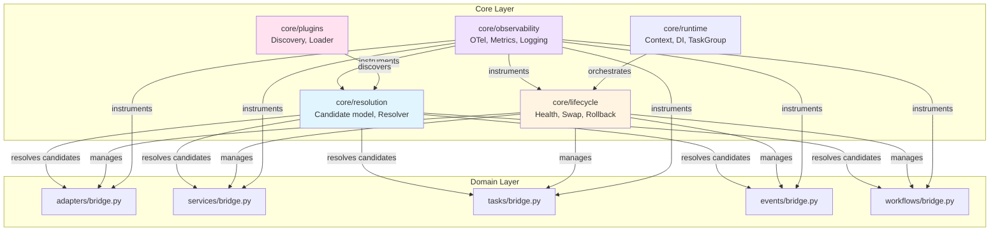
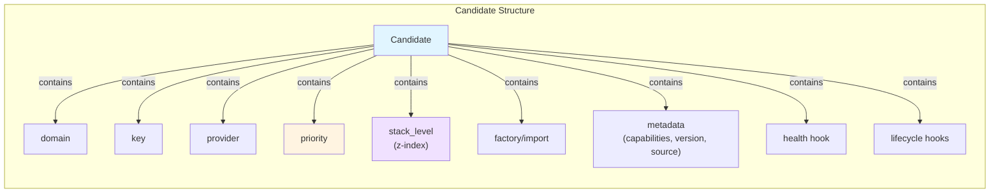
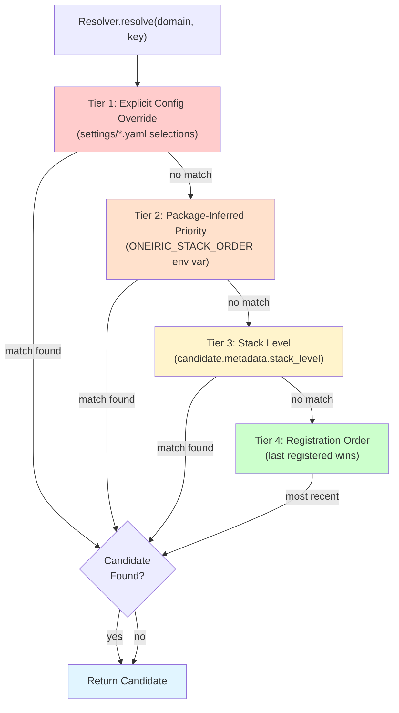
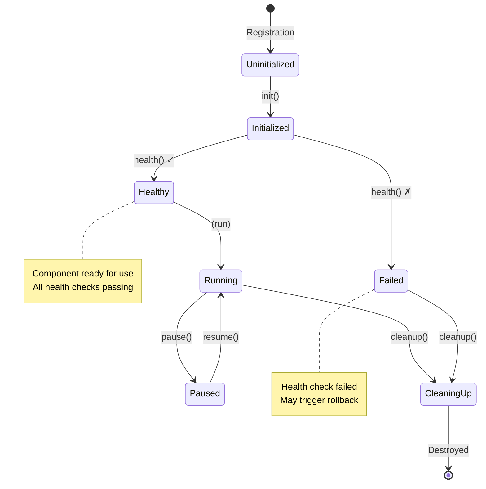
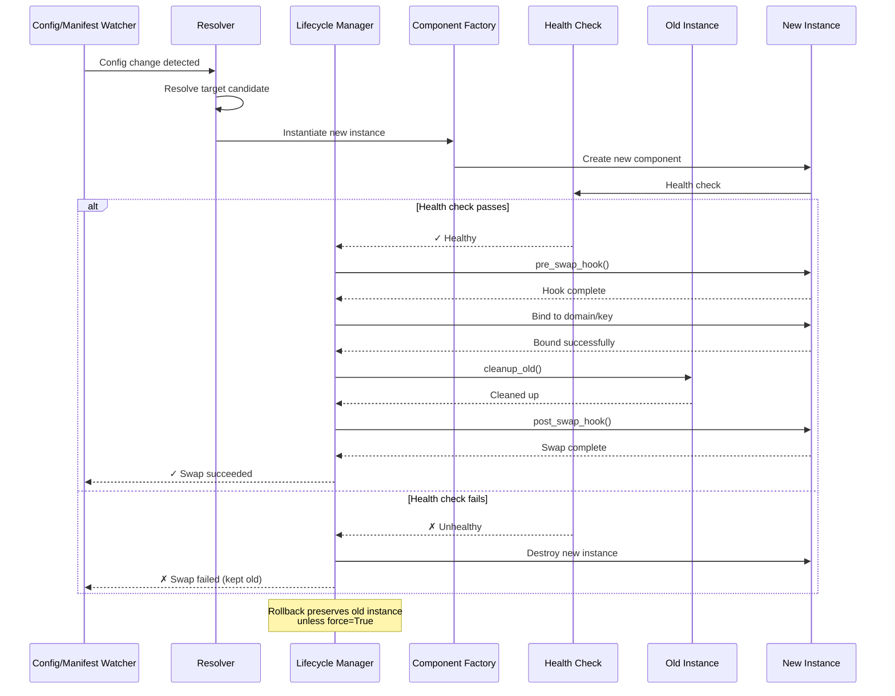
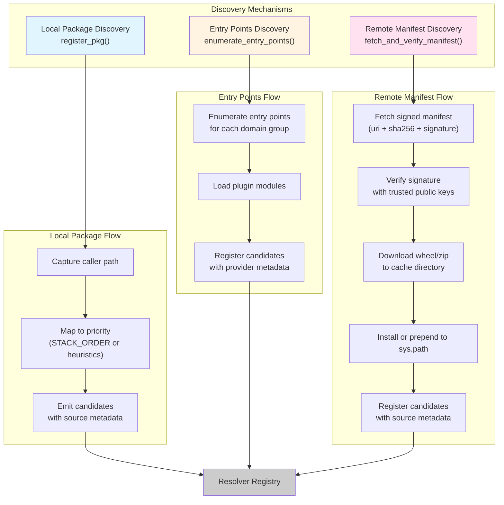
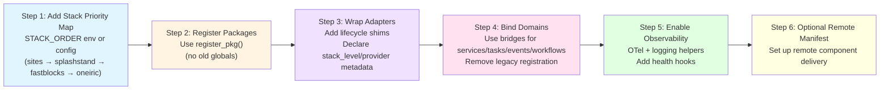
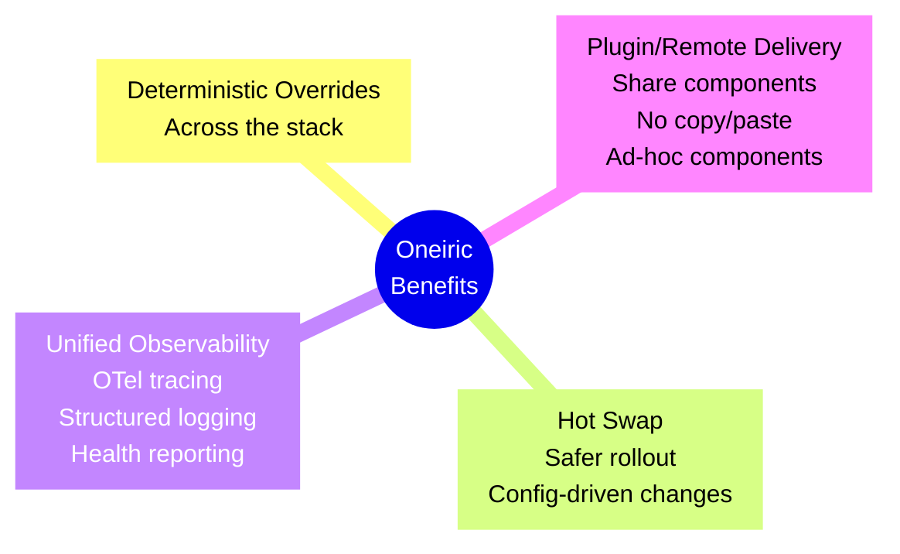

# New Architecture Specification (Oneiric, Python 3.13 Baseline)

Goal: build Oneiric with unified resolution, lifecycle, observability, and plugin
support, reusing existing ACB adapters and actions where useful. Domains (adapters,
services, tasks, events, workflows) plug into the same resolver and lifecycle.

## Top-Level Packages

**Package Overview:**

- **`core/runtime`**: Context, DI bindings, TaskGroup/nursery helpers, cancellation-safe
  utilities.
- **`core/resolution`**: Candidate model, resolver, registries (active/shadowed), explain
  API, hot-swap entry points.
- **`core/lifecycle`**: init/health/cleanup/pause-resume contracts, rollback helpers,
  swap orchestration.
- **`core/observability`**: OpenTelemetry tracer/metrics/logging helpers; structured
  fields (domain, key, provider, source, priority, stack_level).
- **`core/plugins`**: discovery sources (local package, entry points, remote manifest),
  plugin loader utilities.
- **Domain bridges**: `adapters/bridge.py`, `services/bridge.py`, `tasks/bridge.py`,
  `events/bridge.py`, `workflows/bridge.py` — each maps domain concepts to resolver
  keys and lifecycle hooks.

## Candidate Model (shared)

**Candidate Fields:**

- **domain**: Component domain (adapter, service, task, event, workflow)
- **key**: Unique identifier within domain
- **provider**: Implementation name
- **priority**: Explicit priority value
- **stack_level**: Z-index style layering (default: 0)
- **factory/import**: Component instantiation method
- **metadata**: Capabilities, version, source information
- **health hook**: Health check callback
- **lifecycle hooks**: init, cleanup, pause/resume callbacks

### Resolution Precedence (4-tier)

**Precedence Rules** (highest to lowest):

1. **Explicit config override** - User selections in `settings/*.yaml` (e.g., `adapters.yml`)
1. **Package-inferred priority** - From `ONEIRIC_STACK_ORDER` env var or path heuristics
1. **Stack level** - Candidate metadata `stack_level` (z-index style)
1. **Registration order** - Last registered wins (tie-breaker)

## Domain Mapping

```mermaid
graph TB
    subgraph "Adapter Domain"
        AdapterKey["key = category<br/>(cache, queue, storage)"]
        AdapterProvider["provider = adapter name<br/>(redis, sqs, s3)"]
        AdapterMeta["metadata = capabilities, version"]
        AdapterLC["lifecycle = connections, clients"]
    end

    subgraph "Service Domain"
        ServiceKey["key = service_id"]
        ServiceProvider["provider = implementation"]
        ServiceLC["lifecycle + health"]
    end

    subgraph "Task Domain"
        TaskKey["key = task_type"]
        TaskProvider["provider = handler"]
        TaskHooks["pause/resume/drain hooks"]
        TaskResolve["resolver selects active"]
    end

    subgraph "Event Domain"
        EventKey["key = event name/type"]
        EventProvider["provider = handler"]
        EventDefault["highest-wins default"]
        EventPipeline["optional multi-handler<br/>pipeline ordered by priority"]
    end

    subgraph "Workflow Domain"
        WorkflowKey["key = workflow_id<br/>(+ optional version)"]
        WorkflowProvider["provider = definition/engine"]
        WorkflowFlag["activation flag"]
        WorkflowSwap["graceful swap<br/>(migrate in-flight)"]
    end

    Resolver["Resolver"]

    Resolver -->|"resolves"| AdapterKey
    Resolver -->|"resolves"| ServiceKey
    Resolver -->|"resolves"| TaskKey
    Resolver -->|"resolves"| EventKey
    Resolver -->|"resolves"| WorkflowKey

    style AdapterKey fill:#e1f5ff
    style ServiceKey fill:#ffe1f0
    style TaskKey fill:#f0e1ff
    style EventKey fill:#fff4e1
    style WorkflowKey fill:#e1ffe1
    style Resolver fill:#cccccc
```

**Domain Characteristics:**

- **Adapters**: key = category; provider = adapter name; metadata includes capabilities
  and version; lifecycle for outbound resources (connections, clients).
- **Services**: key = service_id; provider = implementation; lifecycle + health.
- **Tasks**: key = task_type; provider = handler; pause/resume/drain hooks; resolver
  selects active handler.
- **Events**: key = event name/type; provider = handler; allow highest-wins by default;
  optional multi-handler pipeline ordered by priority/stack_level.
- **Workflows**: key = workflow_id (+ optional version); provider = definition/engine;
  activation flag; graceful swap (migrate/drain in-flight where possible).

## Lifecycle & Swap

### Standard Lifecycle Contract

### Hot-Swap Flow with Rollback

**Lifecycle Summary:**

- **Standard contract**: init() → health() → (run) → cleanup(); optional pause/resume.
- **Swap flow**: resolve target → instantiate → health check → pre_swap hook → bind →
  cleanup old → post_swap hook; rollback on failure unless force.
- **Config/manifest watcher triggers swap** when mappings change.

## Discovery Sources

**Discovery Sources:**

- **Local package**: `register_pkg` captures caller path, maps to priority, emits candidates.
- **Entry points** (or pluggy-style): enumerate entry points for each domain group.
- **Remote manifest**: signed manifest with uri + sha/signature; download wheel/zip to
  cache; install or sys.path prepend; register candidates with source metadata.

## Observability

- Trace spans for discovery/registration/resolve/swap; metrics for swap attempts/
  successes/failures; structured logs include domain/key/provider/source/priority.
- Health/readiness endpoints/polls backed by lifecycle health hooks.

## Configuration

- Typed settings; `settings/*.yaml` (or TOML) for explicit overrides (domain/key →
  provider). Remote manifest location configurable. Stack order configurable via env
  (e.g., `STACK_ORDER=sites,splashstand,fastblocks,oneiric`).

## CLI/Diagnostics

- Commands: list (active/shadowed), why/explain, swap, health, show sources.
- Per-domain tables include priority, stack_level, source, timestamp, decision reason.

## Compatibility Note

- No legacy constraints. Keep existing adapter behavior by wrapping implementations
  with lifecycle/resolver shims; actions utilities remain, with DI/context bindings.

## Integration Guidance (fastblocks, crackerjack, splashstand, session-mgmt-mcp)

- Feasibility: high. Existing adapter modules can be registered as candidates; their
  categories map directly. Services/tasks/events/workflows integrate by defining
  keys and registering providers; override semantics are handled by resolver.

### Migration Steps

### Benefits After Migration

**Migration Steps:**

1. Add stack priority map per app (`STACK_ORDER` env or config; e.g., sites →
   splashstand → fastblocks → oneiric).
1. Register packages via new `register_pkg` (no old globals).
1. Wrap adapters with lifecycle shims; declare stack_level/provider metadata.
1. Bind services/tasks/events/workflows through their bridges; remove legacy
   registration paths.
1. Enable OTel/logging helpers; add minimal health hooks.
1. Optionally set up remote manifest for shared/ad-hoc components.

**Strengthening Apps:**

- Deterministic overrides across the stack (sites → splashstand → fastblocks → oneiric).
- Hot swap for safer rollout and config-driven changes.
- Unified observability and health/reporting.
- Plugin/remote delivery to share components across repos without copy/paste.

## Optional Early Adds

- Capability tags and negotiation in resolver (select by capability + priority).
- Middleware/pipeline adapters to compose behavior.
- Retry/backoff + circuit breaker mixins for outbound adapters.
- Workflow versioning + migration helpers; durable execution hook for long-running
  workflows/tasks.
- Rate limiting/backpressure utilities shared across domains.
