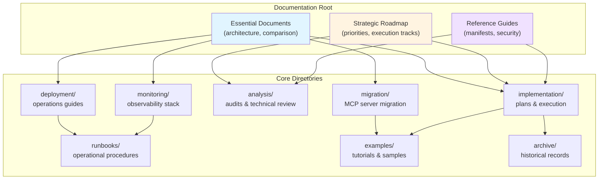

# Oneiric Documentation

**Version:** 0.3.3 (Audit: 95/100 at v0.2.0)
**Last Updated:** 2025-12-19

______________________________________________________________________

## Quick Navigation

### 🚀 Start Here

- [ONEIRIC_VS_ACB.md](ONEIRIC_VS_ACB.md) – Cut-over mandate + comparison vs ACB
- [oneiric/README.md](../oneiric/README.md) – Package map + extension points
- [STRATEGIC_ROADMAP.md](STRATEGIC_ROADMAP.md) – Vision, execution tracks, and milestones (kept in sync with the tracker below)
- [implementation/SERVERLESS_AND_PARITY_EXECUTION_PLAN.md](implementation/SERVERLESS_AND_PARITY_EXECUTION_PLAN.md) – Serverless + parity workstreams and next actions
- [implementation/ORCHESTRATION_PARITY_PLAN.md](implementation/ORCHESTRATION_PARITY_PLAN.md) – Events, DAGs, and supervisor roadmap
- [IMPLEMENTATION_PHASE_TRACKER.md](IMPLEMENTATION_PHASE_TRACKER.md) – Delivery phases, owners, and latest status for every roadmap item
- [implementation/CUTOVER_VALIDATION_CHECKLIST.md](implementation/CUTOVER_VALIDATION_CHECKLIST.md) – Artifact checklist (manifest, DAG/events JSON, telemetry, ChatOps)
- [deployment/CLOUD_RUN_BUILD.md](deployment/CLOUD_RUN_BUILD.md) – Cloud Run/buildpack deployment guide (Procfile-first)
- [UNCOMPLETED_TASKS.md](UNCOMPLETED_TASKS.md) – Open work items (reference only)

### 📌 Roadmap & Plan Crosswalk

| Reference | Purpose | Status Source |
|-----------|---------|----------------|
| **[STRATEGIC_ROADMAP.md](STRATEGIC_ROADMAP.md)** | Principles, recent decisions, execution tracks | Mirrors **[IMPLEMENTATION_PHASE_TRACKER.md](IMPLEMENTATION_PHASE_TRACKER.md)** |
| **[implementation/SERVERLESS_AND_PARITY_EXECUTION_PLAN.md](implementation/SERVERLESS_AND_PARITY_EXECUTION_PLAN.md)** | Serverless profile + adapter/action remediation blueprint | Status rolls up to the tracker |
| **[implementation/ORCHESTRATION_PARITY_PLAN.md](implementation/ORCHESTRATION_PARITY_PLAN.md)** | Event dispatcher, DAG runtime, supervisor milestones | Status rolls up to the tracker |
| **[IMPLEMENTATION_PHASE_TRACKER.md](IMPLEMENTATION_PHASE_TRACKER.md)** | Phase-by-phase owner + status table | Pulls inputs from the roadmap + plans above |

Use this table (and the links above) as the navigation loop: roadmap → plan → tracker → back to this index.

### 🔄 MCP Server Migration

- **[migration/MIGRATION_TRACKING_DASHBOARD.md](migration/MIGRATION_TRACKING_DASHBOARD.md)** – Live migration status dashboard (78 tasks, Gantt chart)
- **[migration/COMPATIBILITY_CONTRACT.md](migration/COMPATIBILITY_CONTRACT.md)** – Comprehensive compatibility contract for all migrations
- **[migration/OPERATIONAL_MODEL_DOCUMENTATION.md](migration/OPERATIONAL_MODEL_DOCUMENTATION.md)** – Crackerjack + Session-Buddy operational contracts
- **[migration/CLI_COMMAND_MAPPING_GUIDE.md](migration/CLI_COMMAND_MAPPING_GUIDE.md)** – Standardized CLI command reference
- **[migration/ROLLBACK_PROCEDURES_TEMPLATE.md](migration/ROLLBACK_PROCEDURES_TEMPLATE.md)** – Rollback procedures template
- **[migration/MIGRATION_CHECKLIST_TEMPLATE.md](migration/MIGRATION_CHECKLIST_TEMPLATE.md)** – Migration checklist template
- **[migration/TEST_COVERAGE_BASELINES.md](migration/TEST_COVERAGE_BASELINES.md)** – Test coverage baselines for all 5 projects
- **[migration/ACB_REMOVAL_INVENTORY.md](migration/ACB_REMOVAL_INVENTORY.md)** – ACB usage inventory across all projects
- **[migration/MCP_SERVER_MIGRATION_PLAN.md](migration/MCP_SERVER_MIGRATION_PLAN.md)** – Overall migration plan
- **[migration/audits/MIGRATION_BASELINE_AUDIT_mailgun-mcp.md](migration/audits/MIGRATION_BASELINE_AUDIT_mailgun-mcp.md)** – Example baseline audit

### 🧱 Architecture References

- **[NEW_ARCH_SPEC.md](NEW_ARCH_SPEC.md)** – Core architecture
- **[RESOLUTION_LAYER_SPEC.md](RESOLUTION_LAYER_SPEC.md)** – Resolver internals
- **[REMOTE_MANIFEST_SCHEMA.md](REMOTE_MANIFEST_SCHEMA.md)** – Manifest format
- **[SIGNATURE_VERIFICATION.md](SIGNATURE_VERIFICATION.md)** – Signature + security system
- **[analysis/NOSQL_ADAPTERS.md](analysis/NOSQL_ADAPTERS.md)** – MongoDB/DynamoDB configuration + manifests
- **[analysis/GRAPH_ADAPTERS.md](analysis/GRAPH_ADAPTERS.md)** – Neo4j configuration, manifests, and CLI usage

### 📊 Status & Quality

- **[implementation/STAGE5_FINAL_AUDIT_REPORT.md](implementation/STAGE5_FINAL_AUDIT_REPORT.md)** – Production readiness audit (95/100) ⭐
- **[analysis/QUALITY_AUDITS.md](analysis/QUALITY_AUDITS.md)** – Summary of architecture/code/test audits
- **[LOAD_TESTING.md](LOAD_TESTING.md)** – Load testing harness + CLI usage
- **[STRATEGIC_ROADMAP.md](STRATEGIC_ROADMAP.md)** – Live execution tracks + status (supersedes the old build progress log)
- **[archive/implementation/BUILD_PROGRESS.md](archive/implementation/BUILD_PROGRESS.md)** – Historical phase log (reference only)

### 🤖 AI & Agent Notes

- **[ai/AI_AGENT_COMPATIBILITY.md](ai/AI_AGENT_COMPATIBILITY.md)** – Guidance for agent integrations and safety constraints
- **[ai/ONNX_GUIDE.md](ai/ONNX_GUIDE.md)** – Local ONNX runtime setup for embeddings

______________________________________________________________________

## Documentation Structure

### `/` (Root) - Essential Documents

**Quick Reference:**

- **ONEIRIC_VS_ACB.md** – Cut-over strategy and comparison
- **STRATEGIC_ROADMAP.md** – Current priorities (Cloud Run/serverless, parity milestones)
- **UNCOMPLETED_TASKS.md** – Future work, known issues, recommendations
- **NEW_ARCH_SPEC.md** – Architecture overview
- **RESOLUTION_LAYER_SPEC.md** – Resolution system design
- **REMOTE_MANIFEST_SCHEMA.md** – Remote manifest format
- **SIGNATURE_VERIFICATION.md** – Security and signature system
- **OBSERVABILITY_GUIDE.md** – Logging, metrics, tracing
- **REBUILD_VS_REFACTOR.md** – Design decision rationale
- **archive/ACB_COMPARISON.md** – Original comparison (superseded by ONEIRIC_VS_ACB.md; kept for history)

### `/migration/` - MCP Server Migration

**Active Migration Project:**

- **MIGRATION_TRACKING_DASHBOARD.md** - Live project tracking (78 tasks, Gantt chart timeline)
- **COMPATIBILITY_CONTRACT.md** - Comprehensive compatibility contract for all migrations
- **OPERATIONAL_MODEL_DOCUMENTATION.md** - Crackerjack + Session-Buddy operational contracts
- **CLI_COMMAND_MAPPING_GUIDE.md** - Standardized CLI command reference
- **ROLLBACK_PROCEDURES_TEMPLATE.md** - Rollback procedures template
- **MIGRATION_CHECKLIST_TEMPLATE.md** - Migration checklist template
- **TEST_COVERAGE_BASELINES.md** - Test coverage baselines for all 5 projects
- **ACB_REMOVAL_INVENTORY.md** - ACB usage inventory across all projects
- **MCP_SERVER_MIGRATION_PLAN.md** - Overall migration plan

**Baseline Audits:**

- **audits/MIGRATION_BASELINE_AUDIT_mailgun-mcp.md** - Example baseline audit (other projects to follow)

### `/implementation/` - Plans & Execution

**Living Documents:**

- **SERVERLESS_AND_PARITY_EXECUTION_PLAN.md** – Serverless profile, Cloud Run posture, adapter/action parity
- **ORCHESTRATION_PARITY_PLAN.md** – Events, DAGs, service supervisors
- **ADAPTER_REMEDIATION_PLAN.md** / **ADAPTER_REMEDIATION_EXECUTION.md** – Adapter backlog & progress evidence
- **archive/implementation/GRAPH_ADAPTER_PLAN.md** – ArangoDB/DuckDB PGQ delivery plan (historical)
- **archive/implementation/MESSAGING_AND_SCHEDULER_ADAPTER_PLAN.md** – Delivery plan for SendGrid/Mailgun/Twilio + Cloud Tasks/Pub/Sub adapters (historical)
- **implementation/STAGE5_FINAL_AUDIT_REPORT.md** – Production readiness audit (95/100) ⭐

**Historical References (archived):**

- `docs/archive/implementation/BUILD_PROGRESS.md` – Phase-by-phase implementation log
- `docs/archive/implementation/UNIFIED_IMPLEMENTATION_PLAN.md` – Consolidated strategy (superseded)
- `docs/archive/implementation/WEEK*.md` and `docs/archive/implementation/*_COMPLETION.md` – Test completion + audit reports

### `/analysis/` - Audits & Technical Analysis

**Quality Audits:**

- **QUALITY_AUDITS.md** - Summary of architecture/code/test audits (full detail in Stage 5 report)

**Adapter Analysis:**

- **ACB_ADAPTER_ACTION_IMPLEMENTATION.md** - Adapter/action porting documentation
- **ADAPTER_GAP_AUDIT.md** - Live table of missing ACB adapters/actions
- **ADAPTER_OBSOLESCENCE_ANALYSIS.md** - Adapter deprecation analysis
- **ADAPTER_PORT_SUMMARY.md** - Adapter migration summary
- **ADAPTER_STRATEGY.md** - Adapter design strategy
- **NOSQL_ADAPTERS.md** - Configuration reference for MongoDB/DynamoDB adapters
- **GRAPH_ADAPTERS.md** - Graph adapter configuration (Neo4j) and manifest snippets
- **DUCKDB_ADAPTER.md** - DuckDB analytics adapter
- **archive/analysis/DNS_FILE_TRANSFER_ADAPTER_PLAN.md** - Blueprint + history for Cloudflare/Route53 DNS and FTP/SFTP/SCP/HTTP/HTTPS file transfer adapters (Wave C backlog sign-off)
- **EMBEDDING_ADAPTERS.md** - Embedding adapter implementations (OpenAI, SentenceTransformers, ONNX)
- **VECTOR_ADAPTERS.md** - Vector DB adapters (Pinecone, Qdrant)

### `/archive/` - Historical Records

- **archive/README.md** - Index of completion reports and plans slated for long-term storage.

**Archive policy:** Move completed or superseded plans/reports into `docs/archive/`, add a brief archive notice at the top of the file, and update this index so new contributors stay focused on current guidance.

### `/deployment/` - Production Operations

**Deployment Guides:**

- **CLOUD_RUN_BUILD.md** - Buildpack + Procfile deployment guide for Cloud Run (default path)
- **SYSTEMD_DEPLOYMENT.md** - Linux systemd services (still used for local agents)

### `/monitoring/` - Observability Stack

**Monitoring Setup:**

- **PROMETHEUS_SETUP.md** - Metrics, alerts, recording rules (1,004 lines)
- **GRAFANA_DASHBOARDS.md** - 6 dashboard specifications (818 lines)
- **LOKI_SETUP.md** - Log aggregation, 40+ queries (826 lines)
- **ALERTING_SETUP.md** - AlertManager configuration (688 lines)

### `/runbooks/` - Operational Procedures

**Incident Management:**

- **INCIDENT_RESPONSE.md** - 5 incident scenarios (1,344 lines)
- **MAINTENANCE.md** - 3 maintenance procedures (929 lines)
- **TROUBLESHOOTING.md** - 15 common issues (959 lines)
- **SERVICE_SUPERVISOR.md** - Pause/drain workflow, CLI proofs, Cloud Run guidance

### `/examples/` - Tutorials & Samples

**Sample Code + Runbooks:**

- **LOCAL_CLI_DEMO.md** - CLI usage examples (now covers ChatOps replay flags)
- **CRACKERJACK_OBSERVABILITY.md** - Crackerjack DAG/event/telemetry capture workflow
- **FASTBLOCKS_OBSERVABILITY.md** - Fastblocks parity inspector checklist + CLI commands
- **SESSION_MGMT_MCP_OBSERVABILITY.md** - Session-Mgmt MCP observability and ChatOps transcript capture
- **EVENT_ROUTING_OBSERVABILITY.md** - Event subscriber inspector + CLI emit proof for parity reviews
- **FASTBLOCKS_PARITY_FIXTURE.yaml** - Shared manifest used by docs, CLI demos, and migration tests
- **sample_remote_manifest.yaml / sample_remote_manifest_v2.yaml** - Canonical manifests with serverless profile toggles, Procfile-ready metadata, and full adapter coverage for local rehearsals
- **plugins/hello_oneiric_plugin/** - Example plugin implementation

______________________________________________________________________

## Key Documents by Use Case

```mermaid
graph TD
    subgraph "New User Journey"
        NU1["1. ONEIRIC_VS_ACB.md<br/>Understand relationship"]
        NU2["2. NEW_ARCH_SPEC.md<br/>Learn architecture"]
        NU3["3. LOCAL_CLI_DEMO.md<br/>Try CLI commands"]
        NU4["4. OBSERVABILITY_GUIDE.md<br/>Set up logging"]
    end

    subgraph "Operator Journey"
        OP1["1. deployment/<br/>Choose deployment method"]
        OP2["2. monitoring/<br/>Set up observability"]
        OP3["3. runbooks/<br/>Learn procedures"]
        OP4["4. INCIDENT_RESPONSE.md<br/>Practice incident response"]
    end

    subgraph "Developer Journey"
        DEV1["1. RESOLUTION_LAYER_SPEC.md<br/>Resolution internals"]
        DEV2["2. REMOTE_MANIFEST_SCHEMA.md<br/>Manifest format"]
        DEV3["3. SIGNATURE_VERIFICATION.md<br/>Security system"]
        DEV4["4. implementation/<br/>Active plans"]
        DEV5["5. analysis/<br/>Quality audits"]
    end

    subgraph "Migration Journey"
        MIG1["1. ONEIRIC_VS_ACB.md<br/>Migration guide"]
        MIG2["2. ACB_ADAPTER_ACTION_IMPLEMENTATION.md<br/>Porting details"]
        MIG3["3. CUTOVER_VALIDATION_CHECKLIST.md<br/>Required artifacts"]
        MIG4["4. migration/<br/>Tracking dashboard"]
    end

    subgraph "Planning Journey"
        PLAN1["1. STAGE5_FINAL_AUDIT_REPORT.md<br/>Production readiness"]
        PLAN2["2. STRATEGIC_ROADMAP.md<br/>Current priorities"]
        PLAN3["3. SERVERLESS_AND_PARITY_EXECUTION_PLAN.md<br/>Execution plan"]
        PLAN4["4. UNCOMPLETED_TASKS.md<br/>Future enhancements"]
    end

    NU1 --> NU2 --> NU3 --> NU4
    OP1 --> OP2 --> OP3 --> OP4
    DEV1 --> DEV2 --> DEV3 --> DEV4 --> DEV5
    MIG1 --> MIG2 --> MIG3 --> MIG4
    PLAN1 --> PLAN2 --> PLAN3 --> PLAN4

    style NU1 fill:#e1f5ff
    style OP1 fill:#fff4e1
    style DEV1 fill:#f0e1ff
    style MIG1 fill:#ffe1f0
    style PLAN1 fill:#e1ffe1
```

**### For New Users**

1. **[ONEIRIC_VS_ACB.md](ONEIRIC_VS_ACB.md)** - Understand Oneiric vs ACB relationship
1. **[NEW_ARCH_SPEC.md](NEW_ARCH_SPEC.md)** - Learn core architecture
1. **[examples/LOCAL_CLI_DEMO.md](examples/LOCAL_CLI_DEMO.md)** - Try CLI commands
1. **[OBSERVABILITY_GUIDE.md](OBSERVABILITY_GUIDE.md)** - Set up logging/metrics

### For Operators

1. **[deployment/](deployment/)** - Choose deployment method (Cloud Run or systemd)
1. **[monitoring/](monitoring/)** - Set up observability stack
1. **[runbooks/](runbooks/)** - Incident response procedures
1. **[UNCOMPLETED_TASKS.md](UNCOMPLETED_TASKS.md)** - Known issues and limitations

### For Developers

1. **[RESOLUTION_LAYER_SPEC.md](RESOLUTION_LAYER_SPEC.md)** - Resolution system internals
1. **[REMOTE_MANIFEST_SCHEMA.md](REMOTE_MANIFEST_SCHEMA.md)** - Remote manifest format
1. **[SIGNATURE_VERIFICATION.md](SIGNATURE_VERIFICATION.md)** - Security implementation
1. **[implementation/](implementation/)** - Active plans (serverless/parity, adapter remediation); completion reports now live in [archive/implementation/](archive/implementation/)
1. **[analysis/](analysis/)** - Code quality and audit reports

### For Migration from ACB

1. **[ONEIRIC_VS_ACB.md](ONEIRIC_VS_ACB.md)** - Complete migration/cut-over guide
1. **[analysis/ACB_ADAPTER_ACTION_IMPLEMENTATION.md](analysis/ACB_ADAPTER_ACTION_IMPLEMENTATION.md)** - Adapter porting details
1. **[implementation/CUTOVER_VALIDATION_CHECKLIST.md](implementation/CUTOVER_VALIDATION_CHECKLIST.md)** - Required artifacts before flipping to Oneiric
1. **[examples/FASTBLOCKS_PARITY_FIXTURE.yaml](examples/FASTBLOCKS_PARITY_FIXTURE.yaml)** - Canonical manifest mirrored in CI + docs
1. **`docs/examples/*_OBSERVABILITY.md`** - Repo-specific DAG/event/telemetry/ChatOps capture instructions
1. **[UNCOMPLETED_TASKS.md](UNCOMPLETED_TASKS.md)** - Remaining parity items (spoiler: nothing critical)

### For MCP Server Migrations

1. **[migration/MIGRATION_TRACKING_DASHBOARD.md](migration/MIGRATION_TRACKING_DASHBOARD.md)** - Live migration status and timeline
1. **[migration/COMPATIBILITY_CONTRACT.md](migration/COMPATIBILITY_CONTRACT.md)** - Compatibility contract and requirements
1. **[migration/OPERATIONAL_MODEL_DOCUMENTATION.md](migration/OPERATIONAL_MODEL_DOCUMENTATION.md)** - Crackerjack + Session-Buddy contracts
1. **[migration/CLI_COMMAND_MAPPING_GUIDE.md](migration/CLI_COMMAND_MAPPING_GUIDE.md)** - Standardized CLI commands
1. **[migration/TEST_COVERAGE_BASELINES.md](migration/TEST_COVERAGE_BASELINES.md)** - Pre-migration test coverage baselines
1. **[migration/ROLLBACK_PROCEDURES_TEMPLATE.md](migration/ROLLBACK_PROCEDURES_TEMPLATE.md)** - Rollback procedures
1. **[migration/ACB_REMOVAL_INVENTORY.md](migration/ACB_REMOVAL_INVENTORY.md)** - ACB dependency inventory

### For Project Planning

1. **[implementation/STAGE5_FINAL_AUDIT_REPORT.md](implementation/STAGE5_FINAL_AUDIT_REPORT.md)** - Production readiness (95/100)
1. **[STRATEGIC_ROADMAP.md](STRATEGIC_ROADMAP.md)** - Current strategic priorities
1. **[implementation/SERVERLESS_AND_PARITY_EXECUTION_PLAN.md](implementation/SERVERLESS_AND_PARITY_EXECUTION_PLAN.md)** - Serverless + parity execution plan
1. **[implementation/ORCHESTRATION_PARITY_PLAN.md](implementation/ORCHESTRATION_PARITY_PLAN.md)** - Orchestration parity roadmap
1. **[implementation/CUTOVER_VALIDATION_CHECKLIST.md](implementation/CUTOVER_VALIDATION_CHECKLIST.md)** - Migration validation workflow + repo sign-off table
1. **[UNCOMPLETED_TASKS.md](UNCOMPLETED_TASKS.md)** - Future enhancements + known issues
1. **[archive/implementation/BUILD_PROGRESS.md](archive/implementation/BUILD_PROGRESS.md)** - Historical phase log

______________________________________________________________________

## Quick Stats

**Production Readiness:**

- ✅ **95/100** audit score (Excellent)

- ✅ **526 tests** passing (96.3% pass rate)

- ✅ **83% coverage** (138% of 60% target)

- ✅ **Zero critical blockers**

- ✅ **All P0 security vulnerabilities resolved**

- **Documentation Completeness:**

- ✅ Comprehensive operational runbooks (3,232 lines)

- ✅ Complete monitoring setup (3,336 lines)

- ✅ Detailed deployment guides (Cloud Run + systemd)

- ✅ Thorough implementation tracking (dozens of completion reports)

**Code Quality:**

- ✅ **Modern Python** (3.13+, 3.14 planned)
- ✅ **Type-safe** (Pydantic throughout)
- ✅ **Observable** (structlog, OpenTelemetry)

______________________________________________________________________

## Document Maintenance

### Outdated Documents

**Superseded (now in `docs/archive/implementation/`):**

- `BUILD_PROGRESS.md`, `UNIFIED_IMPLEMENTATION_PLAN.md`, weekly summaries, and every `*_COMPLETION.md` test report now live in `archive/implementation/`.
- Historical comparison docs remain available under `archive/` (superseded by ONEIRIC_VS_ACB.md).

**Outdated Audits (see implementation/STAGE5_FINAL_AUDIT_REPORT.md + QUALITY_AUDITS.md):**

- Older audit files were removed; the summaries now live in `analysis/QUALITY_AUDITS.md`.

### Living Documents (Updated Regularly)

- **STRATEGIC_ROADMAP.md** - Updated as priorities shift
- **implementation/SERVERLESS_AND_PARITY_EXECUTION_PLAN.md** - Updated whenever serverless/parity scope changes
- **implementation/ORCHESTRATION_PARITY_PLAN.md** - Updated as events/DAGs/supervisor work lands
- **implementation/ADAPTER_REMEDIATION_PLAN.md** / **ADAPTER_REMEDIATION_EXECUTION.md** - Updated with adapter progress
- **UNCOMPLETED_TASKS.md** - Updated quarterly
- **implementation/STAGE5_FINAL_AUDIT_REPORT.md** - Updated with each release
- **ONEIRIC_VS_ACB.md** - Updated as ACB evolves

### Static Reference Documents

- NEW_ARCH_SPEC.md
- RESOLUTION_LAYER_SPEC.md
- REMOTE_MANIFEST_SCHEMA.md
- SIGNATURE_VERIFICATION.md

### Archive Workflow

- Follow `archive/README.md` when moving phased completion reports or superseded plans so the active docs stay concise without losing historical detail.

______________________________________________________________________

## Contributing to Documentation

### Adding New Docs

**Categorize by purpose:**

- `/` - Core architecture and essential reference
- `/migration/` - MCP server migration documentation and tracking
- `/implementation/` - Build progress, plans, completion reports
- `/analysis/` - Audits, quality assessments, technical analysis
- `/deployment/` - Deployment guides and operations
- `/monitoring/` - Observability stack configuration
- `/runbooks/` - Operational procedures
- `/examples/` - Tutorials and sample code

### Updating Docs

**When updating major docs, also update:**

1. This README.md (Quick Navigation, Key Documents sections)
1. /Users/les/Projects/oneiric/README.md (main project README)
1. /Users/les/Projects/oneiric/oneiric/README.md (package map and extension points)
1. /Users/les/Projects/oneiric/CLAUDE.md (project instructions)

______________________________________________________________________

## Feedback & Questions

For questions about documentation:

1. Check this README for document location
1. Start with ONEIRIC_VS_ACB.md for general overview
1. Refer to UNCOMPLETED_TASKS.md for known limitations
1. Check implementation/ for build status
1. Review analysis/ for quality assessments

**Documentation is production-ready.** All critical operational docs are complete and comprehensive.
