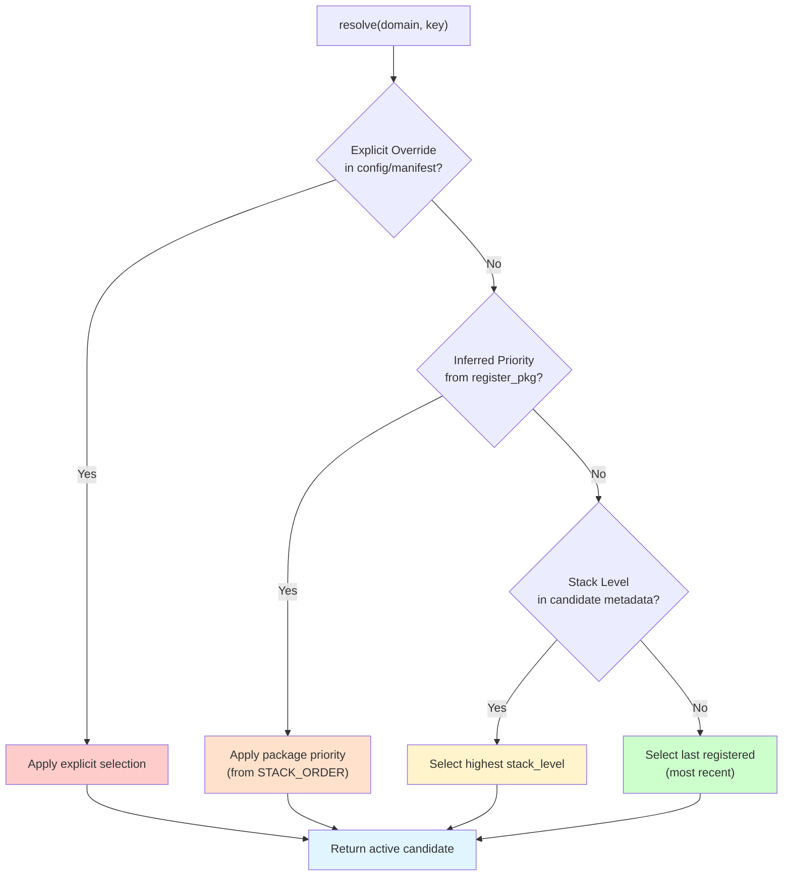
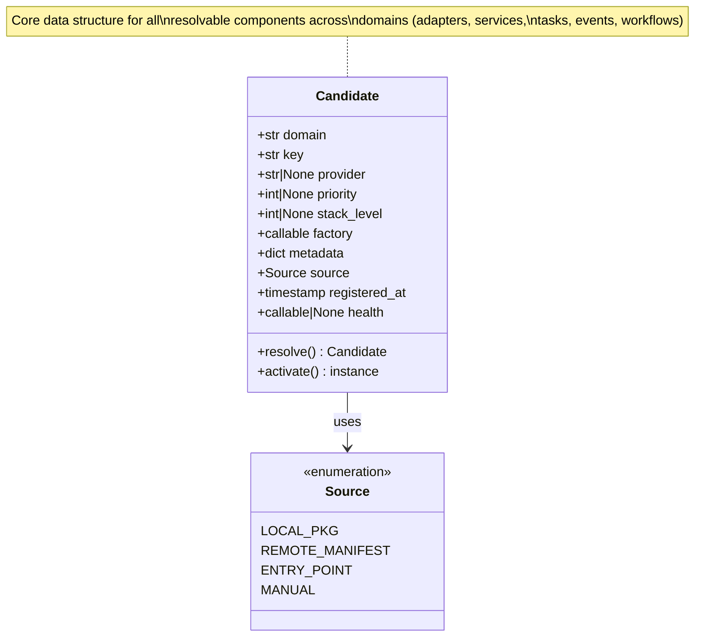
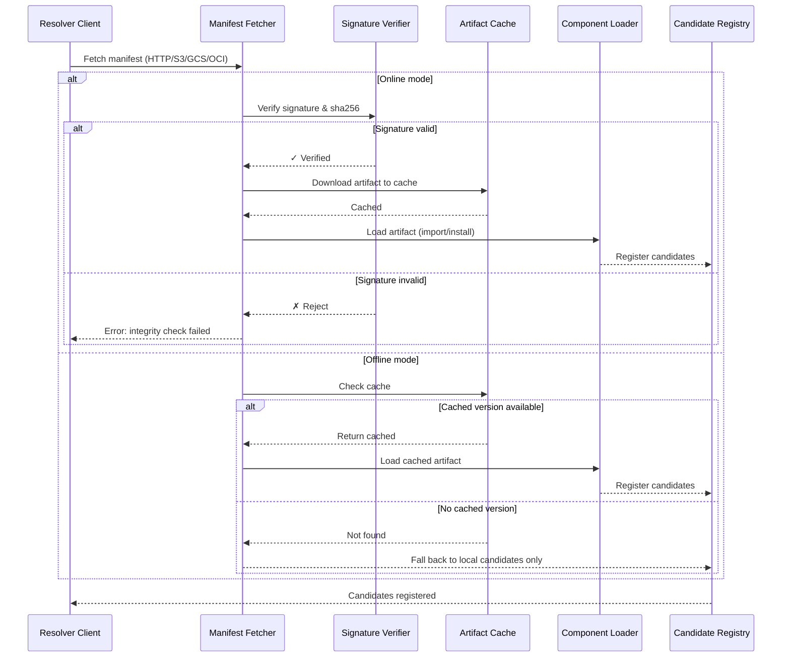
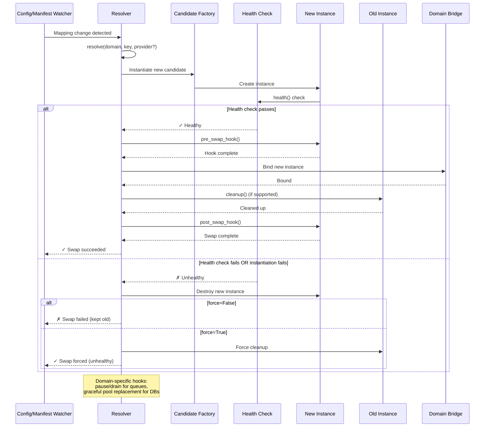

# Resolution Layer Specification

This specification defines a shared discovery/registration/resolver layer for all pluggable domains (adapters, services, tasks, events, workflows) with stack-aware precedence, hot swapping, and remote-sourced candidates.

## Scope

- Domains: adapters (by category), services (by service_id), tasks (by task_type), events (by event_name/type), workflows (by workflow_id, optional version).
- Sources: local packages (via register_pkg), remote manifests (HTTP/S3/GCS/OCI), entry points (oneiric.\* plugin groups).
- Features: precedence resolution, optional capability negotiation, activation/hot swap, observability, remote fetch with integrity checks.

## Terminology

- Candidate: A resolvable item for a domain/key with metadata and a factory/init hook.
- Active: The candidate currently bound for a domain/key.
- Shadowed: Candidate that lost resolution but remains registered for introspection.
- Priority: Numeric ordering derived from package inference or explicit config.
- Stack level (z-index): Optional integer on the candidate metadata used as a tie-breaker inside a package.

## Precedence Rules

Applied in order for each domain/key (highest wins):

**Precedence Order** (highest to lowest):

1. **Explicit override** (config/manifest selection).
1. **Inferred priority** from register_pkg (caller path mapped to stack order; fallback heuristics).
1. **Candidate metadata stack_level** (higher wins).
1. **Registration order** (last registered wins).

## Data Model (Candidate)

**Candidate Fields:**

- **domain**: str (adapter|service|task|event|workflow)
- **key**: str (category/service_id/task_type/event_name/workflow_id[+version])
- **provider**: str | None (human-readable provider/implementation id)
- **priority**: int | None (inferred; higher means higher precedence)
- **stack_level**: int | None (optional z-index)
- **factory**: callable or import path (creates/returns the instance or handler)
- **metadata**: dict (includes version, capabilities, source info)
- **source**: enum (local_pkg | remote_manifest | entry_point | manual)
- **registered_at**: timestamp
- **health**: optional callable for readiness checks

## APIs

- Discovery inputs:
  - `discover_from_pkg(name, path, priority)` -> list[Candidate]
  - `discover_from_manifest(manifest_descriptor)` -> list[Candidate]
  - `discover_from_entry_points(group)` -> list[Candidate]
- Registration:
  - `register_candidate(candidate: Candidate) -> None`
  - Side effect: update per-domain registry and recompute active/shadowed.
- Resolution:
  - `resolve(domain, key, capabilities=None, require_all=True) -> Candidate | None` (applies precedence rules + optional capability filtering)
  - `list_active(domain) -> list[Candidate]`
  - `list_shadowed(domain) -> list[Candidate]`
- Activation/Hot swap:
  - `activate(domain, key) -> instance` (instantiate active candidate lazily)
  - `swap(domain, key, provider=None, force=False) -> instance`
    - Re-resolve with optional provider filter.
    - Instantiate and health-check new candidate.
    - Call cleanup() on old instance if supported.
    - Commit or rollback (unless force).
- Observability:
  - `explain(domain, key) -> decision trace` (why winner, why losers)
  - Emit events/hooks for pre/post swap and registration.

## Remote Manifest

**Manifest Entry Fields:** domain, key, provider, uri, sha256, optional signature, optional stack_level, optional version, source label.

**Flow Steps:**

1. Fetch manifest (HTTP/S3/GCS/OCI).
1. Verify signature/digest.
1. Download artifact to cache; install/import or place on sys.path.
1. Register candidates with manifest-provided stack_level and source priority.
1. Fallback: use cached artifact if offline; otherwise fall back to local candidates.

## Domain Integration

```mermaid
graph TB
    subgraph "Resolver Layer"
        Resolver["Resolver<br/>(shared across all domains)"]
        CandidateRegistry["Candidate Registry<br/>(active + shadowed)"]
    end

    subgraph "Adapter Domain"
        AdapterFind["_find_adapter()"]
        AdapterImport["import_adapter()"]
        AdapterBridge["AdapterBridge"]
    end

    subgraph "Service Domain"
        ServiceSelect["select service_id"]
        ServiceBind["service registry binding"]
        ServiceBridge["ServiceBridge"]
    end

    subgraph "Task Domain"
        TaskSelect["select task_type"]
        TaskQueue["queue binds handler"]
        TaskBridge["TaskBridge"]
    end

    subgraph "Event Domain"
        EventSelect["select event_name"]
        EventBind["bind highest winner<br/>or multiple with priority"]
        EventBridge["EventBridge"]
    end

    subgraph "Workflow Domain"
        WorkflowSelect["select workflow_id + version"]
        WorkflowActivate["activation flag + swap"]
        WorkflowBridge["WorkflowBridge"]
    end

    Resolver <--> CandidateRegistry

    AdapterFind --> Resolver
    AdapterImport --> Resolver
    AdapterBridge --> Resolver

    ServiceSelect --> Resolver
    ServiceBind --> Resolver
    ServiceBridge --> Resolver

    TaskSelect --> Resolver
    TaskQueue --> Resolver
    TaskBridge --> Resolver

    EventSelect --> Resolver
    EventBind --> Resolver
    EventBridge --> Resolver

    WorkflowSelect --> Resolver
    WorkflowActivate --> Resolver
    WorkflowBridge --> Resolver

    style Resolver fill:#e1f5ff
    style CandidateRegistry fill:#fff4e1
```

**Domain-Specific Integration:**

- **Adapters**: tie resolver into import_adapter/\_find_adapter; add stack_level to Adapter metadata; use resolver for enablement and swaps.
- **Services**: resolver selects service class per service_id before registry binding.
- **Tasks**: resolver selects handler per task_type; queue binds active handler.
- **Events**: resolver selects handler(s) per event name/type; bind highest winner; optionally allow multiple with priority ordering.
- **Workflows**: resolver selects workflow definition/engine per workflow_id [+ version]; support activation flag and swap.

## Hot Swap Lifecycle

**Lifecycle Steps:** resolve target → instantiate → health check → pre_swap hook → bind new → cleanup old → post_swap hook.
**Rollback Policy:** Rollback if instantiation/health check fails (unless force).
**Trigger:** Config/manifest watcher triggers swap when mappings change.
**Domain Hooks:** e.g., pause/drain for queues, graceful DB pool replacement.

## Security & Integrity

- Require sha256 (and optional signature) for remote artifacts.
- Enforce allowlist/denylist for sources; configurable cache directory.
- Do not auto-execute arbitrary code without digest verification.

## Observability

- Per-domain tables: active vs shadowed, priorities, stack_level, source, timestamps.
- Decision trace: show which rule decided the winner.
- Metrics: swap attempts, successes/failures, resolution latency.

## Compatibility & Migration

```mermaid
graph LR
    Step1["Step 1: Implement Core<br/>In-memory resolver/registry"]
    Step2["Step 2: Route Adapters<br/>Tie into import_adapter/_find_adapter"]
    Step3["Step 3: Add Hot Swap<br/>Enable adapter hot swapping"]
    Step4["Step 4: Extend Domains<br/>Add services/tasks/events/workflows"]
    Step5["Step 5: Observability<br/>Add metrics, tracing, explain API"]
    Step6["Step 6: Remote Manifest<br/>Enable remote component delivery"]

    Step1 --> Step2 --> Step3 --> Step4 --> Step5 --> Step6

    style Step1 fill:#e1f5ff
    style Step2 fill:#fff4e1
    style Step3 fill:#f0e1ff
    style Step4 fill:#ffe1f0
    style Step5 fill:#e1ffe1
    style Step6 fill:#ffffe1
```

**Migration Strategy:**

- **Backward Compatible**: Defaults maintain current behavior if no stack_level or remote manifests are present.
- **Existing Calls**: Existing register\_\* calls keep working; they flow through register_candidate internally.
- **Incremental Adoption**:
  1. Implement resolver/registry in-memory.
  1. Route adapters through it.
  1. Add hot swap for adapters.
  1. Extend to services/tasks/events/workflows.
  1. Add observability and remote manifest support.
