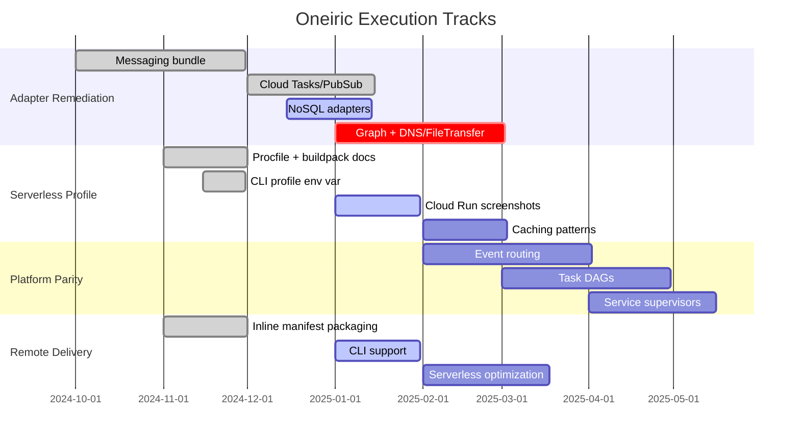
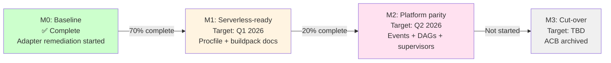

# Oneiric Strategic Roadmap

**Last Updated:** 2025-12-09
**Audience:** Platform Core, Runtime Team, Docs Team
**Purpose:** Provide a concise, up-to-date map of Oneiric’s end-state vision, near-term priorities, and how existing plans fit together so contributors don’t have to chase multiple documents. Progress for every track is mirrored in \[\[IMPLEMENTATION_PHASE_TRACKER|`docs/IMPLEMENTATION_PHASE_TRACKER.md`\]\], while detailed execution steps live in \[\[SERVERLESS_AND_PARITY_EXECUTION_PLAN|`docs/implementation/SERVERLESS_AND_PARITY_EXECUTION_PLAN.md`\]\] and \[\[ORCHESTRATION_PARITY_PLAN|`docs/implementation/ORCHESTRATION_PARITY_PLAN.md`\]\]. For a full documentation index (architecture, reference, runbooks), start with \[\[README|`docs/README.md`\]\].

______________________________________________________________________

## 1. Vision & Principles

1. **Single-platform future** – Oneiric will fully replace ACB (adapters + services + tasks + events). No hybrid deployment path will be supported because no production workloads depend on ACB.
1. **Serverless-first** – Optimize for Google Cloud Run / buildpack deployments with fast cold starts and Procfile-based launches; systemd remains the only local agent path.
1. **Explainable infrastructure** – Preserve Oneiric’s strengths (resolver precedence, “why” tooling, remote manifests) while extending them to orchestration domains.
1. **Lean bundles** – Heavy SDKs live in extras; adapters lazy-load their dependencies; per-function bundles keep serverless artifacts slim.
1. **Secrets precedence** – Secret Manager adapters (GCP/AWS/etc.) are preferred over raw env vars in serverless profiles to keep deployments stateless and safe.

______________________________________________________________________

## Recent Decisions (December 2025)

1. **Track G follow-up:** Runtime modernization (httpx loader, tenacity/aiobreaker, watchfiles, sqlite activity store) is complete. Follow-on work is captured in `docs/implementation/SERVERLESS_AND_PARITY_EXECUTION_PLAN.md`.
1. **Secrets + config:** Serverless profile prefers Secret Manager adapters → env adapters as fallback; inline manifests are packaged inside the build artifact.
1. **Adapter hygiene:** `_base.py` helpers are retired; `common.py` modules own shared logic with lazy imports. Guard optional dependencies via extras.
1. **ACB sunset:** Oneiric replaces ACB in a single cut-over. No re-integration into ACB or hybrid MCP server strategy is planned; Crackerjack/FastBlocks expose MCP layers if desired.
1. **Doc cleanup:** Historical week-by-week completion docs will be moved under `docs/archive/` so strategic plans stay concise.
1. **Profile flag:** `oneiric.cli` now exposes `--profile` (default/serverless) so Cloud Run builds call `uv run python -m oneiric.cli orchestrate --profile serverless`.
1. **Messaging & scheduler parity:** SendGrid, Mailgun, Twilio, Cloud Tasks, and Pub/Sub adapters are now built-in with docs/tests. Notification hooks + orchestration wiring are the remaining items for this wave.
1. **ChatOps coverage:** Slack, Teams, and generic webhook adapters now ship with NotificationMessage support, CLI/demo coverage, and serverless-ready manifest entries.
1. **Profile env var fallback:** `oneiric.cli` and `main.py` now read `ONEIRIC_PROFILE`, so Cloud Run/Procfile deploys can pin the serverless profile via env vars without editing settings files; pytest coverage lives under `tests/core/test_profiles.py` and `tests/core/test_serverless_profile.py`.

______________________________________________________________________

## 2. Deployment Posture

| Aspect | Decision | References |
|--------|----------|------------|
| Runtime Target | Google Cloud Run (or equivalent) | `Procfile`, `README.md` (Operations section) |
| Build Strategy | Prefer Cloud Native Buildpacks; `pack build`/`gcloud run deploy --source .`; Procfile-first bootstrap via `oneiric.cli orchestrate --profile serverless` | `Procfile`, `docs/deployment/CLOUD_RUN_BUILD.md` |
| Config Source | Secret adapters (GCP default) + inline manifests (remote polling off by default in serverless profile) | `oneiric.core.config`, serverless plan |
| Hot-Swap/Watchers | Optional; enabled for long-lived services (Crackerjack) but disabled in serverless profile to minimize cold starts | `SERVERLESS_AND_PARITY_EXECUTION_PLAN.md §3` |

______________________________________________________________________

## 3. Execution Tracks

**Track Overview:**

| Track | Goal | Key Tasks | Status |
|-------|------|-----------|--------|
| **Adapter Remediation** | Complete registration, dependency hygiene, metadata coverage, tests | `ADAPTER_REMEDIATION_PLAN.md`, `ADAPTER_REMEDIATION_EXECUTION.md` | In progress (Messaging bundle, Cloud Tasks/PubSub, NoSQL, and streaming queues shipped; graph + DNS/FileTransfer next) |
| **Serverless Profile** | Procfile, buildpack docs, stateless resolver mode, lazy imports | ✅ CLI/main honor `ONEIRIC_PROFILE`, Procfile+Cloud Run guide live, watchers/remote polling disabled by default in profile; remaining work: capture Cloud Run screenshots + doc caching patterns | In progress (`SERVERLESS_AND_PARITY_EXECUTION_PLAN.md`) |
| **Platform Parity** | Bring events, task DAGs, service supervisors into Oneiric | Define roadmap, port orchestration features, ensure Cloud Run readiness | Planned (`ORCHESTRATION_PARITY_PLAN.md`) |
| **Remote Delivery** | Keep remote manifests usable for both long-lived and serverless deployments | Document inline manifest packaging; add CLI support | Partial |
| **Runtime Modernization** | Replace bespoke infra (artifact fetcher, resiliency, watchers, activity store) with best-in-class libraries | Shipped: httpx loader, tenacity/aiobreaker, watchfiles-based watchers, sqlite-backed activity store (see Track G execution doc) | Complete |

______________________________________________________________________

## 4. Milestones

**Milestone Details:**

1. **M0 – Baseline (Complete):** Adapter remediation underway, HTTP regression fixed, remote tests restored.
1. **M1 – Serverless-ready runtime (Target Q1 2026):** Procfile + buildpack docs, resolver/serverless profile, lazy import guards.
1. **M2 – Platform parity (Target Q2 2026):** Event routing, task DAGs, service supervisors implemented in Oneiric; parity tests run.
1. **M3 – Cut-over (TBD):** Crackerjack, FastBlocks, session-mgmt-mcp move to Oneiric-only deployments; ACB archived.

______________________________________________________________________

## 5. Document Map

| Topic | Primary Doc | Supporting Docs |
|-------|-------------|-----------------|
| Strategy vs ACB | `docs/ONEIRIC_VS_ACB.md` | `docs/archive/ACB_COMPARISON.md` (historical) |
| Adapter remediation | `docs/implementation/ADAPTER_REMEDIATION_PLAN.md` | `docs/implementation/ADAPTER_REMEDIATION_EXECUTION.md` |
| Deployment | `README.md` (Operations) | `Procfile`, `docs/deployment/` (Cloud Run/systemd) |
| Roadmaps | `docs/implementation/SERVERLESS_AND_PARITY_EXECUTION_PLAN.md`, this file | `docs/archive/implementation/UNIFIED_IMPLEMENTATION_PLAN.md` (historical), `docs/archive/implementation/BUILD_PROGRESS.md` |
| Orchestration parity | `docs/implementation/ORCHESTRATION_PARITY_PLAN.md` | `docs/STRATEGIC_ROADMAP.md §3`, `docs/implementation/ADAPTER_REMEDIATION_EXECUTION.md §7` |
| Serverless profile design | `docs/implementation/SERVERLESS_AND_PARITY_EXECUTION_PLAN.md` | Update this doc + remediation plan when spec lands |

______________________________________________________________________

## 6. Action Items

1. **Serverless profile spec:** capture toggles + inline manifest packaging in `SERVERLESS_AND_PARITY_EXECUTION_PLAN.md` and wire the implementation. *(Procfile.cloudrun now checked in so the serverless entrypoint stays explicit.)*
1. **Buildpack guide:** add `docs/deployment/CLOUD_RUN_BUILD.md` (Procfile, `pack`, `gcloud run`) and cross-link from README.
1. **Parity backlog:** keep `ORCHESTRATION_PARITY_PLAN.md` synced with workstream WS-B (events, DAGs, supervisors) so repos know the cut-over timeline.
1. **Adapter parity audit:** diff `ACB_ADAPTER_ACTION_IMPLEMENTATION.md` vs shipped adapters; focus on the remaining graph + DNS/FileTransfer backlog now that NoSQL + streaming queues are complete.
1. **Doc hygiene:** move historical weekly completion docs into `docs/archive/` and keep this roadmap + the execution plan as the living sources.

Keep this file as the authoritative “strategy snapshot” and update it whenever priorities shift so other docs (plans, analyses, audits) stay consistent.

______________________________________________________________________

## 7. Decision Log (December 2025)

| Decision | Rationale | Linked Work |
|----------|-----------|-------------|
| Oneiric fully replaces ACB with no hybrid deployments | No production workloads depend on ACB; simplifies parity scope | §1 Vision, `docs/implementation/ORCHESTRATION_PARITY_PLAN.md` |
| Serverless-first posture (Cloud Run + buildpacks + Procfile) | Target Google Cloud Run/Cloud Run–like runtimes, minimize cold starts | `docs/deployment/CLOUD_RUN_BUILD.md`, Procfile, serverless profile toggles |
| Secret Manager adapters take precedence over env vars | Keeps serverless deployments stateless + compliant | `oneiric.core.config`, serverless profile blueprint |
| `_base.py` helpers retired in favor of `common.py` modules | Reduce heavy imports + align with lazy extras | `docs/implementation/ADAPTER_REMEDIATION_EXECUTION.md` §4 |
| Remote loader uses `httpx` + `tenacity/aiobreaker`; watchers default off in serverless profile | Track G modernization eliminates bespoke infra and optimizes cold starts | `oneiric/remote/loader.py`, `docs/implementation/SERVERLESS_AND_PARITY_EXECUTION_PLAN.md` |
| Slack/Teams/webhook adapters deliver ChatOps parity | Enables Oneiric-based orchestrations to emit notifications without ACB | `docs/archive/implementation/MESSAGING_AND_SCHEDULER_ADAPTER_PLAN.md`, `docs/examples/LOCAL_CLI_DEMO.md` |
| Messaging + scheduler adapters promoted to built-ins | Ensures serverless profile ships with Mailgun, Twilio, Cloud Tasks, Pub/Sub ready for orchestration parity | `docs/archive/implementation/MESSAGING_AND_SCHEDULER_ADAPTER_PLAN.md`, `docs/examples/LOCAL_CLI_DEMO.md` |
