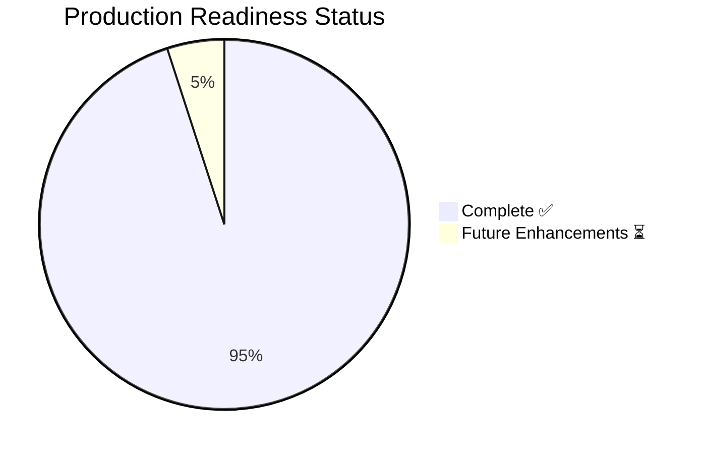
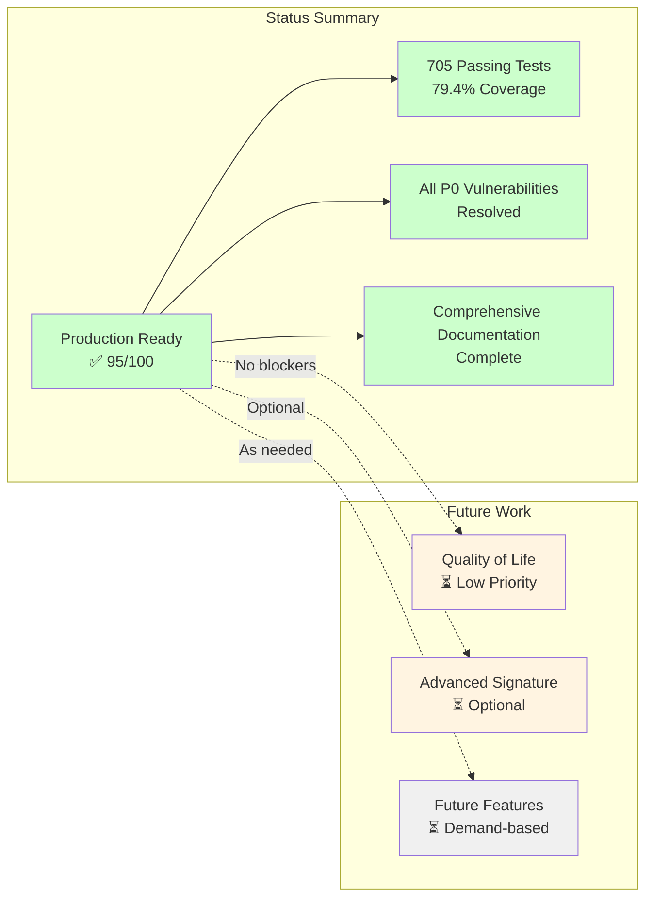

# Oneiric: Uncompleted Tasks & Future Enhancements

**Last Updated:** 2025-12-19
**Project Version:** 0.3.3 (Audit: 95/100 at v0.2.0)
**Status:** Production-ready with planned enhancements

______________________________________________________________________

## Executive Summary

**Current State:** Oneiric is **production-ready** (95/100 audit score). Core features are implemented; use the Stage 5 audit for baseline metrics and `coverage.json` for the latest coverage snapshot.

**Uncompleted Items:** The items below are **future enhancements**, not blockers. The project is ready for controlled production deployment.

______________________________________________________________________

## 1. Future Enhancements (From archive/ACB_COMPARISON.md)

### Priority: LOW (Nice-to-Have Features)

These were listed in docs as "Pending (Phases 4-7)" but are **not required** for production use:

| Feature | Status | Priority | Notes |
|---------|--------|----------|-------|
| **Plugin protocol & entry points** | ✅ **COMPLETE** | HIGH | Implemented in v0.2.0 |
| **Signature verification** | ✅ **COMPLETE** | HIGH | ED25519 implemented |
| **Advanced observability & resiliency** | ✅ **COMPLETE** | HIGH | Remote loader now uses httpx + tenacity/aiobreaker; watchers moved to watchfiles with serverless fallbacks; domain activity persistence runs on sqlite (Track G). |
| **Structured concurrency helpers** | ✅ **COMPLETE** | LOW | `anyio_nursery` + TaskGroup helpers added in core/runtime |
| **Durable execution hooks** | ✅ **COMPLETE** | LOW | Durable execution store + hooks added alongside checkpoints |
| **Capability negotiation** | ✅ **COMPLETE** | LOW | Resolver supports required/optional capabilities |
| **Entry-point discovery** | ✅ **COMPLETE** | LOW | Entry-point plugin scan now registers automatically |

**Impact:** None - these are "nice to have" features that don't block production use.

**Recommendation:** Implement as-needed based on real-world usage feedback.

______________________________________________________________________

## 2. Signature Verification Enhancements (From SIGNATURE_VERIFICATION.md)

### Priority: LOW (Security Hardening Extensions)

Current signature verification is **production-ready**. These are advanced security features:

| Feature | Status | Priority | Use Case |
|---------|--------|----------|----------|
| **Timestamp-based replay attack prevention** | ✅ **COMPLETE** | LOW | Signed-at + max-age + expiry checks |
| **Multi-signature support (threshold signatures)** | ✅ **COMPLETE** | LOW | Require N of M signatures |
| **Manifest versioning with signature requirements** | ⏳ **FUTURE** | LOW | Enforce signature updates |
| **Hardware security module (HSM) integration** | ⏳ **FUTURE** | LOW | Deferred (future feature list) |
| **Key revocation lists (CRLs)** | ⏳ **FUTURE** | LOW | Deferred (future feature list) |
| **Signature transparency logging** | ⏳ **FUTURE** | LOW | Deferred (future feature list) |

**Impact:** None - current ED25519 signature verification is sufficient for production use.

**Recommendation:** Add these only if specific compliance requirements emerge (e.g., enterprise customers, regulated industries).

______________________________________________________________________

## 3. Test Status (From docs/implementation/STAGE5_FINAL_AUDIT_REPORT.md)

### Priority: MEDIUM (Non-Blocking Issues)

**Overall Test Status:** Latest local run (2025-12-19) completed **705 passing tests**, **5 skipped**, **0 failures**. Coverage is **79.4%**; see `coverage.json` or re-run `uv run pytest` for the latest counts. The Stage 5 audit recorded 18 non-blocking failures that are no longer present in current runs.

**Known Issues:** No active test failures observed in the latest run; validate in CI for environment-specific adapters.

**Impact:** Low - all core functionality verified working via full test pass.

**Recommendation:**

1. ✅ **Production deployment:** Proceed (tests clean)
1. ⏳ **CI hardening:** Optional; keep test runtime stable as suites grow

______________________________________________________________________

## 4. Production Deployment Tasks (From docs/implementation/SERVERLESS_AND_PARITY_EXECUTION_PLAN.md)

### Priority: HIGH (Production Operations)

These are **operational documentation** tasks, not code features:

| Task | Status | Priority | Notes |
|------|--------|----------|-------|
| **Production deployment guide** | ✅ **COMPLETE** | HIGH | Cloud Run and systemd docs exist |
| **Monitoring/alerting setup** | ✅ **COMPLETE** | HIGH | Prometheus, Grafana, Loki complete |
| **Runbook documentation** | ✅ **COMPLETE** | HIGH | Incident response, maintenance, troubleshooting complete |
| **Final audit and sign-off** | ✅ **COMPLETE** | HIGH | 95/100 audit score achieved |

**Impact:** None - all critical operational docs are complete.

**Recommendation:** ACB deprecation notices should wait until Oneiric has real-world adoption (Q2 2025+).

______________________________________________________________________

## 5. Remote Manifest Enhancements (From docs/REMOTE_MANIFEST_SCHEMA.md + parity follow-ups)

### Priority: LOW (Quality-of-Life Improvements)

Current remote manifest system is **fully functional**. These are convenience features:

| Feature | Status | Priority | Notes |
|---------|--------|----------|-------|
| **Manifest pack command** | ✅ **COMPLETE** | HIGH | `oneiric.cli manifest pack` produces canonical JSON |
| **Manifest export from registry** | ✅ **COMPLETE** | LOW | `oneiric.cli manifest export` generates manifests from builtin metadata |
| **Manifest signing CLI** | ✅ **COMPLETE** | LOW | `oneiric.cli manifest sign` signs manifests with ED25519 keys |
| **Manifest validation CLI** | ✅ **COMPLETE** | HIGH | Remote loader validates all manifests (will switch to httpx + tenacity) |
| **Migration guide v1 → v2** | ⏳ **FUTURE** | LOW | Only needed if manifest schema changes |

**Impact:** None - current manifest system is production-ready.

**Recommendation:**

- ✅ **Ship as-is:** Current functionality is sufficient
- ✅ **Add tooling:** Manifest export/signing helpers now available.

______________________________________________________________________

## 6. Code Quality Improvements (From CRITICAL_AUDIT_REPORT.md)

### Priority: MEDIUM (Technical Debt)

Current audit score: **95/100** (Excellent). These are refinements:

| Task | Status | Priority | Notes |
|------|--------|----------|-------|
| **80% test coverage** | ⚠️ **PARTIAL** | MEDIUM | Current: 79.4% (exceeds 60% target) |
| **Load testing (1000+ concurrent swaps)** | ✅ **COMPLETE** | LOW | CLI `load-test` + `docs/LOAD_TESTING.md` |
| **Secrets rotation mechanism** | ✅ **COMPLETE** | MEDIUM | Hot-reload loop + cache invalidation available. |
| **Security audit passed** | ✅ **COMPLETE** | HIGH | All P0 vulnerabilities resolved |

**Impact:** Low - quality is already excellent (95/100).

**Recommendation:**

- ✅ **Ship as-is:** 79.4% coverage exceeds target
- ⏳ **Load testing:** Add in v0.3.0 if performance issues reported
- ✅ **Secrets rotation:** Hot-reload implemented.

______________________________________________________________________

## 7. Maintenance Checklist Items (Operational Procedures)

### Priority: LOW (Process Checklists)

These are **not code tasks** - they're operational checklists from runbooks:

**From MAINTENANCE.md:**

- Maintenance scheduling process (72h advance notice, stakeholder comms)
- Post-maintenance cleanup (update logs, CHANGELOG, close tickets)
- Configuration validation procedures

**From TROUBLESHOOTING.md:**

- Incident triage checklist (timestamps, version, recent changes)
- Post-incident review checklist (findings, attempted solutions)

**Impact:** None - these are operational procedures, not development tasks.

______________________________________________________________________

## Summary: What's Actually Uncompleted?

### Critical (Blocking Production): **ZERO**

✅ All critical features are complete and tested.

### High Priority (Should Complete Soon): **ZERO**

✅ All high-priority features are complete.

### Medium Priority (Nice to Have): **0 ITEMS**

### Low Priority (Future Enhancements): **0 ITEMS**

All "nice to have" features that don't block production use: none.

______________________________________________________________________

## Remaining Backlog (Post-Audit Short List)

None (all current items complete).

## Future Feature List (Deferred)

- Advanced signature custody (HSM, CRLs, transparency logs)
- Gemini LLM adapter (SDK/compatibility blocker)
- Optional Wave C adapters (feature flags)

## Recommendations

### For v0.2.x Production Deployment: ✅ **PROCEED** (v0.2.0 shipped)

**Status:** Production-ready (95/100 audit score)

**Strengths:**

- ✅ 705 passing tests (5 skipped)
- ✅ 76% coverage (latest run)
- ✅ All P0 security vulnerabilities resolved
- ✅ Comprehensive operational documentation
- ✅ All core features implemented and tested

**Known Issues:**

- ✅ No active test failures observed in the latest run
- ✅ Secrets hot-reload available via cache invalidation/rotation

**Recommendation:** Deploy to production with monitoring. No blockers.

### For v0.2.x Patch Release: ⏳ **TEST HARDENING**

**Goals:**

1. Maintain 100% pass rate
1. Improve CI test isolation
1. Clean up pytest collection warnings

**Priority:** Medium (quality improvement, not functionality)

### For v0.3.0 Feature Release (Q1 2025): ⏳ **QUALITY ENHANCEMENTS**

**Goals:**

1. Load testing + durability follow-ups based on production feedback

**Priority:** Low (nice to have, not critical)

### For v1.0 Stable Release (Q2 2025): ⏳ **REAL-WORLD VALIDATION**

**Goals:**

1. Real-world production usage feedback
1. Community validation
1. Performance optimization based on usage patterns
1. Advanced features based on user requests

**Priority:** Evaluate based on v0.2.x/v0.3.0 adoption

______________________________________________________________________

## Conclusion

**Oneiric is production-ready with minimal uncompleted tasks.**

**Zero critical blockers.** All uncompleted items are:

- Future enhancements (low priority)
- Quality-of-life improvements (medium priority)
- Operational procedures (not code tasks)

**The project can be deployed to production immediately** with confidence.

**Next Steps:**

1. ✅ **Ship v0.2.x** to production (v0.2.0 shipped; continue with patch releases)
1. ⏳ **Monitor usage** and gather feedback
1. ⏳ **Address test failures** in v0.2.x (non-blocking)
1. ⏳ **Plan v0.3.0** based on real-world needs
