# Oneiric Visual Guide

**Visual diagrams and flowcharts for understanding Oneiric's architecture and workflows.**

______________________________________________________________________

## Table of Contents

1. [Architecture Overview](#1-architecture-overview)
1. [Resolution System](#2-resolution-system)
1. [Lifecycle Management](#3-lifecycle-management)
1. [Remote Manifest Delivery](#4-remote-manifest-delivery)
1. [Domain Bridge Pattern](#5-domain-bridge-pattern)
1. [Complete Request Flow](#6-complete-request-flow)
1. [Quality & Testing](#7-quality--testing)
1. [Security Architecture](#8-security-architecture)
1. [Performance & Deployment](#9-performance--deployment)
1. [Troubleshooting](#10-troubleshooting)
1. [CLI Command Reference](#11-cli-command-reference)

______________________________________________________________________

## 1. Architecture Overview

### High-Level Architecture


### Component Relationships


______________________________________________________________________

## 2. Resolution System

### 4-Tier Precedence Flow


### Resolution Decision Tree

```mermaid
graph TD
    A[Need: Cache Adapter] --> B{Config Override?}
    B -->|Yes: adapters.yml| C[Use Config Provider]
    B -->|No| D{Priority Set?}

    D -->|Yes| E[Highest Priority Wins]
    D -->|No| F{Stack Level Set?}

    F -->|Yes| G[Highest Stack Level Wins]
    F -->|No| H[Last Registered Wins]

    C --> I[Check Capabilities]
    E --> I
    G --> I
    H --> I

    I --> J{Capabilities Match?}
    J -->|Yes| K[✓ Provider Selected]
    J -->|No| L[✗ Try Next Candidate]

    L --> M{More Candidates?}
    M -->|Yes| I
    M -->|No| N[Return None]

    style K fill:#c8e6c9
    style N fill:#ffcdd2
```



### Score Calculation


**Score Tuple Example:**

```
(override_score, capability_score, priority, stack_level, sequence)
     ↓              ↓               ↓           ↓          ↓
     1              2              100         50         5

Meaning:
- override_score=1     → Matches config override
- capability_score=2   → Supports 2 of 3 required capabilities
- priority=100        → High priority
- stack_level=50       → Medium stack layer
- sequence=5          → 5th registered
```

______________________________________________________________________

## 3. Lifecycle Management

### Lifecycle State Machine


### Hot-Swap Flow


### Rollback Scenarios

```mermaid
graph TD
    A[swap() called] --> B[Instantiate New]
    B --> C{Success?}

    C -->|No| ROLLBACK[Rollback to Old]
    C -->|Yes| D[Health Check]

    D --> E{Healthy?}
    E -->|No| ROLLBACK
    E -->|Yes| F[Bind New]

    F --> G{Bind Success?}
    G -->|No| ROLLBACK
    G -->|Yes| H[Cleanup Old]

    H --> I{Cleanup Success?}
    I -->|No| ROLLBACK
    I -->|Yes| J[✓ Swap Complete]

    ROLLBACK --> K[Restore Old Instance]
    K --> L[Post-Swap Hook]
    L --> M[✓ Rollback Complete]

    style J fill:#c8e6c9
    style M fill:#fff9c4
    style ROLLBACK fill:#ffcdd2
```

______________________________________________________________________

## 4. Remote Manifest Delivery

### Remote Sync Architecture


### Manifest Verification Flow

```mermaid
graph TD
    A[Fetch Manifest] --> B{Cached?}
    B -->|Yes| C[Load from Cache]
    B -->|No| D[HTTP Fetch]

    C --> E{Digest Valid?}
    D --> F[Cache Response]
    F --> E

    E -->|Valid| G{Signature Present?}
    E -->|Invalid| H[Fetch Fresh]

    G -->|Yes| I[Verify Signature]
    G -->|No| J[Warning: Unsigned]

    I --> K{Signature Valid?}
    K -->|Yes| L[Parse Manifest]
    K -->|No| M[❌ Reject]

    L --> N{Timestamp Valid?}
    N -->|Yes| O[✓ Accept]
    N -->|No| P[❌ Reject: Too Old]

    J --> Q{Require Signature?}
    Q -->|Yes| M
    Q -->|No| O

    H --> D

    style O fill:#c8e6c9
    style M fill:#ffcdd2
    style P fill:#ffcdd2
```



### Security Layers


______________________________________________________________________

## 5. Domain Bridge Pattern

### Domain Bridge Architecture


### Bridge Usage Pattern


### Config Watcher Flow


______________________________________________________________________

## 6. Complete Request Flow

### End-to-End: Component Resolution


### Hot-Swap with Remote Sync


### Complete Observability Flow


______________________________________________________________________

## 7. Quality & Testing

### Test Coverage by Module


### Test Suite Distribution


### Property-Based Testing Strategy

```mermaid
graph TD
    A[Hypothesis Strategies] --> B[Text Generation]
    A --> C[Integer Generation]
    A --> D[List Generation]
    A --> E[Dictionary Generation]

    B --> F[Restricted Character Sets<br/>a-z, 0-9 for speed]
    C --> G[Range Bounds<br/>min_value, max_value]
    D --> H[Unique Elements<br/>for sequence tests]
    E --> I[Nested Structures<br/>for merge tests]

    F --> J[Property Verification]
    G --> J
    H --> J
    I --> J

    J --> K[Invariants Hold?<br/>e.g., higher priority wins]
    K -->|Yes| L[✓ Property Proven]
    K -->|No| M[✗ Counterexample Found]

    style L fill:#c8e6c9
    style M fill:#ffcdd2
```



______________________________________________________________________

## 8. Security Architecture

### Security Hardening Layers

```mermaid
graph TB
    subgraph "Layer 7: Application"
        APP[Domain-Agnostic Config<br/>Unified security model]
    end

    subgraph "Layer 6: Code Quality"
        DOC[70+ Docstrings<br/>Clear security contracts]
    end

    subgraph "Layer 5: Resolution Logic"
        FIX[5-Element Score Tuples<br/>Correct type safety]
    end

    subgraph "Layer 4: Timing Protection"
        TIMING[Constant-Time Compare<br/>hmac.compare()<br/>Prevents side-channel]
    end

    subgraph "Layer 3: Remote Security"
        REMOTE[ED25519 Signatures<br/>SSRF Protection<br/>Path Sanitization]
    end

    subgraph "Layer 2: Factory Security"
        FACTORY[Allowlist Enforcement<br/>Module import restrictions<br/>No arbitrary code]
    end

    subgraph "Layer 1: Concurrency"
        RLOCK[RLock Thread Safety<br/>Concurrent registration<br/>Race-free resolution]
    end

    APP --> DOC
    DOC --> FIX
    FIX --> TIMING
    TIMING --> REMOTE
    REMOTE --> FACTORY
    FACTORY --> RLOCK

    style REMOTE fill:#ffebee
    style TIMING fill:#fff3e0
    style FACTORY fill:#e8f5e9
    style RLOCK fill:#e3f2fd
```

### Remote Manifest Security Flow

```mermaid
sequenceDiagram
    participant Attacker as Malicious Server
    participant Oneiric as Oneiric Loader
    participant Cache as Local Cache
    participant Verify as Security Layer

    Attacker->>Oneiric: HTTP Response (Manifest)
    Oneiric->>Verify: Check SSRF Protection

    alt Private IP Blocked
        Verify->>Oneiric: ❌ Reject (Private IP)
        Oneiric->>Attacker: Connection closed
    else Public IP Allowed
        Verify->>Cache: Cache response
        Cache->>Verify: Return cached data

        Verify->>Verify: Compute SHA256 digest
        alt Digest Mismatch
            Verify->>Oneiric: ❌ Reject (Corrupted)
            Oneiric->>Cache: Invalidate cache
        else Digest Valid
            Verify->>Verify: Check ED25519 signature

            alt Signature Invalid
                Verify->>Oneiric: ❌ Reject (Unsigned/Bad sig)
            else Signature Valid
                Verify->>Verify: Check timestamp (max-age)

                alt Too Old
                    Verify->>Oneiric: ❌ Reject (Expired)
                else Timestamp OK
                    Verify->>Oneiric: ✅ Accept manifest
                end
            end
        end
    end

    style Verify fill:#e8f5e9
```

### Thread Safety Model

```mermaid
graph LR
    A[Thread 1] -->|register| B[Resolver Registry<br/>RLock protected]
    C[Thread 2] -->|register| B
    D[Thread 3] -->|resolve| B

    B -->|acquire lock| E{Critical Section}
    E -->|Thread 1| F[Modify Registry]
    E -->|Thread 2| G[Read Registry]
    E -->|Thread 3| H[Query Registry]

    F -->|release lock| B
    G -->|release lock| B
    H -->|release lock| B

    B --> I[✓ Thread-Safe Result]

    style B fill:#e3f2fd
    style I fill:#c8e6c9
```

______________________________________________________________________

## 9. Performance & Deployment

### Performance Optimization Flow

```mermaid
graph TD
    A[Performance Issue?] --> B{Type of Problem?}

    B -->|Slow Resolution| C[Check Candidate Count]
    B -->|Slow Hot-Swap| D[Check Health Check Time]
    B -->|High Memory| E[Check Instance Count]
    B -->|CPU Spike| F[Check Remote Sync Interval]

    C --> G{>100 Candidates?}
    G -->|Yes| H[Use Stack Levels<br/>Filter early]
    G -->|No| I[Check Score Calculation]

    D --> J{Health Check >5s?}
    J -->|Yes| K[Add timeout<br/>Use async probes]
    J -->|No| L[Check cleanup time]

    E --> M{Shadowed Instances?}
    M -->|Yes| N[Reduce history size<br/>Aggressive cleanup]
    M -->|No| O[Profile memory]

    F --> P{Sync <60s?}
    P -->|No| Q[Increase interval<br/>Use circuit breaker]
    P -->|Yes| R[Check network]

    H --> S[✓ Optimized]
    I --> S
    K --> S
    L --> S
    N --> S
    O --> S
    Q --> S
    R --> S

    style S fill:#c8e6c9
```

### Deployment Architecture Options

```mermaid
graph TB
    subgraph "Cloud Run (Google Cloud)"
        CR[Cloud Run Service]
        CR_B[Build + Deploy]
        CR_M[Automatic Scaling]
    end

    subgraph "Kubernetes"
        K8S[Kubernetes Deployment]
        K8S_H[Helm Charts]
        K8S_M[Horizontal Pod Autoscaler]
    end

    subgraph "systemd (Linux)"
        SD[systemd Service]
        SD_S[Socket Activation]
        SD_R[Auto-restart on failure]
    end

    subgraph "Docker Compose"
        DC[Docker Compose]
        DC_N[Multi-container]
        DC_R[Restart policies]
    end

    subgraph "Oneiric Application"
        APP[Application Code]
        ORCH[Runtime Orchestrator]
        CONF[Config Files]
    end

    CR --> APP
    K8S --> APP
    SD --> APP
    DC --> APP

    APP --> ORCH
    ORCH --> CONF

    style CR fill:#e8f5e9
    style K8S fill:#e3f2fd
    style SD fill:#fff3e0
    style DC fill:#f3e5f5
```

### Deployment Decision Tree

```mermaid
graph TD
    A[Choose Deployment] --> B{Infrastructure?}

    B -->|GCP Cloud| C{Need Auto-scaling?}
    B -->|Kubernetes Cluster| D[Kubernetes Deployment]
    B -->|Single Linux Server| E{Need Process Supervision?}
    B -->|Local Development| F[Docker Compose]

    C -->|Yes| G[Cloud Run]
    C -->|No| H[Compute Engine<br/>+ systemd]

    E -->|Yes| I[systemd Service]
    E -->|No| J[Manual/Supervisor]

    G --> K[✓ Serverless]
    D --> L[✓ Container Orchestration]
    I --> M[✓ Production Service]
    H --> N[✓ VM Service]
    F --> O[✓ Local Development]
    J --> P[✓ Simple Service]

    style K fill:#c8e6c9
    style L fill:#c8e6c9
    style M fill:#c8e6c9
    style N fill:#c8e6c9
    style O fill:#fff9c4
    style P fill:#fff9c4
```

______________________________________________________________________

## 10. Troubleshooting

### Component Resolution Troubleshooting

```mermaid
graph TD
    A[Component Not Found?] --> B{Error Type?}

    B -->|Returns None| C[Check Registration]
    B -->|Wrong Provider| D[Check Precedence]
    B -->|Resolution Slow| E[Check Candidate Count]

    C --> F{Provider Registered?}
    F -->|No| G[Add registration<br/>Check package import]
    F -->|Yes| H[Check domain/key match]

    D --> I{Config Override Set?}
    I -->|Yes| J[Check adapters.yml<br/>Verify provider name]
    I -->|No| K[Check priorities<br/>Check stack levels]

    E --> L{>100 Candidates?}
    L -->|Yes| M[Use capabilities filter<br/>Add stack levels]
    L -->|No| N[Profile resolution<br/>Check scoring logic]

    G --> O[✓ Fixed]
    H --> O
    J --> O
    K --> O
    M --> O
    N --> O

    style O fill:#c8e6c9
```

### Hot-Swap Failure Troubleshooting

```mermaid
graph TD
    A[Hot-Swap Failed?] --> B{Failure Point?}

    B -->|Factory Error| C[Check Provider Code]
    B -->|Health Check Failed| D[Check Dependencies]
    B -->|Cleanup Failed| E[Check Resource Release]
    B -->|Rollback Triggered| F[Check New Instance]

    C --> G{Factory Callable?}
    G -->|No| H[Fix factory function<br/>Check imports]
    G -->|Yes| I[Check constructor args]

    D --> J{Dependency Running?}
    J -->|No| K[Start database/service<br/>Check network]
    J -->|Yes| L[Check health check logic]

    E --> M{Resources Released?}
    M -->|No| N[Implement cleanup<br/>Close connections]
    M -->|Yes| O[Check for deadlocks]

    F --> P{New Instance Healthy?}
    P -->|No| Q[Fix new provider<br/>Check compatibility]
    P -->|Yes| R[Check rollback logic]

    H --> S[✓ Swap Works]
    I --> S
    K --> S
    L --> S
    N --> S
    O --> S
    Q --> S
    R --> S

    style S fill:#c8e6c9
```

### Remote Sync Troubleshooting

```mermaid
graph TD
    A[Remote Sync Failed?] --> B{Error Type?}

    B -->|Connection Error| C[Check Network]
    B -->|Signature Invalid| D[Check Trust Keys]
    B -->|Digest Mismatch| E[Check Cache]
    B -->|Parse Error| F[Check Manifest Format]

    C --> G{URL Reachable?}
    G -->|No| H[Check firewall<br/>Verify URL<br/>Check DNS]
    G -->|Yes| I[Check timeout setting]

    D --> J{Key Trusted?}
    J -->|No| K[Add public key<br/>Check key format]
    J -->|Yes| L[Check manifest signature]

    E --> M{Cache Corrupted?}
    M -->|Yes| N[Clear cache directory<br/>Re-fetch]
    M -->|No| O[Check network transfer]

    F --> P{Valid YAML/JSON?}
    P -->|No| Q[Fix manifest syntax<br/>Validate schema]
    P -->|Yes| R[Check Oneiric version]

    H --> S[✓ Sync Works]
    I --> S
    K --> S
    L --> S
    N --> S
    O --> S
    Q --> S
    R --> S

    style S fill:#c8e6c9
```

______________________________________________________________________

## 11. CLI Command Reference

### CLI Command Structure

```mermaid
graph TB
    A[oneiric CLI] --> B[list]
    A --> C[explain]
    A --> D[status]
    A --> E[health]
    A --> F[activity]
    A --> G[remote-sync]
    A --> H[orchestrate]
    A --> I[pause/drain]

    B --> J[--domain adapter<br/>--json]
    C --> K[--domain service<br/>--key status]
    D --> L[--domain task<br/>--key process<br/>--json]
    E --> M[--probe]
    F --> N[--json<br/>--resume]
    G --> O[--manifest URL<br/>--watch<br/>--refresh-interval]
    H --> O
    I --> P[--domain workflow<br/>--key etl<br/>--note reason]

    style A fill:#e3f2fd
    style B fill:#e8f5e9
    style C fill:#fff3e0
    style G fill:#f3e5f5
```

### Typical CLI Workflow

```mermaid
sequenceDiagram
    participant Dev as Developer
    participant CLI as oneiric CLI
    participant Core as Oneiric Core

    Dev->>CLI: oneiric list --domain adapter
    CLI->>Core: list_active("adapter")
    Core-->>CLI: [redis, memcached, memory]
    CLI-->>Dev: Available adapters

    Dev->>CLI: oneiric explain status --domain service
    CLI->>Core: explain("service", "status")
    Core-->>CLI: Decision tree + reasons
    CLI-->>Dev: Why status-service chosen

    Dev->>CLI: oneiric status --domain adapter --key cache --json
    CLI->>Core: get_status("adapter", "cache")
    Core-->>CLI: Lifecycle state (ready)
    CLI-->>Dev: {"state": "ready", ...}

    Dev->>CLI: oneiric health --probe
    CLI->>Core: probe_all_health()
    Core-->>CLI: All components healthy
    CLI-->>Dev: Health check results
```

### Remote Sync Workflow

```mermaid
graph LR
    A[Start Sync] --> B{Watch Mode?}
    B -->|No| C[One-time Sync]
    B -->|Yes| D[Background Loop]

    C --> E[Fetch Manifest]
    D --> E

    E --> F{Success?}
    F -->|No| G{Retry Count}
    G -->|<5| H[Wait + Retry]
    G -->|≥5| I[Circuit Breaker Open]

    F -->|Yes| J[Verify Signature]
    H --> E

    J --> K{Valid?}
    K -->|No| L[❌ Reject]
    K -->|Yes| M[Update Config]

    M --> N{Watch Mode?}
    N -->|Yes| O[Wait Interval]
    N -->|No| P[Exit]
    O --> E

    I --> Q[Wait Reset Time]
    Q --> E

    style P fill:#c8e6c9
    style L fill:#ffcdd2
    style I fill:#ffcdd2
```

______________________________________________________________________

## Visual Legend

### Color Key

- 🔵 **Blue** - Core infrastructure (Resolver, Config)
- 🟠 **Orange** - Lifecycle and hot-swap operations
- 🟢 **Green** - Success states, healthy components
- 🔴 **Red** - Failure states, rollbacks, rejections
- 🟣 **Purple** - Observability and monitoring
- 🟡 **Yellow** - Remote sync and caching

### Icon Meanings

- `[(Database)]` - Storage or cache
- `[Process]` - Component or service
- `{Decision}` - Branching logic
- `[Note]` - Additional context

______________________________________________________________________

## Quick Reference

### Key Flows to Understand

1. **New to Oneiric?** Start with [Architecture Overview](#1-architecture-overview)
1. **Understanding resolution?** See [4-Tier Precedence Flow](#2-resolution-system)
1. **Implementing hot-swap?** Check [Hot-Swap Flow](#3-lifecycle-management)
1. **Using remote manifests?** Read [Remote Sync Architecture](#4-remote-manifest-delivery)
1. **Building your own domain?** Study [Domain Bridge Pattern](#5-domain-bridge-pattern)
1. **End-to-end understanding?** Review [Complete Request Flow](#6-complete-request-flow)
1. **Checking test coverage?** View [Test Coverage by Module](#7-quality--testing)
1. **Understanding security?** See [Security Hardening Layers](#8-security-architecture)
1. **Performance tuning?** Check [Performance Optimization Flow](#9-performance--deployment)
1. **Troubleshooting issues?** Use [Troubleshooting Decision Trees](#10-troubleshooting)
1. **Using CLI commands?** Reference [CLI Command Structure](#11-cli-command-reference)

### Diagram Types Used

- **Flowcharts** - Process flows and decision trees
- **Sequence diagrams** - Interactions between components
- **State machines** - Component lifecycle states
- **Architecture diagrams** - System structure and relationships
- **Class diagrams** - Object-oriented design patterns

______________________________________________________________________

**Need more visual help?** See:

- [README.md](../README.md) - Quick start with code examples
- [MIGRATION_GUIDE.md](MIGRATION_GUIDE.md) - Visual ACB → Oneiric mapping
- [CLI_REFERENCE.md](CLI_REFERENCE.md) - Command flow diagrams
