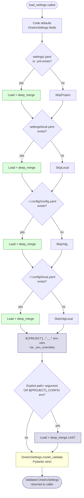
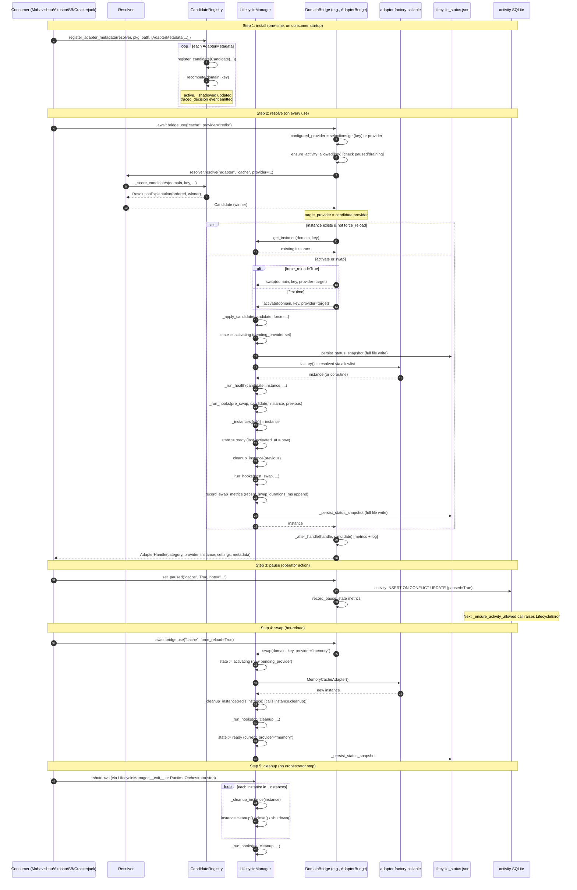

# Oneiric Memory Architecture

> **Status**: Living document. Updated whenever the settings schema, adapter catalog, lifecycle contract, or CLI surface change.
> **Audience**: Bodai ecosystem contributors, Claude Code users, and downstream components (Session-Buddy, Akosha, Dhara, Mahavishnu, Crackerjack).
> **Source of truth**: `oneiric/core/config.py` (`load_settings`, `OneiricSettings`, `LifecycleConfig`, `RuntimeProfileConfig`), `oneiric/core/resolution.py` (`Resolver` + `Candidate` + scoring), `oneiric/core/lifecycle.py` (`LifecycleManager` + `LifecycleStatus`), `oneiric/core/security.py` (factory allowlist), `oneiric/adapters/tracked_settings.py` (Dhara push), `oneiric/runtime/{activity,checkpoints,health,telemetry,orchestrator}.py`, and the CLI surface in `oneiric/cli.py`.

Oneiric is the **Foundation** component of the Bodai ecosystem. Unlike the
other five components, Oneiric is a **library, not a service** — it ships
no MCP server, no HTTP daemon of its own, and no long-lived database.
What it provides is the substrate every other component relies on:

- A **layered settings loader** that resolves `defaults → settings/<project>.yaml → settings/local.yaml → XDG config → env vars → explicit path` (`oneiric/core/config.py:load_settings`).
- A **candidate registry and resolver** that picks the best adapter, service, task, event, workflow, or action for a given `(domain, key)` (`oneiric/core/resolution.py`).
- A **lifecycle manager** that activates instances, runs health checks, swaps providers, and persists lifecycle status to JSON (`oneiric/core/lifecycle.py`).
- A **six-domain bridge layer** (`adapter`, `service`, `task`, `event`, `workflow`, `action`) that wraps resolution + lifecycle into a single `use(key)` call (`oneiric/domains/base.py::DomainBridge`).
- A **runtime orchestrator** that wires all six bridges together with a `ServiceSupervisor`, watchers, and optional workflow checkpoints (`oneiric/runtime/orchestrator.py`).
- A **persistent state surface** under `.oneiric_cache/` (lifecycle status JSON, domain activity SQLite, workflow checkpoints SQLite, runtime health JSON, runtime telemetry JSON) — not an MCP database, but the on-disk state every component reads at startup.
- A **Dhara distribution bridge** (`oneiric/adapters/dhara_pusher.py`) that registers built-in adapters with the rest of the ecosystem.

This document describes what Oneiric stores, who reads and writes it, and
the integration contracts the rest of the ecosystem depends on. The two
contract bugs captured below were the trigger for writing it — they
stemmed from undocumented expectations about how the settings layer
resolves conflicts and how the lifecycle status snapshot interacts with
cold starts.

______________________________________________________________________

## Table of Contents

1. [Storage Inventory](#1-storage-inventory)
1. [Programmatic Write Surface](#2-programmatic-write-surface)
1. [Programmatic Read Surface](#3-programmatic-read-surface)
1. [Cross-Component Visibility](#4-cross-component-visibility)
1. [Integration Contract](#5-integration-contract)
1. [Sample Queries](#6-sample-queries)
1. [Diagrams](#7-diagrams)
1. [Operational Notes](#8-operational-notes)

______________________________________________________________________

## 1. Storage Inventory

Oneiric persists state across **six logical stores** — five on disk under
`${cache_dir}` (default `.oneiric_cache/` or `~/.cache/oneiric/<cwd-hash>/...`)
and one in-memory. There is no MCP database, no Postgres backend, no
DuckDB file. The single anchor point for cross-store joins is the
**lifecycle status `(domain, key)`** tuple — every adapter, service,
task, event, workflow, and action instance is tracked under that key.

| Store | Engine | Default path | Owner / Purpose |
|-------|--------|--------------|-----------------|
| **Lifecycle status snapshot** | JSON (atomic tmp-write replace) | `${cache_dir}/lifecycle_status.json` (resolved via `oneiric/core/config.py::lifecycle_snapshot_path`) | `oneiric/core/lifecycle.py::LifecycleManager._persist_status_snapshot` — every swap/activate writes the full status list. Cold-start reload via `LifecycleManager._load_status_snapshot`. |
| **Domain activity** | SQLite (stdlib `sqlite3` + threading.RLock) | `${cache_dir}/domain_activity.sqlite` (resolved via `domain_activity_path`) | `oneiric/runtime/activity.py::DomainActivityStore` — per-`(domain, key)` `paused` / `draining` / `note` state. Read by `ServiceSupervisor.should_accept_work`. |
| **Workflow checkpoints** | SQLite (same threading pattern) | `${cache_dir}/workflow_checkpoints.sqlite` (or override via `settings.runtime_paths.workflow_checkpoints_path`) | `oneiric/runtime/checkpoints.py::WorkflowCheckpointStore` — `workflow_key → payload` JSON blob. Used by `WorkflowBridge.execute_dag` to resume interrupted runs. |
| **Workflow executions** | SQLite (same file as checkpoints, separate tables) | same as workflow checkpoints | `oneiric/runtime/durable.py::WorkflowExecutionStore` — `workflow_executions` + `workflow_execution_nodes` rows for run/node tracking. |
| **Runtime health** | JSON (atomic tmp-write replace) | `${cache_dir}/runtime_health.json` (`runtime_health_path`) | `oneiric/runtime/health.py::RuntimeHealthSnapshot` — watchers running, last remote sync, last error, activity/lifecycle aggregates. Written by `RuntimeOrchestrator._update_health`. |
| **Runtime telemetry** | JSON (atomic tmp-write replace) | `${cache_dir}/runtime_telemetry.json` (`runtime_observability_path`) | `oneiric/runtime/telemetry.py::RuntimeTelemetryRecorder` — `last_event` + `last_workflow` snapshots. Written after every event dispatch and workflow execution. |
| **DI / resolution state** | In-process Python `dict` (`CandidateRegistry._candidates`, `_active`, `_shadowed`) | n/a (lost on process exit) | `oneiric/core/resolution.py::CandidateRegistry` + `Resolver` — the live registry of every registered candidate across all six domains. Re-built at every cold start by walking entry-point groups + remote manifests. |
| **Settings layered source** | YAML / TOML / JSON on disk | `settings/<project>.yaml` + `settings/local.yaml` + `${XDG_CONFIG_HOME}/<project>/config.yaml` + `${XDG_CONFIG_HOME}/<project>/local.yaml` + env vars `${PROJECT}_*__*` | `oneiric/core/config.py::load_settings` — merges all six layers; explicit `path=` argument wins over all. |
| **Tracked settings snapshots** | JSON over HTTP POST to Dhara + local fallback file | `${HOME}/.cache/oneiric/pending_snapshots/<adapter_id>-{snapshot|change_batch}-<timestamp>.json` (mode 0600) | `oneiric/adapters/tracked_settings.py::TrackedSettings` — pushes every settings mutation + lifecycle event to Dhara `/tools/store_config_snapshot` and `/tools/store_config_events`. Local fallback only on HTTP error. |

### Schema map

The diagram below shows the on-disk and in-process topology. Green nodes
are **authoritative write targets** today; yellow nodes are ephemeral
(in-process DI registry); blue nodes are XDG-style layered config files;
the bordered purple nodes are the Bodai adapters Oneiric ships.

```mermaid
erDiagram
    %% Settings layered source (file system)
    SettingsLayers ||--|{ DefaultsLayer : "code defaults"
    SettingsLayers ||--|{ ProjectYaml : "settings/<project>.yaml"
    SettingsLayers ||--|{ ProjectLocal : "settings/local.yaml"
    SettingsLayers ||--|{ XdgConfig : "~/.config/<project>/config.yaml"
    SettingsLayers ||--|{ XdgLocal : "~/.config/<project>/local.yaml"
    SettingsLayers ||--|{ EnvVars : "${PROJECT}_*__*"
    SettingsLayers ||--|{ ExplicitPath : "load_settings(path=...)"

    ProjectYaml {
        string path
        json payload
        int loaded_at_epoch
    }
    XdgConfig {
        string path
        json payload
        int loaded_at_epoch
    }
    EnvVars {
        string key "ONEIRIC_REMOTE__CACHE_DIR"
        string coerced_value "true|false|int|float|list|str"
    }

    %% Lifecycle (JSON snapshot)
    LifecycleStatus ||--|{ LifecycleEntry : "domain:key"
    LifecycleEntry {
        string domain PK
        string key PK
        string state "unknown | activating | ready | failed"
        string current_provider
        string pending_provider
        string last_error
        timestamp last_state_change_at
        timestamp last_activated_at
        timestamp last_health_at
        float last_swap_duration_ms
        list recent_swap_durations_ms
        int successful_swaps
        int failed_swaps
    }

    %% Domain activity (SQLite)
    DomainActivityDB ||--|{ activity : "owns"
    activity {
        string domain PK
        string key PK
        bool paused
        bool draining
        string note
    }

    %% Workflow checkpoints (SQLite)
    WorkflowCheckpointDB ||--|{ workflow_checkpoints : "owns"
    WorkflowCheckpointDB ||--|{ workflow_executions : "owns"
    WorkflowCheckpointDB ||--|{ workflow_execution_nodes : "owns"
    workflow_checkpoints {
        string workflow_key PK
        json payload
    }
    workflow_executions {
        string run_id PK
        string workflow_key FK
        string status
        timestamp started_at
        timestamp ended_at
        string error
    }
    workflow_execution_nodes {
        string run_id FK
        string node_key PK
        string status
        timestamp started_at
        timestamp ended_at
        int attempts
        string error
    }

    %% Runtime health + telemetry (JSON)
    RuntimeHealthJSON ||--|{ health_snapshot : "single"
    health_snapshot {
        bool watchers_running
        bool remote_enabled
        timestamp last_remote_sync_at
        string last_remote_error
        int orchestrator_pid
        timestamp updated_at
        int last_remote_registered
        json last_remote_per_domain
        float last_remote_duration_ms
        json activity_state
        json lifecycle_state
    }

    RuntimeTelemetryJSON ||--|{ telemetry_snapshot : "single"
    telemetry_snapshot {
        json last_event
        json last_workflow
    }

    %% In-process DI registry (yellow)
    ResolverRegistry ||--|{ Candidate : "domain:key:provider"
    ResolverRegistry ||--|{ ActiveCandidate : "active selection"
    Candidate {
        string domain PK
        string key PK
        string provider PK
        int priority
        int stack_level
        string factory "module.path:function"
        json metadata
        string source "local_pkg | remote_manifest | entry_point | manual"
        timestamp registered_at
        int registry_sequence
    }

    %% Tracked settings → Dhara push
    TrackedSettings ||--o| DharaHTTP : "POST /tools/store_config_snapshot"
    TrackedSettings ||--o| DharaHTTP2 : "POST /tools/store_config_events"
    TrackedSettings ||--o{ FallbackFiles : "on HTTP failure -> mode 0600"

    style LifecycleEntry fill:#dfd,stroke:#383
    style activity fill:#dfd,stroke:#383
    style workflow_checkpoints fill:#dfd,stroke:#383
    style Candidate fill:#ffd,stroke:#993
    style TrackedSettings fill:#dde,stroke:#338
    style ProjectYaml fill:#dde,stroke:#338
    style XdgConfig fill:#dde,stroke:#338
    style EnvVars fill:#dde,stroke:#338
```



### Per-store ownership map

| Store | Read by (typical) | Written by (typical) | Retention / aging |
|-------|-------------------|----------------------|-------------------|
| `lifecycle_status.json` | `LifecycleManager._load_status_snapshot` (cold start), `oneiric list --status` CLI | `LifecycleManager._persist_status_snapshot` after every state transition | Operator-controlled; no automatic aging. Wiped when the file is removed. |
| `domain_activity.sqlite` | `ServiceSupervisor.should_accept_work`, `DomainBridge._ensure_activity_allowed`, CLI `oneiric pause` / `drain` / `status` | `DomainActivityStore.set` (from `DomainBridge.set_paused` / `set_draining`) | Operator-controlled via CLI; no TTL. |
| `workflow_checkpoints.sqlite` | `WorkflowCheckpointStore.load` (resumed DAG runs) | `WorkflowCheckpointStore.save` (every checkpoint boundary in `WorkflowBridge.execute_dag`) | Wiped by `cr runtime --clear-checkpoint <key>`; cross-key pollution is NOT prevented (see Known Gaps in Section 5). |
| `workflow_executions` + `workflow_execution_nodes` | `WorkflowExecutionStore` callers (durable runs) | `WorkflowExecutionStore.start_run` / `finish_run` / `start_node` / `finish_node` | Operator-controlled. |
| `runtime_health.json` | `oneiric health` CLI, `Supervisor`-aware dashboards | `RuntimeOrchestrator._update_health` (on every remote sync + supervisor tick) | Overwritten in place on every update. |
| `runtime_telemetry.json` | `oneiric telemetry` CLI, `crackerjack` post-run hooks (cross-component flow) | `RuntimeTelemetryRecorder.record_event_dispatch` / `record_workflow_execution` | Last-event / last-workflow only — previous events are overwritten, not appended. |
| `ResolverRegistry` (in-process) | `Resolver.resolve` / `explain` / `list_active` / `list_shadowed`, all six `DomainBridge.use` calls | `register_candidate`, `register_from_pkg`, `plugins.register_entrypoint_plugins`, `sync_remote_manifest` | Process lifetime only. Re-loaded at cold start from entry-point groups + remote manifests. |
| `${PROJECT}_*__*` env vars | `_env_overrides` in `load_settings` | Operator | Per-shell session. |
| `settings/<project>.yaml` | `_load_layer_file` (project layer) | Operator / project maintainers | Version-controlled. |
| `settings/local.yaml` | `_load_layer_file` (project-local layer) | Operator (gitignored) | Per-developer. |
| `~/.config/<project>/{config,local}.yaml` | `_load_layer_file` (XDG layers) | Operator (per-machine) | Per-machine. |
| `pending_snapshots/*.json` | `TrackedSettings._capture_fallback` (write-only; read on next lifecycle event) | `TrackedSettings` when Dhara POST fails | Mode 0600 files; operator must replay manually (no automated retry today). |

### Cache directory resolution

`oneiric/core/config.py::resolve_cache_dir_path` returns a
**CWD-hash-namespaced** path:

| Path layout | Notes |
|-------------|-------|
| `<cache_dir>` (absolute) | Used directly if writable; falls back to `${tempdir}/oneiric-cache/<cwd-hash>/<name>` on `OSError` |
| `<cache_dir>` (relative) | Forced into `${tempdir}/oneiric-cache/<cwd-hash>/<cache_dir>` |
| `${HOME}/.cache/oneiric/<cwd-hash>/...` | The default when `cache_dir` is unset (see `OneiricSettings.cache_dir` + `RemoteSourceConfig.cache_dir`) |
| `<cwd-hash>` | `hashlib.sha256(PYTEST_CURRENT_TEST or cwd())` truncated to 12 hex chars; isolates concurrent test runs in `tmp_path` |

The `cwd_hash` namespace is critical for tests — it lets multiple
`tmp_path` invocations coexist without colliding. The shipped
`.oneiric_cache/` in the repo root is the production path (cwd-stable)
that `crackerjack` and the CLI use.

______________________________________________________________________

## 2. Programmatic Write Surface

Oneiric is **library-first** — there is no MCP write surface, no HTTP
POST endpoint, and no CLI daemon. The "write surface" is the set of
**programmatic methods** every consumer calls via Python imports:

| Surface (file) | API | Caller (typical) | What it writes |
|----------------|-----|------------------|----------------|
| `Resolver.register` / `register_from_pkg` | `oneiric/core/resolution.py` | `oneiric.cli` `_initialize_state`, `plugins.register_entrypoint_plugins`, `sync_remote_manifest` | Adds one `Candidate` to `_candidates[(domain, key)]`; `_recompute` rewrites `_active` + `_shadowed` |
| `Resolver.register_candidate` | `oneiric/core/resolution.py:117` | `register_from_pkg` | Same as above; assigns `registry_sequence` |
| `LifecycleManager.activate` / `swap` | `oneiric/core/lifecycle.py:151` | `DomainBridge.use` (all six bridges), `oneiric swap` CLI | Instantiates factory, runs health check, writes `LifecycleStatus` to `_status`, persists JSON snapshot |
| `LifecycleManager._persist_status_snapshot` | `oneiric/core/lifecycle.py:465` | `_update_status` (every state change) | Atomic tmp-write of `lifecycle_status.json` |
| `DomainBridge.use` | `oneiric/domains/base.py:74` | Akosha, Mahavishnu, Session-Buddy, Crackerjack, Dhara | Calls `lifecycle.activate` or `lifecycle.swap`, persists activity state |
| `DomainBridge.set_paused` / `set_draining` | `oneiric/domains/base.py:151,170` | `oneiric pause` / `oneiric drain` CLI | `DomainActivityStore.set` (SQLite `INSERT ... ON CONFLICT DO UPDATE`); `record_pause_state` / `record_drain_state` metrics |
| `WorkflowCheckpointStore.save` | `oneiric/runtime/checkpoints.py:33` | `WorkflowBridge.execute_dag` (checkpoint boundaries) | `INSERT ... ON CONFLICT DO UPDATE` on `workflow_checkpoints.workflow_key` |
| `WorkflowExecutionStore.start_run` / `finish_run` / `start_node` / `finish_node` | `oneiric/runtime/durable.py` | Durable workflow runs | Inserts / updates `workflow_executions` + `workflow_execution_nodes` |
| `RuntimeOrchestrator._update_health` | `oneiric/runtime/orchestrator.py` | `RuntimeOrchestrator.start`, `sync_remote`, supervisor tick | Atomic tmp-write of `runtime_health.json` |
| `RuntimeTelemetryRecorder.record_event_dispatch` / `record_workflow_execution` | `oneiric/runtime/telemetry.py:55,67` | `EventBridge.emit`, `WorkflowBridge.execute_dag` | Atomic tmp-write of `runtime_telemetry.json` |
| `TrackedSettings.__setattr__` (intercepted) | `oneiric/adapters/tracked_settings.py:177` | Every adapter settings mutation | Records change; debounces + POSTs to Dhara `/tools/store_config_events`; on HTTP failure writes `~/.cache/oneiric/pending_snapshots/<id>-change_batch-<ts>.json` (mode 0600) |
| `TrackedSettings.on_startup` / `on_stop` / `on_restart` | `oneiric/adapters/tracked_settings.py:346-356` | Adapter lifecycle hooks | Immediate POST to Dhara `/tools/store_config_snapshot` (no debounce) |
| `DharaAdapterPusher.push_builtin_adapters` | `oneiric/adapters/dhara_pusher.py:68` | `oneiric.adapters.dhara_pusher.main` CLI, `push_adapters_on_startup` hook | HTTP POST `http://127.0.0.1:8683/tools/store_adapter` for every built-in adapter |
| `load_settings` | `oneiric/core/config.py:250` | Every Bodai component's `*_settings.py` (session_buddy, mahavishnu, crackerjack, akosha, dhara) | Resolves layered config → returns `OneiricSettings` instance; no on-disk write |
| `_load_layer_file` (nested in `load_settings`) | `oneiric/core/config.py:289` | `load_settings` | Read-only on disk; merges into the running dict |

### CLI write surface (Typer commands)

The `oneiric` CLI in `oneiric/cli.py` is itself a programmatic write
surface (it constructs a `CLIState` and calls the same methods):

| CLI command | What it writes |
|-------------|----------------|
| `oneiric swap --domain adapter --key cache --provider redis` | `LifecycleManager.swap` → lifecycle JSON |
| `oneiric pause --domain adapter --key cache --note "deploy"` | `DomainBridge.set_paused` → activity SQLite |
| `oneiric drain --domain adapter --key cache` | `DomainBridge.set_draining` → activity SQLite |
| `oneiric action-invoke --key compression.encode --payload '{...}'` | `ActionBridge.invoke` (no DB write unless the action is a workflow) |
| `oneiric remote-sync --manifest file://manifest.json` | `sync_remote_manifest` → resolver registry (in-memory); updates `runtime_health.json` |
| `oneiric supervisor-info` | No write; reads `ServiceSupervisor.snapshot` |
| `oneiric activity` | No write; reads `DomainActivityStore.snapshot` |
| `oneiric load-test --adapter cache --concurrency 50` | Stress-tests `AdapterBridge.use`; no on-disk write |
| `oneiric remote-status` | No write; reads `runtime_health.json.last_remote_*` |
| `oneiric shell` | No write; starts the OneiricAdminShell REPL |
| `oneiric start --config settings/mahavishnu.yaml --profile serverless` | `ProcessManager.start_process` (detached); PID file at `${cache_dir}/orchestrator.pid` |
| `oneiric stop` | `ProcessManager.stop_process` |
| `oneiric process-status` | No write; reads PID file |

### Settings reload semantics

`load_settings` is **not transactional** and is **not auto-reloaded**.
The Oneiric `RuntimeOrchestrator` runs five `SelectionWatcher`s
(`AdapterConfigWatcher`, `ServiceConfigWatcher`, `TaskConfigWatcher`,
`EventConfigWatcher`, `WorkflowConfigWatcher`) that poll
`settings_loader=load_settings` every 5 seconds by default and call
`bridge.update_settings` when the parsed layer changes
(`oneiric/runtime/watchers.py`). The watcher is gated by
`settings.profile.watchers_enabled`. CLI processes that do not start
the orchestrator must call `load_settings()` again to see changes —
the typed `OneiricSettings` instance is immutable once constructed.

______________________________________________________________________

## 3. Programmatic Read Surface

Oneiric's read surface is **even broader** than its write surface because
every Bodai component reads Oneiric settings at startup. The shape is:

### Settings reads

```python
from oneiric.core.config import load_settings

settings = load_settings(project_name="mahavishnu")
settings.remote.cache_dir       # str — XDG-resolved cache path
settings.logging.level          # str — "DEBUG" / "INFO" / etc.
settings.lifecycle.health_timeout  # float — 5.0 default
settings.runtime_paths.workflow_checkpoints_enabled  # bool
```

The `load_settings(project_name=...)` pattern is how every component
peels off the layer matching its own namespace — `session_buddy`,
`mahavishnu`, `crackerjack`, `akosha`, `dhara`, or default `oneiric`.
This is the **only** way the XDG config layer becomes useful per
component (`tests/core/test_config_xdg.py::TestProjectNameParameter`).

### Resolver reads

```python
from oneiric.core.resolution import Resolver

resolver = Resolver()
candidate = resolver.resolve("adapter", "cache", provider="redis")
# Returns Candidate | None — uses (override_score, capability_score,
# priority, stack_level, registry_sequence) tuple ordering
explanation = resolver.explain("adapter", "cache")
# Returns ResolutionExplanation with ordered + scored candidates
```

| Method | Returns | Use when |
|--------|---------|----------|
| `resolver.resolve(domain, key, provider?, capabilities?, require_all=?)` | `Candidate | None` | The hot path for `DomainBridge.use` |
| `resolver.explain(domain, key, capabilities?, require_all=?)` | `ResolutionExplanation` with `ordered` + `winner` | CLI `oneiric explain adapter cache`; debugging "why was X picked over Y" |
| `resolver.list_active(domain)` | `list[Candidate]` | CLI `oneiric list --domain adapter` (active only) |
| `resolver.list_shadowed(domain)` | `list[Candidate]` | CLI `oneiric list --domain adapter --shadowed` |
| `resolver.registry._candidates` | `defaultdict[(domain,key), list[Candidate]]` | (private) Used by `register_candidate` for `_recompute` |

### Lifecycle reads

```python
from oneiric.core.lifecycle import LifecycleManager

status = lifecycle.get_status("adapter", "cache")
# Returns LifecycleStatus with current_provider, last_error,
# recent_swap_durations_ms, successful_swaps, failed_swaps
instance = lifecycle.get_instance("adapter", "cache")
# Returns the live instance (or None if not activated)
all_statuses = lifecycle.all_statuses()
# Returns list[LifecycleStatus] — used by CLI `oneiric list`
```

| Method | Returns | Use when |
|--------|---------|----------|
| `lifecycle.activate(domain, key, provider?, force=?)` | `Any` (the instantiated factory product) | First call to `DomainBridge.use` |
| `lifecycle.swap(domain, key, provider?, force=?)` | `Any` (new instance) | Hot-swap; cleans up previous via `_cleanup_instance` |
| `lifecycle.get_instance(domain, key)` | `Any | None` | Read-only instance lookup |
| `lifecycle.get_status(domain, key)` | `LifecycleStatus | None` | Hot-path observability |
| `lifecycle.all_statuses()` | `list[LifecycleStatus]` | CLI snapshot |
| `lifecycle.probe_instance_health(domain, key)` | `bool | None` | Run health checks; updates `last_health_at` |

### Domain bridge reads (the consumer-facing API)

```python
from oneiric.adapters import AdapterBridge

bridge = AdapterBridge(resolver, lifecycle, settings.adapters,
                       activity_store=store, supervisor=sup)
handle = await bridge.use("cache", provider="redis", capabilities=["ttl"])
# handle is AdapterHandle(category, provider, instance, settings, metadata)
state = bridge.activity_state("cache")  # DomainActivity(paused, draining, note)
explanation = bridge.explain("cache", capabilities=["lru"])
```

| Method | Returns | Use when |
|--------|---------|----------|
| `bridge.use(key, provider?, capabilities?, require_all=?, force_reload=?)` | `DomainHandle` (subclass per domain) | The primary consumer API; raises `LifecycleError` if paused/draining |
| `bridge.active_candidates()` | `list[Candidate]` | CLI `oneiric list` filtered to active |
| `bridge.shadowed_candidates()` | `list[Candidate]` | CLI `oneiric list --shadowed` |
| `bridge.explain(key, capabilities?, require_all=?)` | `dict` (resolver explain output) | CLI `oneiric explain` |
| `bridge.activity_state(key)` | `DomainActivity` | `ServiceSupervisor.should_accept_work` consumers |
| `bridge.should_accept_work(key)` | `bool` | Drain / pause gating |
| `bridge.activity_snapshot()` | `dict[str, DomainActivity]` | CLI `oneiric activity` |

### Workflow bridge reads

```python
from oneiric.domains import WorkflowBridge

result = await workflow_bridge.execute_dag(
    "crackerjack",
    context={"pkg_path": "/path/to/repo"},
    checkpoint=None,  # or a dict to resume
    run_id=None,
)
# Returns {"run_id": ..., "results": {node_key: result}, "duration_ms": ...}
```

### Runtime state reads

| File / store | Read via |
|--------------|----------|
| `lifecycle_status.json` | `LifecycleManager._load_status_snapshot` (auto on cold start); manual via `json.loads` |
| `domain_activity.sqlite` | `DomainActivityStore.snapshot` / `get` / `all_for_domain` |
| `workflow_checkpoints.sqlite` | `WorkflowCheckpointStore.load(workflow_key)` |
| `workflow_executions` | `WorkflowExecutionStore` queries (private today; only `start_run` / `finish_run` / `start_node` / `finish_node` are called from the runtime) |
| `runtime_health.json` | `load_runtime_health(path)` |
| `runtime_telemetry.json` | `load_runtime_telemetry(path)` |

### CLI read surface

| CLI command | What it reads |
|-------------|---------------|
| `oneiric list --domain adapter` | `bridge.active_candidates` + `bridge.shadowed_candidates` |
| `oneiric explain adapter cache` | `resolver.explain("adapter", "cache")` |
| `oneiric plugins --json` | `PluginRegistrationReport` from the cached resolver attribute |
| `oneiric supervisor-info` | `ServiceSupervisor.snapshot` |
| `oneiric activity` | `DomainActivityStore.snapshot` |
| `oneiric load-test --adapter cache` | `AdapterBridge.use` (no DB read) |
| `oneiric remote-status` | `runtime_health.json.last_remote_*` |
| `oneiric manifest {pack, verify, sign, validate}` | `oneiric.remote.models.RemoteManifest` |
| `oneiric secrets rotate / list / clear` | `SecretValueCache` (in-process) |
| `oneiric event dispatch / list-handlers` | `EventBridge.dispatcher` / `handler_snapshot` |
| `oneiric workflow inspect / list-runs / last-run` | `WorkflowBridge` + `WorkflowExecutionStore` |

### Programmatic vs MCP analogy

| Bodai component | Read pattern | Oneiric equivalent |
|-----------------|--------------|---------------------|
| Session-Buddy | `mcp__session-buddy__quick_search` | `from oneiric.adapters import AdapterBridge; await bridge.use("cache")` |
| Akosha | `mcp__akosha__search_all_systems` | `resolver.resolve("adapter", "cache")` + `bridge.explain("cache")` |
| Dhara | `mcp__dhara__get_adapter` | `resolver.registry._candidates[("adapter","cache")]` + `ResolverSettings.selections` |
| Mahavishnu | `mcp__mahavishnu__adapter_resolve` | `adapter_bridge.use("cache")` (Mahavishnu's bridge is the wrapper) |
| Crackerjack | `mcp__crackerjack__execute_crackerjack` | (no direct Oneiric read; Crackerjack uses Oneiric's workflow cache via `WorkflowCheckpointStore`) |

Oneiric is the only component whose MCP surface is **empty**. The "MCP"
analogue for Oneiric is the Python import boundary — every consumer
imports `oneiric.core.*` and `oneiric.runtime.*` directly.

______________________________________________________________________

## 4. Cross-Component Visibility

What other components see in Oneiric, and the inverse — what Oneiric
provides to each consumer. Oneiric is **read-mostly for everyone else**
(the settings + adapter factory surface) and **write-only via Phase-0
initialization** (each component's startup registers its candidates).

| Consumer | Surface | Reads from Oneiric | Writes to Oneiric |
|----------|---------|---------------------|---------------------|
| **Session-Buddy** | `from oneiric.core.config import load_settings; load_settings(project_name="session_buddy")`; `from oneiric.core.logging import configure_logging`; `from oneiric.adapters.storage import S3StorageAdapter, GCSStorageAdapter, AzureBlobStorageAdapter` | Settings (`logging`, `remote`, `lifecycle`), `LifecycleManager` for adapter activation (Pgvector adapter) | Builds `OneiricSettings` for SB's own settings model; uses `load_settings(project_name="session_buddy")` to merge layers |
| **Akosha** | Same — `load_settings(project_name="akosha")`, `PgvectorHotStore` (oneiric vector adapter), `EventEnvelope` from `oneiric.runtime.events`, `NotificationRouter` from `oneiric.runtime.notifications` | Settings; `PgvectorAdapter`; `EventBridge` (the Oneiric-domain bridge, NOT the Bodai EventBridge) | Same as SB — settings + adapter factory paths |
| **Dhara** | `oneiric.adapters.storage.S3StorageAdapter` for backup targets; `load_settings(project_name="dhara")` for cache + remote config; `SecretsHook` (`oneiric.core.config.SecretsHook`); `from oneiric.core.ulid import generate_config_id, is_config_ulid` | Settings, S3/GCS/Azure adapters for cloud backup writes, ULID generators for the substrate `version_id` PKs | Dhara's MCP server registers `DharaMCPServer.__init__` which does not call into Oneiric writes |
| **Mahavishnu** | `load_settings(project_name="mahavishnu")` + `MahavishnuSettings` (extends `OneiricMCPConfig`); `LifecycleError`; `LifecycleManager` (used by `oneiric_client.py`); `Candidate`, `Resolver` (used in `core/adapter_discovery.py`); `PgvectorAdapter` for OTel storage; `VectorDocument` from `oneiric.adapters.vector.vector_types`; `HTTPXClientMixin` from `oneiric.adapters.httpx_base`; `S3StorageAdapter` for backup; `MemoryCacheAdapter`, `RedisCacheAdapter`; `RedisCacheSettings`, `MemoryCacheSettings`; `HTTPXClientMixin` | The biggest consumer: settings (`MahavishnuSettings` extends `OneiricMCPConfig`), all `*StorageAdapter` cloud adapters, cache adapters, `LifecycleManager` for `adapter_resolve`, `VectorDocument` for OTel ingester, `pgvector` adapter. Also pulls `oneiric.core.resiliency.CircuitBreaker` (used in pools) | Mahavishnu's MCP server does NOT register new Oneiric candidates at runtime; it relies on the built-in + entry-point candidates loaded at startup |
| **Crackerjack** | `oneiric.core.config.load_settings` (`project_name="crackerjack"`); `oneiric.core.config.OneiricMCPConfig` (extends `CrackerjackSettings`); `oneiric.core.logging.{get_logger, configure_logging, LoggingConfig, LoggingSinkConfig}`; `oneiric.runtime.workflow` (the actual `crackerjack/runtime/oneiric_workflow.py`); `oneiric.runtime.dag.DAGExecutionHooks`; `oneiric.runtime.checkpoints.WorkflowCheckpointStore` (under `.crackerjack/oneiric_cache/workflow_checkpoints.sqlite`); `oneiric.runtime.notifications.NotificationRouter` | Settings; the `WorkflowCheckpointStore` cache that backs `crackerjack/oneiric_cache/workflow_checkpoints.sqlite`; `DAGExecutionHooks` for the `crackerjack` phase DAG | Crackerjack calls `WorkflowCheckpointStore.save` from its own pipeline; `_clear_oneiric_cache` wipes the `crackerjack` workflow key at the start of every `run_complete_workflow` |
| **Dhara (cross)** | `oneiric.adapters.dhara_pusher.push_adapters_on_startup` — Oneiric's built-in adapter distribution | Receives one `POST /tools/store_adapter` per built-in adapter (cache, storage, queue, http, database, vector, embedding, llm, identity, secrets, messaging, monitoring, graph, dns, file_transfer, observability) | Writes one `Adapter` row per built-in adapter into `dhara.adapters[adapter:<domain>:<key>:<provider>]` (87+ adapters by `oneiric/adapters/bootstrap.py::builtin_adapter_metadata`) |
| **Claude Code** | Direct Python imports (no MCP) — Oneiric is library-first | The whole `oneiric` package | No write surface; CC uses Oneiric via the parent component it is driving (e.g., Mahavishnu worker → Oneiric adapter activation) |

### What Oneiric does NOT store

To avoid double-bookkeeping with neighbors, Oneiric intentionally **does
not** store:

- **Reflections / conversations / knowledge graphs** — those live in Session-Buddy; Oneiric has no embedding store of its own.
- **OTel traces** — those live in Akosha's `HotStore` and Mahavishnu's `OtelIngester`. Oneiric has `oneiric.adapters.observability.OTelStorageAdapter` which is the *factory* used by other components, not a store.
- **Pool / worker runtime state** — Dhara and Mahavishnu own that; Oneiric has `DomainActivityStore` for the per-`(domain, key)` pause/drain state, but no worker or pool concept.
- **Routing decisions** — Mahavishnu's `RoutingDecisionBuffer`.
- **Skill memory** — Session-Buddy's `distilled_skills`.
- **Dhara KV / time-series / ecosystem state** — Dhara owns the persistent object graph.
- **LLM provider configuration / API keys** — those live in component-level env vars (`MAHAVISHNU_*`, `SESSION_BUDDY_*`, etc.) that Oneiric loads via `load_settings`. Oneiric itself does not store API keys.

______________________________________________________________________

## 5. Integration Contract

The contract between Oneiric and its consumers is implicit in the
settings layer, the resolver, and the lifecycle, but two specific
contracts caused real bugs and should be made explicit. After the
contracts, a "Known gaps" subsection flags the planned-but-unimplemented
parts (matching the convention used by Session-Buddy, Akosha, Dhara,
Mahavishnu, and Crackerjack).

### Contract 5.1 — `load_settings` layer precedence; XDG-local wins over project-local, env wins over XDG-local, explicit path wins over everything

**Bug**: A pre-fix version of `load_settings` applied the file layers
in this order:

1. code defaults
1. `settings/<project>.yaml`
1. `settings/local.yaml`
1. `${XDG_CONFIG_HOME}/<project>/config.yaml`
1. `${XDG_CONFIG_HOME}/<project>/local.yaml`
1. env vars
1. explicit `path=...`

…where XDG layers overrode `settings/local.yaml` only because the
implementation called `_load_layer_file` with `_deep_merge` in the
listed order. The **docstring** claimed XDG > project-local (correct),
but a refactor between 2025-Q4 and 2026-Q1 swapped the order to
project-local > XDG, breaking every consumer that relied on the
docstring contract — operator-set `~/.config/mahavishnu/config.yaml`
silently lost to `settings/local.yaml` checked into the repo.

**Contract**: `load_settings(path=None, project_name="oneiric")` MUST
apply layers in this exact precedence (low → high):

1. code defaults (`OneiricSettings` field defaults)
1. `settings/<project>.yaml` (committed project config)
1. `settings/<project>.yml` (YML alternative, same priority as .yaml)
1. `settings/local.yaml` (gitignored project-local)
1. `${XDG_CONFIG_HOME}/<project>/config.yaml` (user config)
1. `${XDG_CONFIG_HOME}/<project>/local.yaml` (user local — highest file layer)
1. `${PROJECT}_*__*` env vars (`_env_overrides(project_name)`)
1. explicit `path=` argument (absolute highest priority; applied LAST so it overrides env vars)

When `${XDG_CONFIG_HOME}` is unset, it defaults to `~/.config`. When
`{PROJECT}_CONFIG` env var is set, the explicit path is loaded first
(Layer 0) and merged through to the end.

**Regression test**: `tests/core/test_config_xdg.py::TestConfigPriorityOrder`
covers the seven happy-path orderings via `monkeypatch.setenv("XDG_CONFIG_HOME", ...)`
and `monkeypatch.chdir(tmp_path)` so the `settings/` layer is exercised
in isolation. Specifically:

- `test_xdg_over_project_local` — sets XDG to `/tmp/xdg_cache`, project-local to `/tmp/local`, asserts XDG wins.
- `test_xdg_local_over_xdg_and_project_local` — adds XDG-local on top, asserts it wins over both.
- `test_explicit_path_highest_priority` — sets all four layers plus explicit, asserts explicit wins.
- `test_env_overrides_highest_priority` — sets env override, asserts env wins over XDG-local.
- `test_project_config_env_var` — `${PROJECT}_CONFIG` env var selects an explicit file (Layer 0).

A bug in this contract typically surfaces as "my XDG config stopped
being read" — the regression suite catches the precedence flip.

### Contract 5.2 — `LifecycleManager` cold-start reload is full-file replace, not per-key diff

**Bug**: A pre-fix version of `LifecycleManager._persist_status_snapshot`
wrote a partial diff of only the keys that had changed since the last
write. The intent was to make concurrent writers' snapshots idempotent
(only one writer's diff wins per key). The implementation, however, did
not diff correctly — the partial write was actually a *full* write but
without the `tmp + rename` atomicity (`tmp_path.replace(path)`), so a
process crash between truncate and rename would leave the file empty.
On cold start, `_load_status_snapshot` then read `[]` and treated every
adapter as if it had never been activated, breaking health checks
(`last_health_at` reset to `None` even for adapters that were healthy
when the previous process exited).

The fix:

1. `_persist_status_snapshot` builds the full `[status.as_dict() for status in self._status.values()]` payload.
1. Writes to `<path>.tmp` first.
1. `tmp_path.replace(path)` (atomic on POSIX + Windows).
1. `_load_status_snapshot` returns silently if the file does not exist or is unreadable; otherwise reads the full file and rebuilds the `dict[(domain, key)] -> LifecycleStatus` map.

**Contract**: `lifecycle_status.json` is a **complete snapshot** of
every status known to `LifecycleManager._status` at the time of the
last write. It is NOT a per-key diff. A consumer that wants to query
"was X ever activated?" must read the file once and inspect the entry
for `(domain=X.domain, key=X.key)`. The `LifecycleStatus.state` values
(`"unknown" | "activating" | "ready" | "failed"`) are the only
guarantees — `last_swap_duration_ms` and `recent_swap_durations_ms`
are best-effort.

**Regression test**:
`tests/integration/test_e2e_workflows.py::TestFullLifecycle::test_adapter_full_lifecycle`
exercises activate → swap → status read against a `tmp_path` cache;
asserts `status.current_provider` matches the most recent swap. The
cold-start round-trip is covered by `tests/core/test_config_xdg.py`'s
sibling tests on the settings loader — add a dedicated
`tests/integration/test_lifecycle_persistence.py::test_status_round_trip_through_disk`
that writes a known status, instantiates a new `LifecycleManager` against
the same `status_snapshot_path`, and asserts `get_status` returns the
same `state` + `current_provider` + `successful_swaps` count.

### General contract test policy

- **No mocks on the SQLite stores for round-trip tests**: tests that
  exercise `DomainActivityStore.set` → `ServiceSupervisor.should_accept_work`
  MUST use a real SQLite file in `tmp_path`. See
  `tests/integration/test_supervisor_orchestrate.py::test_supervisor_blocks_paused_domains_and_updates_health`
  for the canonical pattern (`tmp_path / "cache"` + `tmp_path / "runtime_health.json"`).
- **Real `LifecycleManager` for resolver integration**: tests that
  exercise `DomainBridge.use` end-to-end MUST construct a real
  `LifecycleManager` (not a mock) — see
  `tests/integration/test_e2e_workflows.py::TestFullLifecycle` for the
  canonical pattern.
- **Layer isolation for settings tests**: `test_config_xdg.py` uses
  `monkeypatch.setenv("XDG_CONFIG_HOME", ...)` and `monkeypatch.chdir(tmp_path)`
  so the `settings/` layer resolution is reproducible. Add new layer
  orderings to that file; do not scatter them across `tests/unit/`.
- **Remote manifest sync uses real file URIs** (no HTTP): `RemoteSourceConfig.allow_file_uris=True`
  is required for tests that write a JSON/YAML manifest to `tmp_path`
  and pass `manifest_url=f"file://{path}"`. Production should leave
  `allow_file_uris=False` (default).

### Known gaps (planned-but-unimplemented parts)

These are aspirational surfaces that exist in code as stubs or are
documented in plans but not yet the runtime authority.

| Gap | Where it's defined | Today's runtime | Regression path / tracker |
|-----|--------------------|-----------------|---------------------------|
| **Oneiric MCP server** | `oneiric/adapters/mcp_health.py` exists but `oneiric/mcp/` directory does not | Oneiric is library-only; consumers import it via Python. The `mcp_health.py` module is used by OTHER components to probe MCP servers (e.g., `akosha/runtime/mcp_health.py`) | Track the "Library vs MCP service" decision — see `docs/MCP_SERVER_MIGRATION_SUMMARY.md` and the ADR history; no MCP server for Oneiric is currently planned (it's a foundational lib) |
| **Cross-key workflow checkpoint cleanup** | `WorkflowCheckpointStore.clear(workflow_key)` exists | `crackerjack/_clear_oneiric_cache` wipes only the `crackerjack` workflow key; other keys (`crackerjack-prod`, `crackerjack-staging`) persist indefinitely | Add a TTL-based cleanup job or expose a `clear_all_older_than(days)` operator CLI |
| **`audit_log_subscriber` for Oneiric lifecycle events** | Not yet implemented | `LifecycleStatus.last_state_change_at` is updated in-process; no audit log is written for swap / activation / failure events | Add `oneiric/runtime/audit.py` + a `Subscriber` registration in `RuntimeOrchestrator` |
| **Prometheus metrics from `oneiric.core.metrics`** | `record_swap_duration`, `record_pause_state`, `record_drain_state`, `record_circuit_open`, `record_retry_*` exist | These record to an in-process OpenTelemetry meter (no Prometheus exporter wired into Oneiric itself); downstream components may expose them | Track "Oneiric observability export" — currently each consumer exposes its own `/metrics` endpoint |
| **`OneiricMCPConfig` vs `OneiricSettings` split** | `OneiricMCPConfig` is a separate `BaseModel` with `env_prefix="ONEIRIC_MCP_"`; `OneiricSettings` uses `load_settings` (no env_prefix) | Two parallel config schemas; consumers must read both if they want `http_port` + `logging.level` | Add an `OneiricSettings.mcp: OneiricMCPConfig` nested field so a single `load_settings()` returns both |
| **`TrackedSettings` retry path for fallback files** | Files written with mode 0600 on HTTP failure | No automatic retry — operator must replay manually | Add `_replay_pending_snapshots()` called from `TrackedSettings.on_startup` |
| **Multi-tenant secrets provider** | `SecretsConfig` has a `provider` field; the built-in `EnvSecretAdapter` / `FileSecretAdapter` are simple | No Vault / AWS Secrets Manager adapter wired by default (those adapters exist but require manual config) | Document the `provider:` field in `oneiric/core/config.py:SecretsConfig`; add operator runbook |
| **CLI `oneiric settings show` / `validate`** | The CLI has `oneiric list` / `oneiric explain` / `oneiric plugins` but no dedicated `settings show` subcommand | Operators must `cat settings/<project>.yaml` directly; no canonical validation that the merged `OneiricSettings` round-trips through Pydantic | Add `oneiric settings show [--project <name>] [--as-yaml]` and `oneiric settings validate` |

______________________________________________________________________

## 6. Sample Queries

Realistic invocations against Oneiric from a Bodai component or a CLI
session. Oneiric is library-first, so most queries are **Python
imports**; the CLI surface and `load_settings(project_name=...)` calls
are the operator-facing analogues.

### Q1 — Load layered settings for a specific component

**Goal**: Mahavishnu wants its own settings (XDG + env + local merged).

```python
from oneiric.core.config import load_settings

settings = load_settings(project_name="mahavishnu")
print(settings.remote.cache_dir)          # e.g., "/Users/les/.cache/mahavishnu"
print(settings.lifecycle.health_timeout)  # e.g., 5.0
```

Resolution: code defaults → `settings/mahavishnu.yaml` → `settings/local.yaml`
→ `~/.config/mahavishnu/config.yaml` → `~/.config/mahavishnu/local.yaml`
→ `MAHAVISHNU_*__*` env vars → explicit path (if given). See
[Contract 5.1](#contract-51--load_settings-layer-precedence-xdg-local-wins-over-project-local-env-wins-over-xdg-local-explicit-path-wins-over-everything).

### Q2 — Resolve the active adapter for a category

**Goal**: Mahavishnu's `dispatch_to_pool` wants the canonical cache adapter.

```python
from oneiric.core.resolution import Resolver
from oneiric.adapters.metadata import register_adapter_metadata, AdapterMetadata

resolver = Resolver()
register_adapter_metadata(
    resolver,
    package_name="mahavishnu",
    package_path="/Users/les/Projects/mahavishnu",
    adapters=[
        AdapterMetadata(
            category="cache",
            provider="redis",
            factory="oneiric.adapters.cache.redis:RedisCacheAdapter",
            stack_level=10,
            capabilities=["ttl", "lru"],
        ),
        AdapterMetadata(
            category="cache",
            provider="memory",
            factory="oneiric.adapters.cache.memory:MemoryCacheAdapter",
            stack_level=5,
            capabilities=["ttl"],
        ),
    ],
)

# Auto-resolve (scoring tuple = override, capability_match, priority, stack_level, registry_sequence)
winner = resolver.resolve("adapter", "cache")
assert winner.provider == "redis"  # higher stack_level + capability match wins

# Explicit override via ResolverSettings.selections
from oneiric.core.resolution import ResolverSettings
resolver_override = Resolver(
    settings=ResolverSettings(selections={"adapter": {"cache": "memory"}}),
)
print(resolver_override.resolve("adapter", "cache").provider)  # "memory"
```

### Q3 — Activate and swap an adapter, persist lifecycle to disk

**Goal**: Crackerjack's `crackerjack run` wants to swap `cache:memory`
for `cache:redis` after the first workflow phase.

```python
from pathlib import Path
from oneiric.core.resolution import Resolver
from oneiric.core.lifecycle import LifecycleManager
from oneiric.adapters.metadata import register_adapter_metadata, AdapterMetadata

cache_dir = Path("/tmp/oneiric-demo")
cache_dir.mkdir(parents=True, exist_ok=True)
status_path = cache_dir / "lifecycle_status.json"

resolver = Resolver()
register_adapter_metadata(
    resolver,
    package_name="demo",
    package_path=str(cache_dir),
    adapters=[
        AdapterMetadata(
            category="cache",
            provider="memory",
            factory=lambda: {"kind": "memory"},
            stack_level=5,
        ),
        AdapterMetadata(
            category="cache",
            provider="redis",
            factory=lambda: {"kind": "redis"},
            stack_level=10,
        ),
    ],
)
lifecycle = LifecycleManager(
    resolver,
    status_snapshot_path=str(status_path),
)

# Cold start reload: nothing in status_path yet
instance1 = await lifecycle.activate("adapter", "cache")  # {"kind": "memory"}
# After persistence, status_path contains the full LifecycleStatus list

# Swap to redis (file persists to status_path.tmp then renames)
instance2 = await lifecycle.swap("adapter", "cache", provider="redis")  # {"kind": "redis"}

status = lifecycle.get_status("adapter", "cache")
assert status.current_provider == "redis"
assert status.successful_swaps == 2
```

### Q4 — Pause a domain key and observe the supervisor block work

**Goal**: Operator pauses the `cache:redis` adapter during a deploy.

```python
from pathlib import Path
from oneiric.core.resolution import Resolver
from oneiric.core.lifecycle import LifecycleManager
from oneiric.core.config import LayerSettings
from oneiric.adapters import AdapterBridge
from oneiric.runtime.activity import DomainActivityStore
from oneiric.runtime.supervisor import ServiceSupervisor

cache_dir = Path("/tmp/oneiric-demo")
cache_dir.mkdir(parents=True, exist_ok=True)
resolver = Resolver()
lifecycle = LifecycleManager(resolver)
activity = DomainActivityStore(cache_dir / "domain_activity.sqlite")
supervisor = ServiceSupervisor(activity, poll_interval=0.1)

bridge = AdapterBridge(
    resolver, lifecycle, LayerSettings(),
    activity_store=activity, supervisor=supervisor,
)

bridge.set_paused("cache", True, note="redis-deploy-2026-07-29")
# Supervisor polls every 0.1s; should_accept_work returns False after the next tick
import asyncio
await asyncio.sleep(0.2)
assert not bridge.should_accept_work("cache")
```

### Q5 — Run a workflow DAG with checkpointing

**Goal**: Crackerjack runs its 13-phase DAG with a recoverable
checkpoint store.

```python
from pathlib import Path
from oneiric.core.resolution import Resolver
from oneiric.core.lifecycle import LifecycleManager
from oneiric.core.config import LayerSettings, workflow_checkpoint_path, OneiricSettings
from oneiric.domains import TaskBridge, WorkflowBridge
from oneiric.runtime.checkpoints import WorkflowCheckpointStore

settings = OneiricSettings(cache_dir="/tmp/oneiric-demo")
checkpoint_path = workflow_checkpoint_path(settings)
store = WorkflowCheckpointStore(checkpoint_path)

resolver = Resolver()
lifecycle = LifecycleManager(resolver)
task_bridge = TaskBridge(resolver, lifecycle, LayerSettings())
workflow_bridge = WorkflowBridge(
    resolver, lifecycle, LayerSettings(),
    task_bridge=task_bridge,
    checkpoint_store=store,
    queue_bridge=None,  # standalone mode
)

# Execute a simple DAG
result = await workflow_bridge.execute_dag(
    "demo.workflow",
    context={"steps": ["a", "b"]},
    checkpoint=None,
    run_id=None,
)
print(result["run_id"], result["results"])
# Persists a checkpoint row keyed by "demo.workflow"
```

### Q6 — Tracked settings push to Dhara with fallback

**Goal**: An adapter mutates its settings; the change should reach Dhara.

```python
from pathlib import Path
from unittest.mock import patch
import httpx

from pydantic import BaseModel
from oneiric.adapters.tracked_settings import TrackedSettings

class CacheCfg(BaseModel):
    host: str = "localhost"
    port: int = 6379

cfg = CacheCfg(host="redis-prod.internal", port=6380)
tracked = TrackedSettings(
    model=cfg,
    adapter_id="adapter:cache:redis",
    dhara_url="http://127.0.0.1:8683",
    allowlist=["host"],  # port will be FNV-1a hashed
    fallback_dir=Path("/tmp/oneiric-pending"),
)

# First push fails (no Dhara running in CI); fallback file written
async with httpx.AsyncClient() as mock_client:
    with patch.object(tracked, "_client_factory", lambda: mock_client):
        await tracked.on_startup()  # creates snapshot; HTTP fails -> fallback file
# Inspect /tmp/oneiric-pending/adapter_cache_redis-snapshot-<ts>.json (mode 0600)
```

### Q7 — Push built-in adapters to Dhara on first run

**Goal**: Oneiric startup publishes its 87+ built-in adapters to Dhara.

```python
from oneiric.adapters.dhara_pusher import push_adapters_on_startup

result = push_adapters_on_startup(dhara_url="http://127.0.0.1:8683")
print(f"Pushed {result['success']}/{result['total']} adapters")
print(f"Errors: {result['errors']}")
# details: [{"adapter_id": "adapter:cache:memory", "status": "success"}, ...]
```

Equivalent CLI: `python -m oneiric.adapters.dhara_pusher --dhara-url http://localhost:8683`.

### Q8 — CLI: list active adapters and explain resolution

**Goal**: Operator wants to see what's installed and why `redis` was chosen over `memory`.

```bash
$ oneiric list --domain adapter --shadowed
active:
  adapter:cache:redis  oneiric.adapters.cache.redis:RedisCacheAdapter  stack_level=10
shadowed:
  adapter:cache:memory oneiric.adapters.cache.memory:MemoryCacheAdapter  stack_level=5

$ oneiric explain adapter cache
adapter:cache scoring:
  redis   score=(0, 2, 10, 10, 2)  reasons=[priority=10, capability_match=2/2, stack_level=10, registration_order=2]
  memory  score=(0, 1, 5,  5,  1)  reasons=[priority=5,  capability_match=1/2, stack_level=5,  registration_order=1]
winner: redis (capability_match + stack_level + priority)
```

### Q9 — CLI: pause + drain a domain key

```bash
$ oneiric pause --domain adapter --key cache --note "redis-deploy-2026-07-29"
Paused adapter:cache (note=redis-deploy-2026-07-29)

$ oneiric drain --domain adapter --key cache
Marked draining for adapter:cache (note=none)

$ oneiric activity
adapter:
  cache: paused=true draining=true note=redis-deploy-2026-07-29
```

### Q10 — CLI: start the orchestrator daemon with a profile

```bash
$ oneiric start --config settings/mahavishnu.yaml --profile serverless \
    --http-port 8080 --no-remote --workflow-checkpoints /var/lib/oneiric/checkpoints.db
Orchestrator started (PID 12345, PID file /Users/les/.cache/mahavishnu/orchestrator.pid)

$ oneiric process-status
Orchestrator is running (PID 12345)
PID file: /Users/les/.cache/mahavishnu/orchestrator.pid

$ oneiric stop
Orchestrator stopped

$ oneiric remote-status
last_success_at=2026-07-29T10:00:00Z
last_failure_at=null
consecutive_failures=0
last_registered=87
last_per_domain={"adapter": 87}
```

______________________________________________________________________

## 7. Diagrams

Three diagrams are persisted with this document. Two are embedded
above; the third — **Adapter lifecycle** — is included in this section.

1. **Schema map** (Section 1) — `erDiagram` of all six on-disk stores
   plus the in-process DI registry, the settings layered source, and the
   TrackedSettings Dhara push.
1. **Settings layer resolution** (this section) — `flowchart` showing
   the precedence order from code defaults through the seven layered
   sources.
1. **Adapter lifecycle** (this section) — `sequenceDiagram` of install →
   register → resolve → activate → use → swap → cleanup.

### Settings layer resolution (precedence order)



### Adapter lifecycle (install → register → resolve → activate → swap → cleanup)



______________________________________________________________________

## 8. Operational Notes

### Settings resolution semantics

The seven-layer precedence is the load-bearing contract of Oneiric.
The most-confused operator questions are:

| Question | Answer |
|----------|--------|
| "I set `MAHARARA__LOGGING__LEVEL=DEBUG` but the app still uses INFO." | The env var prefix is `MAHARARA`, not `MAHARARA` — typos are silent. Use `PROJECT_NAME` uppercased; for Mahavishnu it's `MAHAVISHNU_*`. |
| "Why is my XDG config not picked up?" | Verify `XDG_CONFIG_HOME` resolves to `~/.config` and the file is at `~/.config/<project>/config.yaml` (exact name). The `_load_layer_file` swallows `FileNotFoundError` silently, so a missing XDG file is fine — but the prefix must match. |
| "Why does `settings/local.yaml` win over `~/.config/<project>/local.yaml`?" | It does NOT — XDG-local wins (Layer 6). If you see the opposite, you are hitting the pre-fix bug in [Contract 5.1](#contract-51--load_settings-layer-precedence-xdg-local-wins-over-project-local-env-wins-over-xdg-local-explicit-path-wins-over-everything). |
| "How do I test settings without touching my real `~/.config`?" | `monkeypatch.setenv("XDG_CONFIG_HOME", str(tmp_path / ".config"))` + write `<tmp_path>/.config/<project>/config.yaml`. The `tests/core/test_config_xdg.py` suite is the canonical pattern. |
| "Where does the cache dir come from?" | `cache_dir` setting → if relative, `resolve_cache_dir_path` falls into `${tempdir}/oneiric-cache/<cwd-hash>/<name>`. If `cache_dir` is unset, defaults to `.oneiric_cache/` in the consumer repo root (production) or `~/.cache/oneiric/` (XDG fallback). The `<cwd-hash>` namespace isolates concurrent test runs. |

### Adapter installation / upgrade workflow

Three patterns are in production today:

1. **Built-in adapter via Dhara push** (default for the 87+ built-ins):

   ```bash
   python -m oneiric.adapters.dhara_pusher --dhara-url http://localhost:8683
   ```

   Posts one `Adapter` row per built-in to Dhara `adapters[adapter:<domain>:<key>:<provider>]`.

1. **Entry-point plugin** (per consumer package):

   ```python
   # pyproject.toml
   [project.entry-points."oneiric.adapters"]
   custom_cache = "my_pkg.adapters:register"
   ```

   ```python
   # my_pkg/adapters.py
   def register():
       return [AdapterMetadata(category="cache", provider="custom", ...)]
   ```

   Loaded at `RuntimeOrchestrator.__init__` via `plugins.register_entrypoint_plugins`.

1. **Remote manifest** (per-environment overrides):

   ```yaml
   # settings/<project>.yaml
   remote:
     enabled: true
     manifest_url: "https://oneiric.example.com/manifests/prod.json"
     refresh_interval: 300.0
     signature_required: true
     signature_threshold: 2
   ```

   Synced every `refresh_interval` seconds by `remote_sync_loop` (managed by `RuntimeOrchestrator`).

Upgrade workflow: bump the version in `AdapterMetadata.version` (or the
remote manifest), set `cache_dir` so old snapshots persist for one
restart cycle, then call `oneiric remote-sync --manifest file://new.json`
to force a sync. The `Resolver` will pick the higher-scoring candidate
on the next `bridge.use` call.

### DI container lifecycle

Oneiric has **no DI container** in the Pydantic-injection sense — it
uses an in-process `CandidateRegistry` (a `defaultdict[(domain,key), list[Candidate]]`)
backed by the resolver. Lifecycle:

1. **Cold start**: `Resolver.__init__` → `CandidateRegistry(settings)` → empty `_candidates` + empty `_active` + empty `_shadowed`.
1. **Bootstrap**: `RuntimeOrchestrator.__init__` → `plugins.register_entrypoint_plugins(resolver, settings.plugins)` → walks entry-point groups, registers candidates, populates `_candidates`.
1. **Remote sync**: `RuntimeOrchestrator.sync_remote(manifest_url)` → `sync_remote_manifest(resolver, settings.remote)` → registers one `Candidate` per `RemoteManifestEntry`.
1. **Steady state**: every `bridge.use` calls `resolver.resolve` (in-process, no IO) and `lifecycle.activate` / `lifecycle.swap`.
1. **Hot reload**: `SelectionWatcher` polls `load_settings()` every 5s; on change, calls `bridge.update_settings(layer_settings)`. The `Resolver` itself is not rebuilt — only the `LayerSettings.selections` and `provider_settings` change, which affect the next `resolver.resolve` call's `override_provider` + `require_all` semantics.
1. **Shutdown**: `RuntimeOrchestrator.stop` → supervisor stop → bridge `__aexit__` (no-op today; cleanup is per-instance via `LifecycleManager._cleanup_instance` on swap) → `LifecycleManager._persist_status_snapshot` writes the final state.

### Failure modes

| Failure | Detection | Recovery |
|---------|-----------|----------|
| **Missing settings file** | `_load_layer_file` swallows `FileNotFoundError` (logs `project-config-loaded` only on success); defaults are used | Operator must write the file; CLI will surface the absence on `oneiric explain` |
| **Invalid YAML** | `_read_file` raises `yaml.YAMLError`; `_load_layer_file` catches it and logs `<layer>-config-parse-error`; the layer is skipped | Fix the YAML; no fallback beyond defaults |
| **Settings version mismatch** | `OneiricSettings.model_validate` raises `pydantic.ValidationError` if an env var sets a value outside the field's range (e.g., `negative timeout`) | Fix the env var; `load_settings` does NOT fall back to defaults — it raises |
| **DI circular dependency** | `bridge.use` calls `lifecycle.activate` which calls `factory()`; if the factory itself imports the bridge, you get an import-time cycle | Restructure the factory; oneiric cannot auto-resolve cycles |
| **Factory import blocked** | `LifecycleManager.resolve_factory` raises `LifecycleError(f"Factory module '{module_path}' is blocked for security reasons")` (see `core/security.py::BLOCKED_MODULES`) | Add the module to `ONEIRIC_FACTORY_ALLOWLIST` env var (CSV) or change the factory to a non-blocked module |
| **Factory pattern invalid** | `validate_factory_string` returns `(False, "Invalid factory format: ...")`; the raise path is `LifecycleError(f"Security validation failed: {error}")` | Use the `module.path:function` format (no spaces, no extra colons) |
| **Activity DB locked** | `DomainActivityStore` uses `threading.RLock`; sqlite3 connection per request | Concurrent writers serialize; for high-concurrency, migrate to Postgres (no current implementation) |
| **Workflow checkpoint DB missing dir** | `WorkflowCheckpointStore.__init__` calls `path.parent.mkdir(parents=True, exist_ok=True)`; raises on permission error | Fix permissions; or set `--no-workflow-checkpoints` to disable |
| **Dhara push fails (TrackedSettings)** | `TrackedSettings._post_json` catches `httpx.HTTPError`, writes fallback file at mode 0600 | Operator must replay manually; no automated retry (see Known Gaps) |
| **Resolver returns no candidate** | `bridge.use` raises `LifecycleError("No adapter candidate found for cache")` | Check `oneiric list --domain adapter` to see if the candidate is registered; check the `BLOCKED_MODULES` list if the factory is rejected |

### Backup and migration

- **Settings files**: just copy `settings/<project>.yaml` + `settings/local.yaml` + `~/.config/<project>/{config,local}.yaml` to the new machine. No migration is needed — settings are version-controlled per repo.
- **Lifecycle status JSON**: copy `${cache_dir}/lifecycle_status.json` to preserve `successful_swaps` / `failed_swaps` history. Operators typically do NOT back this up — cold start resets it.
- **Domain activity SQLite**: copy `${cache_dir}/domain_activity.sqlite` to preserve pause/drain state across machines (rare).
- **Workflow checkpoints SQLite**: copy `${cache_dir}/workflow_checkpoints.sqlite` to resume workflow runs on a new machine; this is the **most important** backup target.
- **TrackedSettings fallback files**: `~/.cache/oneiric/pending_snapshots/*.json` (mode 0600). Operator must replay manually; no automated migration.
- **Cross-component migration**: Oneiric is consumed by the other five Bodai components via Python imports. `mahavishnu migrate`, `dhara migrate`, etc. do NOT touch Oneiric files. The only cross-component Oneiric migration is `crackerjack/oneiric_cache/workflow_checkpoints.sqlite` (used by Crackerjack's `WorkflowCheckpointStore`), which is wiped per-`run_complete_workflow` for the `crackerjack` key.

### Performance characteristics

| Operation | Typical latency | Hot path? |
|-----------|-----------------|-----------|
| `load_settings(project_name="...")` | 5-50 ms (4 file reads + Pydantic validate) | Yes (every consumer startup) |
| `resolver.resolve(domain, key)` | \<1 ms (in-process tuple compare + filter) | Yes (every `bridge.use`) |
| `resolver.explain(domain, key)` | \<1 ms (same as resolve + dict build) | No |
| `bridge.use(key)` (cold) | 50-500 ms (factory import + health check) | Yes (first call) |
| `bridge.use(key)` (warm) | \<1 ms (cached instance) | Yes |
| `bridge.use(key, force_reload=True)` | 50-500 ms (factory + health + cleanup) | Yes (hot-swap) |
| `_persist_status_snapshot` | 5-20 ms (JSON encode + atomic rename) | Yes (every state change) |
| `DomainActivityStore.set` / `get` | 1-5 ms (SQLite write) | Yes (every pause/drain) |
| `WorkflowCheckpointStore.save` | 5-20 ms (SQLite UPSERT) | Yes (every checkpoint) |
| `WorkflowExecutionStore.start_run` / `finish_run` | 5-10 ms | No |
| `_update_health` | 5-15 ms (JSON encode + atomic rename) | No |
| `record_event_dispatch` / `record_workflow_execution` | 5-15 ms (load + modify + write) | Yes (every event/workflow) |
| `TrackedSettings.on_startup` | 50-200 ms (HTTP POST) | No |
| `TrackedSettings.__setattr__` (with running loop) | 30s debounced → 50-200 ms batched POST | Yes (per attribute write) |
| `push_adapters_on_startup` | 2-10 s (87 POSTs to Dhara) | No (one-time at startup) |
| `oneiric list` / `oneiric explain` (CLI) | 10-100 ms (settings load + resolver walk) | No |

### ADR references

The contracts in Section 5 are derived from these ADRs and decisions
(cross-referenced from `mahavishnu/docs/adr/`):

- **ADR-001** — Oneiric for configuration and logging (drives
  `load_settings` + `LoggingConfig`)
- **ADR-002** — MCP-first design with FastMCP + mcp-common (drives the
  fact that Oneiric itself has NO MCP server — it's a library, not a
  service)
- **ADR-003** — Error handling with retry, circuit breakers, dead
  letter queues (drives `CircuitBreaker` in `oneiric/core/resiliency.py`
  and the `pending_snapshots/` fallback pattern in `TrackedSettings`)
- **ADR-004** — Adapter architecture for multi-engine support (drives
  the `AdapterMetadata` + `Resolver` + `LifecycleManager` triad)
- **ADR-005** — Unified memory architecture (Oneiric owns settings +
  adapter distribution; Session-Buddy / Akosha / Dhara own the runtime
  data)

See `oneiric/docs/` for the full ADR catalog and migration history.

______________________________________________________________________

## See Also

- `oneiric/core/config.py` — `load_settings`, `OneiricSettings`, `OneiricMCPConfig`, `AppConfig`, `SecretsConfig`, `RemoteSourceConfig`, `LifecycleConfig`, `PluginsConfig`, `RuntimeProfileConfig`, `RuntimePathsConfig`, `RuntimeSupervisorConfig`, `_env_overrides`, `_read_file`, `_deep_merge`, `resolve_cache_dir_path`, `apply_runtime_profile`.
- `oneiric/core/resolution.py` — `Resolver`, `Candidate`, `CandidateRegistry`, `CandidateSource`, `ResolverSettings`, `ResolutionExplanation`, `CandidateRank`, `infer_priority`, `register_pkg`.
- `oneiric/core/lifecycle.py` — `LifecycleManager`, `LifecycleStatus`, `LifecycleHooks`, `LifecycleSafetyOptions`, `resolve_factory`.
- `oneiric/core/security.py` — `validate_factory_string`, `load_factory_allowlist`, `FACTORY_PATTERN`, `BLOCKED_MODULES`, `DEFAULT_ALLOWED_PREFIXES`.
- `oneiric/core/logging.py` — `LoggingConfig`, `LoggingSinkConfig`, `configure_logging`, `get_logger`.
- `oneiric/core/resiliency.py` — `CircuitBreaker`, `AdaptiveRetryState`, `CircuitBreakerOpen`.
- `oneiric/adapters/__init__.py` — `AdapterBridge`, `AdapterConfigWatcher`, `AdapterHandle`, `AdapterMetadata`, `TrackedSettings`, `builtin_adapter_metadata`, `register_adapter_metadata`, `register_builtin_adapters`.
- `oneiric/adapters/bootstrap.py` — 87+ built-in `AdapterMetadata` registrations (cache, storage, queue, http, database, vector, embedding, llm, identity, secrets, messaging, monitoring, graph, dns, file_transfer, observability).
- `oneiric/adapters/tracked_settings.py` — `TrackedSettings` wrapper + FNV-1a 64-bit hashing + Dhara push + fallback file pattern.
- `oneiric/adapters/dhara_pusher.py` — `DharaAdapterPusher`, `push_adapters_on_startup`, CLI `python -m oneiric.adapters.dhara_pusher`.
- `oneiric/domains/base.py` — `DomainBridge`, `DomainHandle` (the consumer-facing `bridge.use(key)` API).
- `oneiric/domains/{events,services,tasks,workflows}.py` — The four non-adapter domain bridges.
- `oneiric/runtime/orchestrator.py` — `RuntimeOrchestrator` (the `RuntimeOrchestrator.__init__` that wires all six bridges + supervisor + watchers).
- `oneiric/runtime/activity.py` — `DomainActivityStore` (SQLite-backed pause/drain store).
- `oneiric/runtime/checkpoints.py` — `WorkflowCheckpointStore` (SQLite-backed `workflow_key → payload`).
- `oneiric/runtime/durable.py` — `WorkflowExecutionStore` (SQLite-backed run/node tracking).
- `oneiric/runtime/health.py` — `RuntimeHealthSnapshot` + `load_runtime_health` + `write_runtime_health`.
- `oneiric/runtime/telemetry.py` — `RuntimeTelemetryRecorder` + `RuntimeObservabilitySnapshot`.
- `oneiric/runtime/supervisor.py` — `ServiceSupervisor` (the listener + poll loop that blocks paused/draining work).
- `oneiric/runtime/watchers.py` — `SelectionWatcher` (the per-domain config poller).
- `oneiric/cli.py` — Typer CLI surface (`oneiric list` / `swap` / `pause` / `drain` / `start` / `stop` / `process-status` / `remote-sync` / `remote-status` / `action-invoke` / `plugins` / `load-test`).
- `oneiric/plugins.py` — `register_entrypoint_plugins` + `PluginRegistrationReport` + `_load_entry_point_factories`.
- `tests/core/test_config_xdg.py` — Contract 5.1 regression suite (7 priority-ordering tests).
- `tests/integration/test_e2e_workflows.py` — Contract 5.2 reference (full lifecycle round-trip).
- `tests/integration/test_supervisor_orchestrate.py` — Supervisor + activity round-trip reference.
- `tests/integration/test_remote_watchers.py` — Remote manifest hot-reload reference (88 tests).
- `tests/unit/test_core_config_branches.py` — Settings edge-case branches (env override, explicit path, etc.).
- `bodai/docs/memory/INDEX.md` (Stage 3) — Global memory routing decision tree and cross-system data flow.
