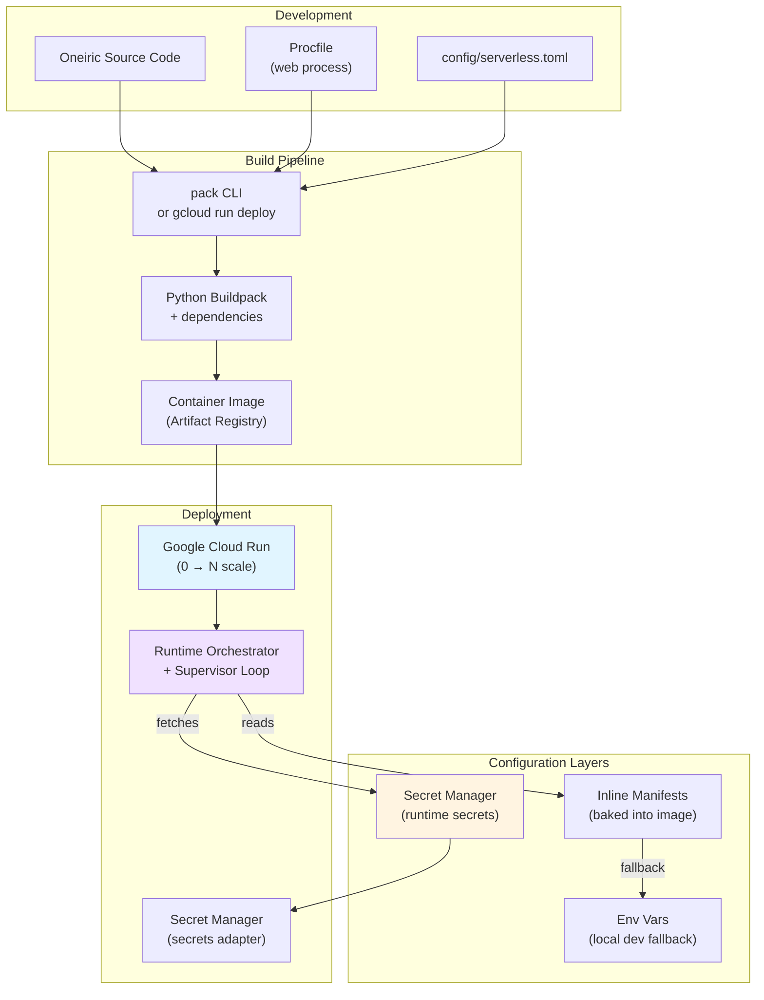
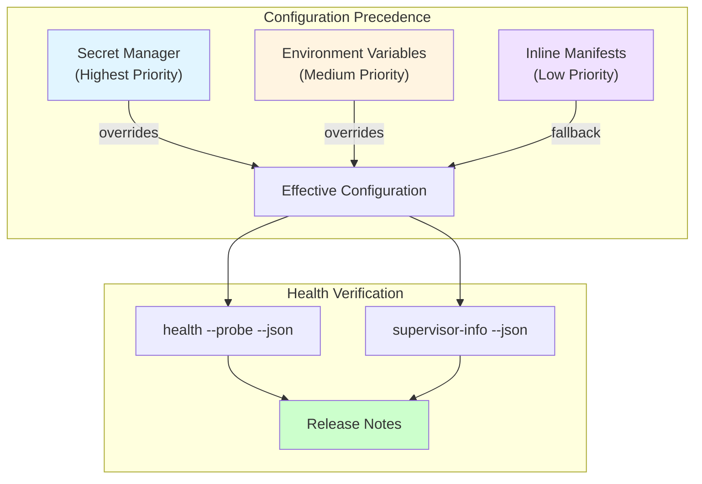

# Cloud Run Buildpacks Deployment Guide

**Last Updated:** 2025-12-07
**Audience:** Platform Core, Runtime Team, DevOps

This guide documents the default deployment flow for Oneiric when targeting Google Cloud Run (or other buildpack-capable serverless platforms). It pairs with the `serverless` runtime profile and the Procfile entry that now ships in the repository.

______________________________________________________________________

## 1. Overview



**Deployment Architecture:**

| Item | Decision |
|------|----------|
| Runtime | Google Cloud Run (container revisions, 0 → N scale) |
| Build | Cloud Native Buildpacks via `pack` or `gcloud run deploy --source` |
| Entry point | `uv run python -m oneiric.cli orchestrate --profile serverless` (Procfile `web` process) |
| Config | Inline manifests baked into the image + Secret Manager adapters (env fallback for local dev) |
| Remote polling | Disabled by default; enable explicitly per deployment if needed |

The serverless profile disables file watchers and remote refresh loops, keeps runtime secrets stateless, and assumes cold starts should do the minimal amount of work before activating adapters/actions.

______________________________________________________________________

## 2. Prerequisites

1. **Google Cloud CLI** with `gcloud components install beta` (for `gcloud run`).
1. **pack CLI** (`brew install buildpacks/tap/pack` on macOS).
1. Service account or user with `Cloud Run Admin`, `Artifact Registry Writer`, `Secret Manager Secret Accessor` roles.
1. Optional: `uv` installed locally for parity with CI commands.

______________________________________________________________________

## 3. Source Layout & Procfile

The repo ships two Procfile definitions so Cloud Run teams can track serverless-specific changes without colliding with local overrides:

- `Procfile` – default entry consumed automatically by `pack`/`gcloud run deploy --source`
- `Procfile.cloudrun` – serverless template that stays aligned with roadmap defaults (copy/symlink it into place if a repo needs a dedicated Cloud Run Procfile)

```Procfile
web: uv run python -m oneiric.cli orchestrate --profile serverless --no-remote
```

Notes:

- `--profile serverless` applies the watcher/remote toggles baked into `oneiric.core.config`.
- `--no-remote` keeps remote sync disabled unless you explicitly provide a manifest URL and flip `remote.enabled` back on.
- The Service Supervisor now runs automatically (even in serverless profile) to enforce pause/drain windows and export `runtime_health.json` (which now includes both `activity_state` and `lifecycle_state`). Keep `.oneiric_cache` persisted so `domain_activity.sqlite` and the health snapshot survive across revisions.
- If you need to temporarily disable the supervisor loop (for staged rollouts or debugging), set `ONEIRIC_RUNTIME_SUPERVISOR__ENABLED=false` when launching `oneiric.cli orchestrate`; leave it unset (default `true`) for normal serverless/Cloud Run deploys.
- To confirm which toggle is in effect (profile default vs. runtime config vs. env override), run `uv run python -m oneiric.cli supervisor-info` against the same config before deploying and capture the output in your release notes.
- When customizing the Procfile for a specific service, update both files (or keep a symlink) so future roadmap updates land consistently across local + Cloud Run profiles.
- Override or extend the command via `--` in `gcloud run deploy` if you need per-service variations.

______________________________________________________________________

## 4. Building with `pack`

```bash
# Set registry location (Artifact Registry or GCR)
export IMAGE=gcr.io/$PROJECT_ID/oneiric-runtime:$(git rev-parse --short HEAD)

# Build using the official Python buildpack + Procfile
pack build "$IMAGE" \
  --builder gcr.io/buildpacks/builder:v1 \
  --env GOOGLE_RUNTIME=python \
  --env BP_KEEP_FILES=/workspace/.oneiric_cache \
  --env PYTHONUNBUFFERED=1

# Push image (pack automatically pushes when registry is remote)
gcloud run deploy oneiric-runtime \
  --image "$IMAGE" \
  --region us-central1 \
  --platform managed \
  --allow-unauthenticated \
  --port 8080 \
  --max-instances 5 \
  --min-instances 0 \
  --set-env-vars "ONEIRIC_CONFIG=/workspace/config/serverless.toml"
```

Recommendations:

- Keep the `.oneiric_cache` directory on disk so cached manifests/activity snapshots survive across revisions. Use `BP_KEEP_FILES` to ensure buildpacks do not prune the cache.
- Store your serverless-specific settings file under `config/serverless.toml` (checked into the repo or injected at build time); it should pin adapter selections and secret providers for Cloud Run.

______________________________________________________________________

## 5. Deploying with `gcloud run deploy --source`

For smaller services you can skip explicit image builds:

```bash
gcloud run deploy oneiric-runtime \
  --source . \
  --region us-central1 \
  --allow-unauthenticated \
  --set-env-vars "ONEIRIC_PROFILE=serverless" \
  --set-env-vars "ONEIRIC_CONFIG=/workspace/config/serverless.toml"
```

Tips:

- `gcloud run deploy --source` detects the Procfile automatically. Ensure the file lives at repo root.
- Set `ONEIRIC_PROFILE=serverless` to mirror the CLI flag when running under `gcloud run deploy --source` (the CLI flag is still useful for local runs and custom Procfiles). The CLI and `main.py` automatically honor that env var now—no need to duplicate it inside your settings file unless you want to bake the profile permanently.

______________________________________________________________________

## 6. Secrets & Configuration



**Configuration Strategy:**

1. **Secret Manager adapter** – configure `settings.secrets.provider = "gcp.secret_manager"` and grant the Cloud Run service account `roles/secretmanager.secretAccessor`.
1. **Inline manifests** – package critical manifest entries into your TOML (or embed as JSON inside the repo); the serverless profile assumes no remote polling unless you opt in.
1. **Env fallbacks** – keep `.env`-style config limited to local dev. Production deployments should prefer Secret Manager + build-time manifest packaging.
1. **Precedence & verification** – Secret Manager overrides env vars, which override manifest defaults; run `uv run python -m oneiric.cli health --probe --json` (or `--demo health --probe --json`) before deploys to capture the `secrets` block and confirm the expected provider is `status=ready`. Pair it with `uv run python -m oneiric.cli supervisor-info` so release notes show both the runtime profile and the current supervisor toggle.

Sample snippet (`config/serverless.toml`):

```toml
[profile]
name = "serverless"

[secrets]
provider = "gcp.secret_manager"

[adapters.selections]
vector = "pgvector"
secrets = "gcp"
queue = "cloudtasks"

[workflows.options]
queue_category = "queue.scheduler"

[adapters.provider_settings.pgvector]
dsn = "postgresql://..."

[remote]
enabled = false
```

Setting `[workflows.options] queue_category = "queue.scheduler"` keeps workflow enqueue operations pointed at the Cloud Tasks adapter without needing CLI flags. Combine that with `[adapters.selections] queue = "cloudtasks"` (and the corresponding provider settings) so `RuntimeOrchestrator` can resolve the adapter when Cloud Tasks delivers HTTP callbacks.

Before shipping a revision, run:

```bash
ONEIRIC_PROFILE=serverless uv run python -m oneiric.cli supervisor-info --json
ONEIRIC_PROFILE=serverless uv run python -m oneiric.cli health --probe --json --manifest build/serverless_manifest.json
```

Capture both outputs (or screenshots) alongside the deploy ticket so auditors can confirm:

- profile toggles (`watchers_enabled`, `remote_enabled`, `inline_manifest_only`)
- supervisor override (`runtime.supervisor.enabled`)
- Secret Manager readiness (`"secrets": {"provider": "gcp.secret_manager", "status": "ready"}`)
- lifecycle and pause/drain state.

______________________________________________________________________

## 7. Inline Manifest Packaging

When remote polling is disabled, bake your manifest into the image so cold starts can activate adapters immediately:

1. Keep manifests under `deployment/manifests/*.yaml`.
1. Package them into JSON during the build:

```bash
uv run python -m oneiric.cli manifest pack \
  --input deployment/manifests/serverless.yaml \
  --output build/serverless_manifest.json
```

3. Point `[remote] manifest_url = "file:///workspace/build/serverless_manifest.json"` in `config/serverless.toml`, and allow the local path explicitly:

```toml
[remote]
manifest_url = "file:///workspace/build/serverless_manifest.json"
allow_file_uris = true
allowed_file_uri_roots = ["/workspace/build"]
```

Because remote sync is disabled in the serverless profile, the orchestrator sticks to the packaged manifest until you redeploy.

______________________________________________________________________

## 8. Verification & Observability

1. Run `uv run pytest -k serverless_profile` before shipping (tests to be expanded alongside profile work).
1. Use `oneiric.cli supervisor-info --json` followed by `oneiric.cli health --probe --json` locally to ensure adapters/actions activate without remote polling and the serverless toggles are correct.
1. Configure Cloud Run logs to export structlog JSON (`stdout`) to Cloud Logging; reserve `stderr` for fatal errors only.
1. Mirror Cloud Run deployments by running `uv run python -m oneiric.cli orchestrate --profile serverless --no-remote --health-path /tmp/runtime_health.json` locally, then inspect `oneiric.cli activity --json` and `oneiric.cli health --probe --json` to confirm the Service Supervisor is honoring pause/drain settings.
1. Inspect the new `profile`, `secrets`, and `lifecycle_state` blocks in the `health --probe --json` output to verify the serverless toggles (`watchers_enabled`, `remote_enabled`, `inline_manifest_only`), confirm the Secret Manager adapter reports `status=ready`, and ensure lifecycle entries are paused/draining as expected before shipping.

The orchestrator writes `runtime_health.json` (with supervisor + lifecycle metadata) and `domain_activity.sqlite` under `.oneiric_cache/`; Cloud Run operators can tail that directory to confirm the Service Supervisor sees the same state exposed via the CLI.

The orchestrator now exposes an HTTP server when `oneiric.cli orchestrate` runs with the default (or serverless) profile and a listening port is available (`$PORT`, `--http-port`). It serves:

- `GET /healthz` – lightweight readiness probe for Cloud Run.
- `POST /tasks/workflow` – Cloud Tasks callback that expects the JSON payload emitted by `workflow enqueue`. Point the Cloud Tasks adapter’s `http_target_url` at `https://<service>/tasks/workflow` so DAG runs begin as soon as tasks are delivered.

Disable the server with `--no-http` if you are running the orchestrator outside Cloud Run.

______________________________________________________________________

## 9. Troubleshooting

| Symptom | Likely Cause | Fix |
|---------|--------------|-----|
| Service fails to start with watcher errors | Profile defaulted to `watchers_enabled=True` | Ensure `--profile serverless` (CLI) or `ONEIRIC_PROFILE=serverless` env is set. |
| Remote sync attempts despite `--no-remote` | `remote.enabled` true in config | Set `[remote] enabled = false` in `serverless.toml` or pass `--no-remote`. |
| Secret lookup fails | Cloud Run service account missing Secret Manager role | Grant `roles/secretmanager.secretAccessor` and redeploy. |
| Buildpack purge removes `.oneiric_cache` | `BP_KEEP_FILES` not set | Add `--env BP_KEEP_FILES=/workspace/.oneiric_cache` during pack build. |

______________________________________________________________________

## 10. Sample Buildpack Transcript

Use this transcript as a reference when validating CI or local builds; the exact log lines will vary per environment, but the sequence (pack → deploy → health check) should match.

```text
$ export IMAGE=gcr.io/demo-project/oneiric-runtime:$(git rev-parse --short HEAD)
$ pack build "$IMAGE" --builder gcr.io/buildpacks/builder:v1 \
    --env GOOGLE_RUNTIME=python \
    --env BP_KEEP_FILES=/workspace/.oneiric_cache \
    --env PYTHONUNBUFFERED=1
===> DETECTING
[python] Selected Python Buildpack
...
===> EXPORTING
Reusing layer 'launcher'
Successfully built image gcr.io/demo-project/oneiric-runtime:9f36c2a

$ gcloud run deploy oneiric-runtime --image "$IMAGE" --region us-central1 \
    --allow-unauthenticated \
    --set-env-vars "ONEIRIC_PROFILE=serverless" \
    --set-env-vars "ONEIRIC_CONFIG=/workspace/config/serverless.toml"
Deploying container...done.
Service [oneiric-runtime] revision [oneiric-runtime-00004-zol] has been deployed.
URLs:
 https://oneiric-runtime-xxxxxxxx-uc.a.run.app

$ ONEIRIC_PROFILE=serverless uv run python -m oneiric.cli supervisor-info --json
{
  "profile_default": "serverless",
  "runtime_config": "serverless",
  "env_override": null,
  "supervisor_enabled": true,
  "watchers_enabled": false,
  "remote_enabled": false,
  "inline_manifest_only": true
}

$ ONEIRIC_PROFILE=serverless uv run python -m oneiric.cli health --probe --json \
    --manifest build/serverless_manifest.json
{
  "status": "healthy",
  "profile": {
    "name": "serverless",
    "watchers_enabled": false,
    "remote_enabled": false,
    "inline_manifest_only": true
  },
  "secrets": {
    "provider": "gcp.secret_manager",
    "status": "ready"
  },
  "lifecycle_state": {
    "activity_state": "accepting",
    "supervisor": {
      "enabled": true,
      "last_update": "2025-12-09T18:22:14Z"
    }
  }
}
```

Keep this document aligned with the runtime roadmap; reference it in release notes whenever deployment behavior changes.
