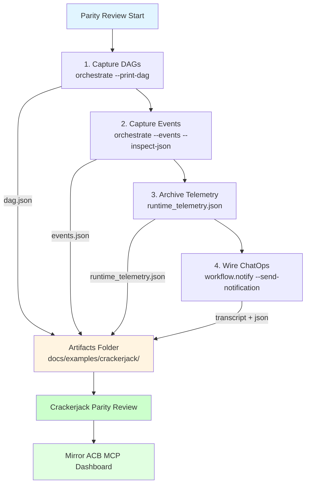

# Crackerjack Observability Checklist

Oneiric ships the CLI + telemetry hooks we need to mirror ACB's MCP dashboards. Use this playbook before every Crackerjack parity review or deployment.



## 1. Capture Workflow DAGs

```bash
uv run python -m oneiric.cli \
  --config docs/examples/demo_settings.toml \
  orchestrate \
  --print-dag \
  --workflow crackertasks.daily-export \
  --workflow crackertasks.audit
```

- Add `--inspect-json` when you want to paste the payload into the MCP dashboard mock.
- Inspectors exit immediately, so no orchestrator loop spins up.

## 2. Capture Event Handlers

```bash
uv run python -m oneiric.cli \
  --config docs/examples/demo_settings.toml \
  orchestrate \
  --events \
  --inspect-json > artifacts/crackerjack_events.json
```

The JSON payload lists every handler (topics, concurrency, filters) so Ops can compare it to ACB’s MCP extractor.

## 3. Ship Telemetry Snapshots

- After running the inspectors or a real orchestrator session, archive `.oneiric_cache/runtime_telemetry.json`.
- The file mirrors `remote_status.json` and includes:
  - `last_event`: handler attempts/failures/duration.
  - `last_workflow`: per-node runtimes, retry counts, queue metadata.
- Attach the file (or its JSON excerpt) to the Crackerjack parity issue so dashboards can replay the data.

## 4. Wire ChatOps Notifiers

Workflows that emit `workflow.notify` already include the structured message body. To mirror ACB’s MCP notifications:

1. Configure `[adapters.selections.notifications]` to point at `slack`, `teams`, or `webhook`.
1. Use the same config when running the CLI inspectors so the logs include `NotificationMessage` payloads.
1. Replay the payload via `uv run python -m oneiric.cli action-invoke workflow.notify --workflow crackerjack.workflows.release --payload '{"message":"Deploy queued","channel":"deploys"}' --send-notification --json` so the ChatOps transcript matches production. The CLI uses the same `NotificationRouter` the orchestrator uses, so the Slack/Teams/Webhook payload stays identical.
1. Drop the CLI transcript + telemetry JSON into Slack/Teams for reviewer context.

> Tip: keep all artifacts (`dag.json`, `events.json`, `runtime_telemetry.json`) under `docs/examples/crackerjack/` so Crackerjack reviewers have a single folder to diff.
