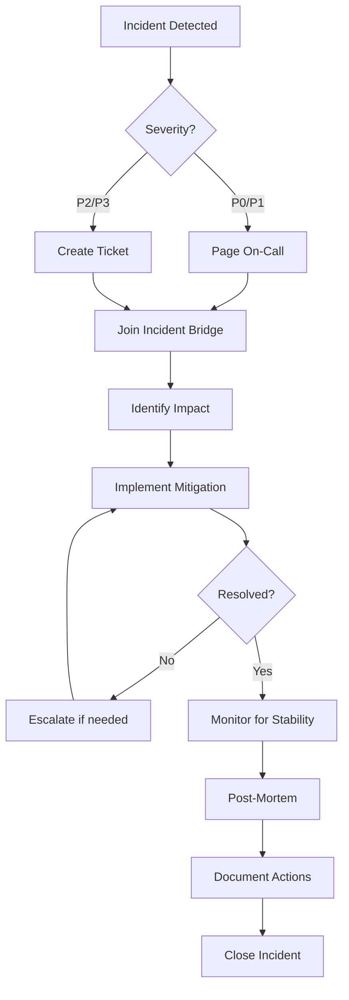

# Operational Runbooks

**Procedures for operating, maintaining, and troubleshooting Oneiric in production.**

This directory contains comprehensive runbooks for common operational tasks, incident response procedures, and troubleshooting guides.

## Table of Contents

### Core Runbooks

1. **[Incident Response](INCIDENT_RESPONSE.md)** - Emergency procedures

   - Severity classification (P0-P3)
   - On-call escalation paths
   - Communication templates
   - Post-mortem process

1. **[Troubleshooting](TROUBLESHOOTING.md)** - Common issues and solutions

   - Component resolution failures
   - Hot-swap problems
   - Remote sync errors
   - Performance issues
   - Security incidents

1. **[Maintenance](MAINTENANCE.md)** - Routine operational tasks

   - Config updates without downtime
   - Hot-swap procedures
   - Health check management
   - Rolling updates

### Advanced Operations

4. **[Service Supervisor](SERVICE_SUPERVISOR.md)** - Process supervision

   - systemd service configuration
   - Auto-restart policies
   - Log management
   - Graceful shutdown

1. **[OTel Index Management](OTEL_INDEX_MANAGEMENT.md)** - Observability data

   - Elasticsearch index lifecycle
   - Retention policies
   - Index optimization
   - Storage management

1. **[OTel Performance Tuning](OTEL_PERFORMANCE_TUNING.md)** - Telemetry optimization

   - Sampling strategies
   - Batch size tuning
   - Exporter configuration
   - Performance impact

## Quick Reference

### Common Commands

```bash
# Check component status
oneiric status --domain adapter --key cache

# List active components
oneiric list --domain adapter

# Health check
oneiric health --probe

# Trigger hot-swap
# (Edit config file - automatic swap via watcher)

# View activity (paused/drained)
oneiric activity --json

# Remote sync status
oneiric remote-status
```

### Severity Levels

| Severity | Response Time | Examples |
|----------|---------------|----------|
| **P0 - Critical** | < 15 minutes | Complete service outage, data loss |
| **P1 - High** | < 1 hour | Major degradation, partial outage |
| **P2 - Medium** | < 4 hours | Minor issues, workarounds available |
| **P3 - Low** | < 24 hours | Cosmetic bugs, documentation |

## Incident Response Workflow



## Troubleshooting Decision Trees

### Component Not Found

1. Check registration: `oneiric list --domain <domain>`
1. Verify config: `settings/<domain>.yml`
1. Check logs for resolution errors
1. Verify package imports

### Hot-Swap Failed

1. Check new provider factory
1. Verify health check logic
1. Check cleanup implementation
1. Review rollback logs

### Remote Sync Issues

1. Check network connectivity
1. Verify manifest URL
1. Check signature verification
1. Review cache directory

## Maintenance Windows

**Recommended Schedule:**

- **Weekly**: Review logs and metrics
- **Monthly**: Security updates, dependency upgrades
- **Quarterly**: Archive old observability data, review retention policies
- **Annually**: Complete architecture review, capacity planning

## Emergency Contacts

| Role | Contact | Responsibility |
|------|---------|----------------|
| **On-Call Engineer** | pagerduty@example.com | Immediate response |
| **Engineering Lead** | lead@example.com | Escalation, decisions |
| **Product Owner** | product@example.com | Communication |
| **Support Team** | support@example.com | Customer communication |

## Runbook Maintenance

Runbooks should be:

- **Reviewed quarterly** for accuracy
- **Updated after** every major incident
- **Tested during** tabletop exercises
- **Version controlled** with change history

## Related Documentation

- [Monitoring Setup](../monitoring/) - Observability configuration
- [Deployment Guides](../deployment/) - Production deployment
- [Security Hardening](../implementation/STAGE5_FINAL_AUDIT_REPORT.md) - Security posture

## Contributing

To add or update runbooks:

1. Follow the existing template and structure
1. Include code examples and commands
1. Add decision trees where helpful
1. Review with on-call team before publishing
1. Update this README when adding new runbooks
