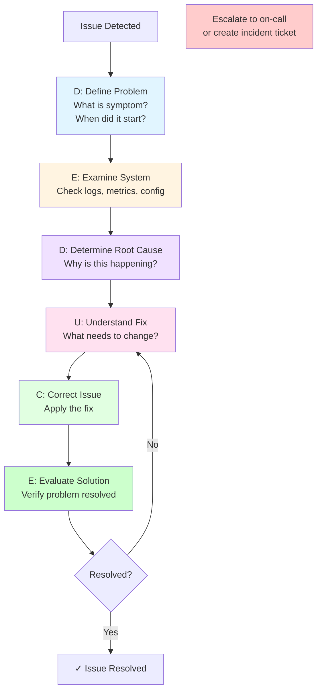
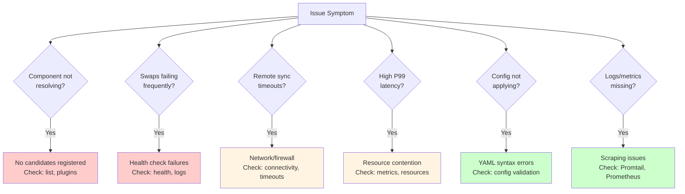

# Troubleshooting Guide for Oneiric

**Last Updated:** 2025-11-26
**Status:** Production Ready
**Maintainer:** Platform Team

______________________________________________________________________

## Table of Contents

1. \[[#overview|Overview]\]
1. \[[#troubleshooting-methodology|Troubleshooting Methodology]\]
1. \[[#quick-reference|Quick Reference]\]
1. \[[#common-issues|Common Issues]\]
   - \[[#resolution-issues|Resolution Issues]\]
   - \[[#lifecycle-issues|Lifecycle Issues]\]
   - \[[#remote-sync-issues|Remote Sync Issues]\]
   - \[[#performance-issues|Performance Issues]\]
   - \[[#configuration-issues|Configuration Issues]\]
1. \[[#diagnostic-commands|Diagnostic Commands]\]
1. \[[#log-analysis|Log Analysis]\]
1. \[[#when-to-escalate|When to Escalate]\]

______________________________________________________________________

## Overview

This guide provides diagnostic steps and solutions for common Oneiric operational issues. Use this for self-service troubleshooting before escalating to on-call or creating incident tickets.

### Using This Guide

1. **Identify symptom** from Quick Reference table
1. **Follow diagnostic steps** in relevant section
1. **Apply solution** or escalate if unresolved
1. **Document findings** for knowledge base

______________________________________________________________________

## Troubleshooting Methodology

### Standard Approach (DEDUCE)



**DEDUCE Steps:**

1. **D**efine the problem - What is the symptom? When did it start?
1. **E**xamine the system - Check logs, metrics, configuration
1. **D**etermine root cause - Why is this happening?
1. **U**nderstand the fix - What needs to change?
1. **C**orrect the issue - Apply the fix
1. **E**valuate the solution - Verify problem resolved

### Information Gathering Checklist

```bash
# Before starting, collect:
- [ ] When did issue start? (timestamp)
- [ ] What changed recently? (deployments, config)
- [ ] Which environment? (prod/staging/dev)
- [ ] Current version: `uv run python -m oneiric.cli --version`
- [ ] System status: `uv run python -m oneiric.cli health --probe`
- [ ] Recent alerts: Check AlertManager
- [ ] Recent logs: Check Loki for errors
```

______________________________________________________________________

## Quick Reference



**Quick Decision Tree:**

| Symptom | Likely Cause | Section | Severity |
|---------|--------------|---------|----------|
| Components not resolving | No candidates registered | \[[#resolution-issues|Resolution Issues]\] | High |
| Swaps failing frequently | Health check failures | \[[#lifecycle-issues|Lifecycle Issues]\] | High |
| Remote sync timeouts | Network/firewall issues | \[[#remote-sync-issues|Remote Sync Issues]\] | Medium |
| High P99 latency | Resource contention | \[[#performance-issues|Performance Issues]\] | Medium |
| Config not applying | YAML syntax errors | \[[#configuration-issues|Configuration Issues]\] | Low |
| Logs not visible | Promtail not scraping | \[[#log-analysis|Log Analysis]\] | Low |
| Metrics missing | Prometheus not scraping | \[[#diagnostic-commands|Diagnostic Commands]\] | Medium |

______________________________________________________________________

## Common Issues

______________________________________________________________________

## Resolution Issues

### Issue 1: "Resolution returns None"

**Symptom:** Resolver cannot find candidate for domain/key

**Diagnostic Steps:**

```bash
# 1. Check if candidates registered
uv run python -m oneiric.cli list --domain adapter

# 2. If empty, check registration
uv run python -m oneiric.cli plugins

# 3. Check explain output
uv run python -m oneiric.cli explain status --domain adapter

# 4. Check logs
{app="oneiric"} | json | event="resolver-decision" | outcome="failed"
```

**Common Causes & Solutions:**

**A. No candidates registered**

```bash
# Check if plugins loaded
uv run python -m oneiric.cli plugins
# If plugins missing, reinstall:
uv pip install -e /path/to/plugin
```

**B. All candidates shadowed**

```bash
# Adjust stack order
export ONEIRIC_STACK_ORDER="myapp:20,oneiric:10"

# Or add explicit selection
vim settings/adapters.yml
# Add: selections: { cache: redis }
```

**C. Config file missing**

```bash
# Check config exists
ls -la settings/adapters.yml

# If missing, create from template
cp settings/adapters.yml.example settings/adapters.yml
```

______________________________________________________________________

### Issue 2: "Resolution latency high (P99 > 100ms)"

**Symptom:** Resolution takes longer than expected

**Diagnostic Steps:**

```promql
# Check resolution latency
oneiric:resolution_latency_p99:5m

# By domain
histogram_quantile(0.99, rate(oneiric_resolution_duration_seconds_bucket[5m])) by (domain)

# Check CPU usage
rate(process_cpu_seconds_total{job="oneiric"}[5m])
```

**Common Causes & Solutions:**

**A. High candidate count**

```bash
# Check total candidates
uv run python -m oneiric.cli list --all | wc -l

# If > 100 per domain, consider:
# - Removing unused candidates
# - Using explicit selections
# - Optimizing precedence rules
```

**B. Slow health checks**

```bash
# Identify slow providers
{app="oneiric"} | json | event="health-check-complete" | duration_ms > 1000

# Increase health check timeout
vim settings/app.yml
# lifecycle: { health_timeout: 30 }
```

**C. Resource contention**

```bash
# Check system resources
# If CPU/memory high, scale up
```

______________________________________________________________________

### Issue 3: "Shadowed components increasing"

**Symptom:** Many candidates marked as shadowed (inactive)

**Diagnostic Steps:**

```bash
# Count shadowed candidates
sum(oneiric_resolution_shadowed_total)

# List shadowed by domain
uv run python -m oneiric.cli list --domain adapter --show-shadowed

# Check precedence
uv run python -m oneiric.cli explain status --domain adapter
```

**Solution:**

```bash
# Review and remove duplicate registrations
# Edit plugin/adapter registration code

# Or adjust stack levels
# Update metadata in adapter registration:
# stack_level=20  # Higher = preferred
```

______________________________________________________________________

## Lifecycle Issues

### Issue 4: "Swap operations failing"

**Symptom:** Hot-swaps fail with rollbacks

**Diagnostic Steps:**

```bash
# Check swap failure rate
rate(oneiric_lifecycle_swap_total{outcome="failed"}[5m])

# Recent failures
{app="oneiric"} | json | event="swap-failed"

# Check failure reasons
{app="oneiric"} | json | event="swap-failed" | line_format "{{.error}}"
```

**Common Causes & Solutions:**

**A. Health check failures**

```bash
# Check health check logs
{app="oneiric"} | json | event="health-check-failed"

# Test provider manually
# Example: Redis
redis-cli -h redis-host PING

# Fix provider config
vim settings/adapters.yml
# Update connection string, credentials
```

**B. Import errors**

```bash
# Check for ImportError
{app="oneiric"} | json | error=~".*ImportError.*"

# Install missing dependencies
uv pip install <package>
```

**C. Timeout errors**

```bash
# Increase swap timeout
vim settings/app.yml
# lifecycle:
#   activation_timeout: 60
#   health_timeout: 30

```

______________________________________________________________________

### Issue 5: "Components stuck in 'activating' state"

**Symptom:** Lifecycle status shows "activating" for extended period

**Diagnostic Steps:**

```bash
# Check lifecycle status
uv run python -m oneiric.cli status --domain adapter --key cache

# Check for hanging operations
{app="oneiric"} | json | event="swap-started" | __timestamp__ > 5m

# Check for deadlocks
# (Application logs)
```

**Solution:**

```bash
# Force cleanup (caution: may lose in-progress work)
# Restart Oneiric

# Check for stuck async tasks
# (Requires code-level debugging)

# Prevention: Implement swap timeouts
vim settings/app.yml
# lifecycle: { activation_timeout: 30 }
```

______________________________________________________________________

### Issue 6: "High rollback rate"

**Symptom:** Many swaps rolling back to previous provider

**Diagnostic Steps:**

```promql
# Rollback rate
rate(oneiric_lifecycle_swap_total{outcome="rollback"}[5m])

# Rollback logs
{app="oneiric"} | json | event="swap-rollback"
```

**Solution:**

```bash
# Identify problematic provider
{app="oneiric"} | json | event="swap-rollback" | line_format "{{.provider}}: {{.error}}"

# Fix provider issues
# - Update configuration
# - Fix connectivity
# - Increase health check timeout

# Test in staging first
# Before deploying to production
```

______________________________________________________________________

## Remote Sync Issues

### Issue 7: "Remote sync failures"

**Symptom:** Cannot fetch remote manifests

**Diagnostic Steps:**

```bash
# Check sync status
uv run python -m oneiric.cli remote-status

# Recent sync errors
{app="oneiric"} | json | event="remote-sync-error"

# Test manifest URL
curl -v https://manifests.example.com/oneiric/manifest.yaml
```

**Common Causes & Solutions:**

**A. Network connectivity**

```bash
# Test connectivity
ping manifests.example.com
curl -I https://manifests.example.com

# Check DNS
nslookup manifests.example.com

# Check firewall rules
# Ensure HTTPS egress allowed

# Test from container
```

**B. Signature verification failures**

```bash
# Check signature logs
{app="oneiric"} | json | event="signature-verification-failed"

# Verify public key configured
vim settings/app.yml
# remote: { public_key: "..." }

# If key rotated, update config
# Get new key from release engineer
```

**C. Circuit breaker open**

```bash
# Check circuit breaker state
{app="oneiric"} | json | circuit_breaker="open"

# Wait for reset (60s default)
# Or restart to reset immediately

# Adjust settings if too sensitive
vim settings/app.yml
# remote:
#   failure_threshold: 5
#   reset_timeout: 120
```

______________________________________________________________________

### Issue 8: "Digest verification failures"

**Symptom:** SHA256 mismatch for cached artifacts

**Diagnostic Steps:**

```bash
# Check digest errors
{app="oneiric"} | json | event="digest-check-failed"

# List corrupted artifacts
ls -lh .oneiric_cache/artifacts/

# Check disk health
dmesg | grep -i error
smartctl -a /dev/sda
```

**Solution:**

```bash
# Clear corrupted artifact
rm -f .oneiric_cache/artifacts/<artifact>

# Re-download
uv run python -m oneiric.cli remote-sync --manifest <url>

# If disk errors, replace hardware
# Schedule maintenance window
```

______________________________________________________________________

### Issue 9: "Slow remote sync (latency budget exceeded)"

**Symptom:** Remote sync taking > 30 seconds

**Diagnostic Steps:**

```promql
# Check sync latency
oneiric:remote_sync_latency_p99:5m

# Recent slow syncs
{app="oneiric"} | json | event="remote-sync-complete" | duration_ms > 30000
```

**Solution:**

```bash
# Check manifest size
curl -I https://manifests.example.com/oneiric/manifest.yaml
# If > 1MB, optimize manifest

# Check network latency
ping -c 10 manifests.example.com

# Use CDN for manifest delivery
# Update manifest URL to CDN endpoint

# Increase timeout
vim settings/app.yml
# remote: { timeout: 60 }
```

______________________________________________________________________

## Performance Issues

### Issue 10: "High CPU usage"

**Symptom:** CPU usage > 80%

**Diagnostic Steps:**

```bash
# Check CPU usage

# Profile application
# Install py-spy
uv pip install py-spy

# Profile for 30 seconds
py-spy top --pid $(pidof python)
```

**Common Causes & Solutions:**

**A. Too many resolution operations**

```promql
# Check resolution rate
rate(oneiric_resolution_total[5m])

# If > 1000/sec, consider:
# - Caching at application layer
# - Reducing resolution frequency
# - Horizontal scaling
```

**B. Heavy health checks**

```bash
# Identify slow health checks
{app="oneiric"} | json | event="health-check-complete" | duration_ms > 5000

# Optimize provider health check logic
# Or increase check interval
```

**C. Insufficient resources**

```bash

# Or increase CPU limit
```

______________________________________________________________________

### Issue 11: "High memory usage"

**Symptom:** Memory usage growing, approaching limit

**Diagnostic Steps:**

```bash
# Check memory usage

# Check active instances
oneiric:system_active_instances_total:5m

# Memory estimate
oneiric:system_memory_usage_estimate_bytes:5m / (1024^3)
```

**Solution:**

```bash
# Identify memory leak
# Install memray
uv pip install memray

# Profile memory
memray run -m oneiric.cli orchestrate

# If instance leak:
# - Fix cleanup logic
# - Ensure garbage collection

# If legitimate high usage:
# Increase memory limit
```

______________________________________________________________________

### Issue 12: "Slow response time (high P99 latency)"

**Symptom:** Overall system latency degraded

**Diagnostic Steps:**

```bash
# Check all latency metrics
open http://grafana:3000/d/oneiric-performance

# Resolution latency
oneiric:resolution_latency_p99:5m

# Swap latency
oneiric:lifecycle_swap_latency_p95:5m

# Remote sync latency
oneiric:remote_sync_latency_p99:5m
```

**Solution:**

```bash
# Identify bottleneck (resolution vs lifecycle vs remote)

# If resolution slow:
# - Optimize candidate count
# - Use explicit selections

# If lifecycle slow:
# - Increase health check timeout
# - Optimize provider initialization

# If remote slow:
# - Use CDN
# - Increase timeout
# - Cache manifests longer
```

______________________________________________________________________

## Configuration Issues

### Issue 13: "Config changes not applying"

**Symptom:** Updated config file but no effect

**Diagnostic Steps:**

```bash
# Check config file syntax
python -c "import yaml; yaml.safe_load(open('settings/adapters.yml'))"

# Check watcher status
{app="oneiric"} | json | event="config-changed"

# Check file modification time
stat settings/adapters.yml
```

**Common Causes & Solutions:**

**A. YAML syntax error**

```bash
# Validate YAML
yamllint settings/adapters.yml

# Common errors:
# - Missing colons
# - Incorrect indentation (must use spaces, not tabs)
# - Duplicate keys

# Fix syntax
vim settings/adapters.yml

# Restart if watchers disabled
```

**B. Config watcher disabled**

```bash
# Check if watchers running
{app="oneiric"} | json | event="watcher-started"

# If not, enable in settings
vim settings/app.yml
# watchers:
#   enabled: true
#   poll_interval: 5

```

**C. Wrong config path**

```bash
# Check config directory
echo $ONEIRIC_CONFIG
# Should point to: /app/settings or ./settings

# If wrong, set correctly
export ONEIRIC_CONFIG=/app/settings
```

______________________________________________________________________

### Issue 14: "Secrets not loading"

**Symptom:** Authentication failures, "credential not found" errors

**Diagnostic Steps:**

```bash
# Check secrets configured

cat .env | grep -v '^#'

# Check logs
{app="oneiric"} | json | error=~".*credential.*|.*auth.*"
```

**Solution:**

```bash
# Verify secret exists

ls -la .env

# Verify secret mounted correctly


# If missing, recreate secret
# (See MAINTENANCE.md - Secret Rotation)
```

______________________________________________________________________

### Issue 15: "Component not found after config change"

**Symptom:** After updating selection, component not available

**Diagnostic Steps:**

```bash
# Check current selection
vim settings/adapters.yml

# Check explain output
uv run python -m oneiric.cli explain status --domain adapter

# Check if provider registered
uv run python -m oneiric.cli list --domain adapter | grep <provider>
```

**Solution:**

```bash
# If provider not registered:
# - Check provider plugin installed
# - Verify metadata registration
# - Check remote manifest includes provider

# If registered but shadowed:
# - Adjust stack_level
# - Use explicit selection
# - Remove conflicting candidates

# Force swap to provider
uv run python -m oneiric.cli swap --domain adapter --key cache --provider <provider>
```

______________________________________________________________________

## Diagnostic Commands

### System Status

```bash
# Overall health
uv run python -m oneiric.cli health --probe

# Version info
uv run python -m oneiric.cli --version

# System info
uv run python -m oneiric.cli health --json | jq '.system'
```

### Metrics Queries

```bash
# Resolution success rate
curl 'http://prometheus:9090/api/v1/query?query=oneiric:resolution_success_rate_global:5m'

# Swap success rate
curl 'http://prometheus:9090/api/v1/query?query=oneiric:lifecycle_swap_success_rate:5m'

# Active instances
curl 'http://prometheus:9090/api/v1/query?query=oneiric:system_active_instances_total:5m'

# Cache size
curl 'http://prometheus:9090/api/v1/query?query=oneiric_system_cache_size_bytes'
```

### Log Queries

```bash
# Recent errors (last 5 minutes)
{app="oneiric"} | json | level="error" | __timestamp__ > 5m

# Failed resolutions
{app="oneiric"} | json | event="resolver-decision" | outcome="failed"

# Failed swaps
{app="oneiric"} | json | event="swap-failed"

# Remote sync errors
{app="oneiric"} | json | event="remote-sync-error"
```

### Configuration Checks

```bash
# Validate config files
for file in settings/*.yml; do
  echo "Validating $file"
  python -c "import yaml; yaml.safe_load(open('$file'))"
done

# List registered candidates
uv run python -m oneiric.cli list --all

# Check plugin diagnostics
uv run python -m oneiric.cli plugins
```

### Performance Profiling

```bash
# CPU profiling
py-spy record -o profile.svg -- python -m oneiric.cli orchestrate &
sleep 60
kill %1

# Memory profiling
memray run --live -m oneiric.cli orchestrate

# Network profiling
```

______________________________________________________________________

## Log Analysis

### Log Levels

| Level | Purpose | Action |
|-------|---------|--------|
| **DEBUG** | Detailed diagnostics | Review for deep debugging |
| **INFO** | Normal operations | Baseline activity |
| **WARNING** | Potential issues | Investigate if recurring |
| **ERROR** | Operation failures | Requires investigation |
| **CRITICAL** | System-level failures | Immediate action required |

### Common Error Patterns

**Import Errors:**

```logql
{app="oneiric"} | json | error=~".*ImportError.*|.*ModuleNotFoundError.*"
```

**Connection Errors:**

```logql
{app="oneiric"} | json | error=~".*ConnectionError.*|.*timeout.*"
```

**Authentication Errors:**

```logql
{app="oneiric"} | json | error=~".*auth.*|.*credential.*|.*permission.*"
```

**Configuration Errors:**

```logql
{app="oneiric"} | json | error=~".*ConfigError.*|.*yaml.*|.*validation.*"
```

### Log Aggregation

```bash
# Errors by domain (last hour)
{app="oneiric"} | json | level="error" | __timestamp__ > 1h | line_format "{{.domain}}/{{.key}}: {{.error}}" | count by (domain)

# Top error messages
{app="oneiric"} | json | level="error" | line_format "{{.error}}" | topk(10, count by (error))

# Error rate over time
rate({app="oneiric"} | json | level="error" [5m])
```

______________________________________________________________________

## When to Escalate

### Escalation Criteria

| Situation | Escalate To | Timing |
|-----------|-------------|--------|
| **Cannot resolve in 30 min** | Team Lead | After 30 min |
| **Data loss risk** | On-call Manager | Immediately |
| **Security incident** | Security Team | Immediately |
| **Production down** | On-call + Manager | Immediately |
| **Unclear root cause** | Senior Engineer | After 1 hour |

### Escalation Information to Provide

```markdown
## Issue Summary
- **Symptom:** [What's wrong]
- **Started:** [Timestamp]
- **Environment:** [prod/staging/dev]
- **Impact:** [Users affected, severity]

## Diagnostic Steps Taken
- [ ] Checked logs: [findings]
- [ ] Checked metrics: [findings]
- [ ] Checked configuration: [findings]
- [ ] Attempted solutions: [what was tried]

## Current State
- **Version:** [oneiric version]
- **Health:** [health check results]
- **Recent Changes:** [deployments, config changes]

## Assistance Needed
- [Specific question or help requested]
```

### Escalation Contacts

See `docs/runbooks/INCIDENT_RESPONSE.md` for full escalation matrix.

______________________________________________________________________

## Additional Resources

- **Incident Response Runbooks:** `docs/runbooks/INCIDENT_RESPONSE.md`
- **Maintenance Runbooks:** `docs/runbooks/MAINTENANCE.md`
- **Monitoring Dashboards:** http://grafana:3000/dashboards
- **Alert Definitions:** `deployment/monitoring/prometheus/rules/alert_rules.yml`
- **Slack Channels:**
  - #platform-help (general questions)
  - #platform-oncall (urgent issues)
  - #oneiric-users (user community)

______________________________________________________________________

**Document Version:** 1.0
**Last Reviewed:** 2025-11-26
**Next Review:** 2026-02-26
**Feedback:** platform-team@example.com
